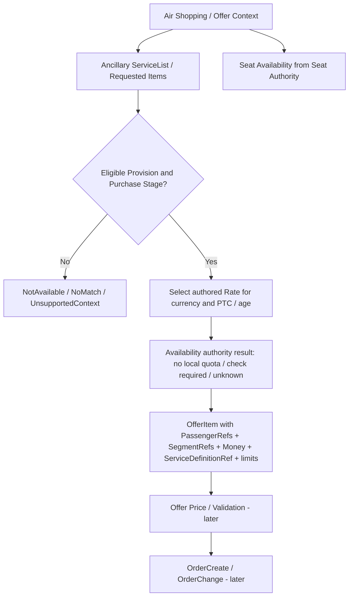

# Read-only contract target for future OTA/NDC exposure — Phase 3 / Shopping NOT authorized

The commercial+inventory domain must support these facts so a future adapter can build real-world agency API messages. This document is a **boundary target**, not permission to create a shopping API, matcher, new service, or OrderChange implementation.

## Future sequence (Amadeus/Iberia/flydubai inspired)


## Minimum future DTO shape; **not actual REST API implementation**
```json
{
  "serviceDefinitionRef": "XBAG_WEIGHT_10KG",
  "ancillaryProvisionId": "100",
  "priceVersionId": "200",
  "serviceType": "BAGGAGE",
  "passengerRefs": ["PAX1"],
  "segmentRefs": ["SEG1"],
  "purchaseStage": "PreOrder",
  "quantity": {"unit":"Each","min":1,"max":4,"selected":2},
  "chargeDescription": {"kind":"WeightPackage","weightPerUnitKg":"10"},
  "unitPrice": {
    "base":{"amount":"40.00","currency":"EUR"},
    "taxes":[{"code":"XT","amount":"4.00","currency":"EUR"}],
    "fees":[],
    "unitTotal":{"amount":"44.00","currency":"EUR"},
    "nonUnitFees":[]
  },
  "availability": {"authority":"Unlimited","requiresCheck":false,"guaranteed":false}
}
```

All IDs/sample numbers are **illustrative**, not actual API responses. Price per-unit, not multiplied incorrectly; multiply only using explicitly selected unit in future consumer. Offer expiry and provider references are generated by future offer/booking components, not stored as new Phase 1/2 artifacts.

## Required output states (do not collapse to bool)
`NoMatchingProvision`, `ExplicitlyNotAvailable`, `UnsupportedContext`, `NoMatchingCurrency`, `ConfirmationRequired`, `AvailabilityUnknown`, `OutOfStock` (future), `EligibleButNotReserved` (future). Pricing and inventory's current admin reads must expose factual data only. A requestable SSR without provider confirmation cannot become `GuaranteedAvailable`. Missing input (fare, passenger age, locale/timezone, baggage concept, provider status) fails closed when applicable.

## Explicit out of scope
No `ServiceList` endpoint, no `SeatAvailability` endpoint, no OrderCreate/OrderChange/EMD, no FlightFlow connector, no OTA credential/provisioner, no inventory decrement/reservation, no full shopping evaluator. These are future concerns; only preserve the necessary domain representation and tests now.
