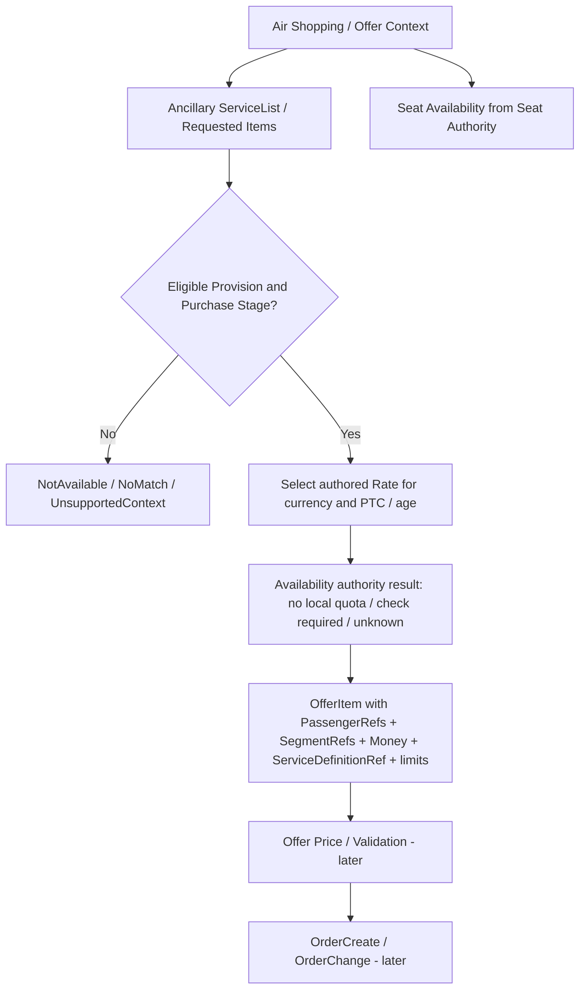

---

<!-- SOURCE 00-START-HERE.md -->

# AeroTech.Ancillary v12.1 — FINAL DOMAIN COMPLETION PACK (PHASE 1 + PHASE 2)
**Status:** Domain design and implementation authority for correction on existing `feat/ancillary-v12.1-phase2-stock`, **not code already implemented**. Date: 2026-10-09.

## Goal
Deliver a realistic airline Ancillary catalog + provisions + price authoring + capacity policy and capacity administration for 15 mainstream families, consistent with documented Amadeus, flydubai, Iberia NDC, ATPCO examples, with the **smallest coherent domain**. Preserve the existing v12.1 framework and source. No external service changes. No Phase 3 Hold/Confirm/Release/EMD or real shopping evaluator.

## Source of truth
- Repo: `aliifarhadi/AeroTech.Ancillary`, feature branch `feat/ancillary-v12.1-phase2-stock`, pushed SHA `1abf7a53e0efb9eb892097977327718c61486158`; `k8s-stg@933b7b7a793b426dbcb6362bbf8519886edf9080` still has Phase 1.
- User-approved D01–D14 from 2026-10-09: D01–03, D05–07, D09, D12–13 Recommended; **D04 different Provision per POS**; **D11 keep current**; **D14 cleanup**. User delegated design selection on unknown D08 and D10: this pack selects the least complex benchmark-supported interpretation and documents why.
- **New definitive authority:** docs 01–10 of THIS pack for Phase 1+2 corrections > approved v12.1 business contract for unchanged concepts > current source > older donor packs. No rename or new domain object beyond documented delta.
- Canonical existing Phase 1: Supplier; AncillaryServiceDefinition; AncillaryProvision with ten typed Rule children; AncillaryPricing; Phase 2 AncillaryInventoryPolicy, FlightCountInventory, FlightWeightInventory, AirportSlotInventory. Existing `AncillaryReservation` frozen.

## Scope and production truth
**Phase 1** author/publish a service, its eligibility conditions, prices and documentary/booking metadata.
**Phase 2** author/activate inventory authority, local capacity administrative totals and immutable adjustments where real source evidence exists. The new design is **authoring-ready** and tests real SQL concurrency. It does **not** claim flight safety capacity or permit guaranteed limited-stock selling. A missing physical reference remains explicitly unavailable per Owner D11.
**Phase 3** future only: shopping evaluation, supplier approval, Sell/Hold/Confirm/Release, expiry, cross-order passenger consumption, stock allocations, EMD. Do not implement.

## Reading order
01 decisions → 02 complete graph/fields → 03 Pricing contract → 04 Provision contract → 05 Inventory contract → 06 15 real families → 07 future OTA contract boundary → 08 migration → 09 acceptance matrix → 10 Coding Agent instruction → 11 traceability.

## Stop conditions
- No changes to AirAvail, FlightFlow, AirPrice, Ordering, JetPay, or their contract copies beyond existing Ancillary-owned contracts as separately specified.
- No undocumented industry RFISC/SSR codes or fake provider availability.
- No destructive migrations without Ancillary-owned pre/post reconciliation, backup/recovery proof.
- Do not merge or close without actual test logs and Owner audit.


---

<!-- SOURCE 01-FINAL-DECISIONS.md -->

# Final decisions — CLOSED by domain architect using user-approved boundaries

| ID | Final decision | Implementation consequence |
|---|---|---|
| D01 | Keep `AncillaryPricing` aggregate root; create `AncillaryPricingRate` and child `AncillaryPriceComponent`; retire mixed old line after migration | One clear rate containing Base Money and components |
| D02 | Money = `(Amount,CurrencyId)` on Rate base and each component | No authoritative root CurrencyId; no ambiguous amount |
| D03 | Multiple authored currencies inside one Active Pricing revision | No FX; a requested unsupported selling currency is unavailable, NOT converted |
| D04 | **Separate Provision for each POS** | POS is a typed Provision sales selector; **NO POS selector on PricingRate** |
| D05 | Base means net amount, tax and fee components additive; gross derived | TaxIncluded only optional source/provenance flag; inclusive sourced price without net breakdown cannot masquerade as additive base |
| D06 | FeeApplicationUnit only on the applicable Fee component | No universal root fee scope; Tax components have none |
| D07 | decimal(19,6) storage; validate currency scale using `CurrencyReadModel.DecimalPlaces` | JPY 0, EUR 2, KWD 3, no silent rounding or FX |
| D08 | **Fixed baggage weight packs as separate service SKUs/definitions**, e.g. 5kg/10kg/20kg as repository already has; `QuantityRule` remains integer min/max, no StepQuantity DSL. Add `MaximumPeriod?` to existing AdvancePurchase rule only to model bounded presale windows | A 10kg pack quantity 2 means 20kg entitlement. For arbitrary kilo sales use PerKilogram SKU; the concept comes from the fare/route, not a stock unit. No generic tariff matrix |
| D09 | Baggage is a **commercial carriage entitlement**, not automatically finite flight stock | Local Count/Weight sources apply only when a factual airline-owned quota has been authored and validated |
| D10 | `MustCheckAvailability` is NOT proof of a local numerical quota. **Remove ban on Unlimited+MustCheckAvailability** | Policy may have no local quota while commercial/operational confirmation is required; no automatic available/guaranteed claim; an actual delegated authoritative stock source still uses Supplier/FlightFlow |
| D11 | **KEEP CURRENT strict evidence gating** per Owner | `NotConnected...` reference ports remain fail-closed; Local Flight/Facility sources cannot become Active without source proof. No fake local registry/attestation bypass, no other-service integration |
| D12 | DailyCount, RoomNight and AssignedAsset remain schema/semantics **documented, unimplemented and explicitly unsupported for activation** | 3 proven local ARs only; supplier-managed accommodation and transfers supported at policy level |
| D13 | No invented discount, agency commission, percent of fare, mileage, merchant markup, FX or dynamic formulas | Existing net Base + fixed Tax/Fee is complete for this release; list unsupported formulas honestly |
| D14 | Clean obsolete Ancillary-owned schema only after audit; retain/restore historical semantics | Review already pushed `V121LegacySchemaCleanup` and new Pricing migration; no other-service changes |

## Extra minimal domain commitments needed for observed commercial variants
1. `BookingDefinition.ConfirmationRequirement: Immediate | SubjectToConfirmation` — only describes whether provider/operations may have to confirm request. Existing `BookingMethod/SSR/SSIM` remain authoritative. A listed SSR is not guaranteed stock (Iberia SpecialNeeds).
2. `AncillaryProvision.PurchaseStage: PreOrder | PostTicketed | Both` — condition for sell-stage selection; does NOT process tickets or orders, and maps to documented pre-/post-sale restrictions. Default migration of legacy rows to `Both` only if their recorded service policy can support both; otherwise keep Draft/quarantine for explicit catalog classification rather than silently widening. For existing published records without stage evidence, prefer `LegacyUnspecified` (not saleable by stage-specific future consumers) with migration lineage.
3. `ProvisionAdvancePurchaseRule.MaximumPeriod?` measured with same approved unit as `MinimumPeriod`; if defined require Maximum >= Minimum; limit values without a proven temporal interpretation are non-publishable. Absolute SalesRestrictons dates do not replace relative booking lead-time.
4. `ProvisionBaggageApplicationRule.ChargeKind` typed minimal value (`ExtraPiece`, `WeightPackage`, `Overweight`, `Oversize`, `SpecialEquipment`) plus optional `AllowanceConcept` (`Piece`, `Weight`) only when documented for this product. Do not infer universal baggage concept from SKU name or route. Existing `FreePieces/FirstExcessPiece/LastExcessPiece/Weight/...` retained. Pet service remains its own product family; no phantom universal baggage rate table.

**These four additions are minimal typed authoring descriptors** grounded in public airline offers/SSR/booking windows. They do not authorize new ARs, runtime matcher, reservation state, supplier call or EMD.

## Deliberately rejected
- New generic `StockPool`; arbitrary rule DSL; clone pricing per POS plus POS-in-rate; three competing tax representations; one class per ancillary family; tax/fee percentage formulas without requirement; treating `ServiceDefinition.ServiceSubCode` as stock key; granting limited stock sellability before Phase 3.


---

<!-- SOURCE 02-FULL-DOMAIN-ENTITY-CATALOG.md -->

# Exact target aggregate/entity/VO catalog (Phase 1+2)

## Aggregate topology (7 commercial + inventory ARs + existing Supplier)
```text
Supplier [unchanged]
AncillaryServiceDefinition [AR] --stable ServiceDefinitionRef--> AncillaryInventoryPolicy [AR]
  BookingDefinition [VO: Method, SsrCode?, SsimCode?, ConfirmationRequirement]
  DocumentDefinition [VO: Type, Rfic?, Rfisc?]
  PricingUnit, ServiceDateBasis, ATPCO-like codes and lifecycle
AncillaryProvision [AR] --ServiceDefinitionId--> AncillaryServiceDefinition
  QuantityRule [VO] / CommercialOutcome [VO] / SettlementDefinition [VO]
  AvailabilityDefinition [VO] / FulfillmentDefinition [VO]
  10 OPTIONAL TYPED RULE ENTITY GROUPS (below)
AncillaryPricing [AR] --ProvisionId--> AncillaryProvision
  AncillaryPricingRate [Entity 1..N]
    BasePrice [Money VO]
    AncillaryPriceComponent [Entity 0..N; Money VO]
AncillaryInventoryPolicy [AR; stable owner+ServiceDefinitionRef identity]
  PassengerUsageLimit [Entity]
  FlightCountConsumption / FlightWeightConsumption / AirportSlotConsumption [typed VOs]
FlightCountInventory [AR] -> FlightCountAdjustment [Entity]
FlightWeightInventory [AR] -> FlightWeightAdjustment [Entity]
AirportSlotInventory [AR] -> AirportSlotAdjustment [Entity]
AncillaryReservation [existing, FROZEN for Phase 3]
```

## AncillaryServiceDefinition AR
Fields (current and retained): `Id:long, OwnerAirlineId:int, SupplierId:long, ServiceDefinitionRef:string(30), Version:int, ServiceTypeCode:string(1), ServiceSubCode:string(3), SubCodeSource:Industry|CarrierDefined, GroupCode:string, SubGroupCode:string?, Description1Code:string?, Description2Code:string?, CommercialName:string(100), Description:string(500)?, PricingUnit:enum, ServiceDateBasis:enum, Document:DocumentDefinition VO, Booking:BookingDefinition VO, SalesEffectiveFrom:DateOnly?, SalesDiscontinueOn:DateOnly?, Status:Draft|Active|Suspended|Retired, CreatedAt/ActivatedAt?/SuspendedAt?/RetiredAt?`. **Delta**: BookingDefinition adds `ConfirmationRequirement` enum (Immediate=1/SubjectToConfirmation=2). No proposed new AR or external provider lifecycle.

## AncillaryProvision AR
`Id:long, ServiceDefinitionId:long, Sequence:int positive, Status, CoverageScope:ServiceCoverageScope, Quantity:QuantityRule(Unit:Each|Piece|Kilogram,MinQuantity:int,MaxQuantity:int), ApplicationType:Standard|Baggage|Seat, Outcome:CommercialOutcome(Paid|Free|NotAvailable,DocumentRequired,BookingRequired), Settlement, Availability(MustCheckAvailability:bool), Fulfillment(FulfillmentProviderKey), PurchaseStage:PreOrder|PostTicketed|Both|LegacyUnspecified, timestamps`. All rules below optional; all modifications via root Draft methods, published immutability preserved.

### Exactly ten typed rule-group entities and owned rows
| Rule-group Entity 0..1 | Scalar fields + child Entities |
|---|---|
| `ProvisionPassengerEligibilityRule` | `ProvisionPassengerType(PassengerTypeCode)`; `ProvisionEligibleAgeBand(AgeFromInclusive,AgeToExclusive?)` |
| `ProvisionSalesRestrictionsRule` | SalesEffectiveFrom:DateTimeOffset?, SalesDiscontinueAt:DateTimeOffset?, `ProvisionPointOfSale(PointOfSaleId:long)`, `ProvisionCustomer(CustomerId:long)`, `ProvisionCustomerType(CustomerType)` |
| `ProvisionGeographyRule` | `ProvisionOriginAirport(AirportId:int)`, `ProvisionDestinationAirport(AirportId:int)`, `ProvisionViaAirport(AirportId:int)`, `ProvisionRoutePair(OriginAirportId:int,DestinationAirportId:int,Direction)`, `ProvisionServiceLocation(LocationType,LocationId:int)`, `ProvisionCoverageCountry(CountryId:int)` |
| `ProvisionFlightApplicationRule` | `ProvisionMarketingAirline(AirlineId:int)`, `ProvisionOperatingAirline(AirlineId:int)`, `ProvisionFlightNumber(FlightNumber:string(16))`, `ProvisionFlight(FlightId:long)`, `ProvisionAircraft(AircraftId:int)` |
| `ProvisionFareApplicationRule` | `ProvisionAirFare(AirFareId:long)`, `ProvisionAirFareType(AirFareType)`, `ProvisionFareFamily(FareFamilyId:long)`, `ProvisionFareBasis(FareBasisCode:string(64))`, `ProvisionCabinClass(CabinClassId:int)`, `ProvisionRbd(RbdId:long)` |
| `ProvisionTravelDateRule` | `ProvisionPermittedTravelPeriod(StartDate:DateOnly,EndDate:DateOnly)`, `ProvisionBlackoutPeriod(StartDate,EndDate)`; intervals inclusive, Blackout overrides |
| `ProvisionDayTimeApplicationRule` | `ProvisionDayTimeWindow(DaysOfWeekMask:byte,StartLocalTime:TimeOnly?,EndLocalTime:TimeOnly?,Effect:Allow|Deny)` |
| `ProvisionAdvancePurchaseRule` | `MinimumPeriod:int >=0`, **`MaximumPeriod:int?`**, `Unit:AirPrice.TimeUnit`, `SameTimeAsTicketed:bool` |
| `ProvisionBaggageApplicationRule` | current FreePieces?,FirstExcessPiece?,LastExcessPiece?,Weight?,WeightUnit,TravelApplication?,PurchaseApplication,RuleDeference? + **ChargeKind enum, AllowanceConcept? enum** |
| `ProvisionSeatApplicationRule` | `ProvisionSeatNumber(SeatNumber:string(16))`, `ProvisionSeatCharacteristic(CharacteristicCode:string(25))` — commercial filters, NOT live seat allocation |

Every Rule Entity/row has `Id:long` and typed FK to parent (RuleGroup owns rows; Provision owns RuleGroup). Retain existing row fields/enum numeric values and constraints. No independent repositories per Rule or per ancillary product.

## Pricing AR and children — authoritative replacement of legacy flat Lines
| Type | Fields | Cardinality |
|---|---|---|
| `AncillaryPricing` AR | `Id:long, AncillaryProvisionId:long, Version:int, PricingUnit:enum (inherited immutable product unit), Status, CreatedAt, ActivatedAt?, SuspendedAt?, RetiredAt?` | one Provision -> many revisions, at most 1 Active |
| `AncillaryPricingRate` Entity | `Id:long, AncillaryPricingId:long, PassengerTypeCode?, AgeFromInclusive?, AgeToExclusive?, BasePrice:Money` | 1..N per Pricing; unique normalized (CurrencyId,PTC,AgeBand) |
| `AncillaryPriceComponent` Entity | `Id:long, RateId:long, Category:Tax|Fee, Code:string(10), Name:string(100)?, CountryId:int?, StationAirportId:int?, Amount:Money, FeeApplicationUnit:enum? (required on newly published Fee, null on Tax), TaxIncludedInSource:bool? (Tax only; informational)` | 0..N per rate; unique code/type/country/station/feeUnit within rate |
| `Money` VO | `Amount:decimal(19,6), CurrencyId:int` | same currency enforced across base/components of one Rate |

**REMOVE authoritative `CurrencyId` and `FeeApplicationUnit` from Pricing root after verified migration**, old columns retained physically during expand/verify then cleanup in contract phase. `AncillaryPricingLine` replaced by Rate/Component with exact mapping and stable historical price snapshots. No `PointOfSaleId` on Rate.

## Inventory Policy AR and children
`AncillaryInventoryPolicy`: Id:long, OwnerAirlineId:int, ServiceDefinitionRef:string(30) stable key, ServiceDefinitionId:long **non-authoritative latest validated source reference / migration compatibility only**, Authority:Unlimited|Local|Supplier|FlightFlow, LocalPattern?:FlightCount|FlightWeight|FlightCountPlusWeight|AirportSlot|DailyCount|RoomNight|AssignedAsset (last three unactivatable), ProviderKey?:string(50), CountConsumption?:VO(ResourceId:long,CountPerAcceptedUnit:int,CountUnit:enum), WeightConsumption?:VO(WeightResourceId:long,ConsumptionMode:FixedKgPerAcceptedUnit|AcceptedWeightKg,FixedKgPerUnit?:decimal(18,3)), SlotConsumption?:VO(FacilityId:long,OccupancyMinutes:int,PeoplePerAcceptedUnit:int), PassengerUsageLimits[Entity: Id,InventoryPolicyId,LimitScope:PerOrder|PerFlightOccurrence|PerServiceDate,MaxUnits:int,CountingFamilyCode:string(30)], Status:Draft|Active|Suspended|Retired, Version:long, timestamps, rowversion.`

Do not bind physical quotas to ephemeral ServiceDefinitionId; policy resolves effective current definition via owner+stable Ref, validates its current identity, and maintains version-aware diagnostic pointer if necessary. Physical sources keyed only by physical resource, NOT product, Provision, or Price.

## Supported Local ARs (actual Phase2 persistence)
- `FlightCountInventory`: Id:long, OwnerAirlineId:int, FlightId:long, ResourceId:long, CountUnit:Person|Piece|Item|AnimalCarrier|Equipment, TotalCapacity:int>=0, ClosedForSale:bool, Status, Version, audit timestamps, RowVersion; `FlightCountAdjustment` Id,ParentId,PreviousTotal,NewTotal,ExpectedVersion,ResultingVersion,ReasonCode,ActorId,CorrelationId,OccurredAt.
- `FlightWeightInventory`: Id:long, OwnerAirlineId:int, FlightId:long, WeightResourceId:long, CapacityKg:decimal(18,3)>=0, ClosedForSale, Status, Version, audit timestamps, RowVersion; `FlightWeightAdjustment` same previous/new kg structure.
- `AirportSlotInventory`: Id:long, OwnerAirlineId:int, AirportId:int, FacilityId:long, StartUtc:DateTimeOffset, EndUtc:DateTimeOffset (half-open), CapacityPersons:int>=0, ClosedForSale, Status, Version, audit timestamps, RowVersion; `AirportSlotAdjustment` same previous/new people structure.
- For all: immutable physical key, one current active/non-retired record per key, optimistic version + SQL overlap locks for slots, adjustments immutable and idempotent by (parent,CorrelationId). No Held/Sold/Available counters in Phase 2.
- `DailyCount`, `RoomNight`, `AssignedAsset`: **documented only**, not activated/registered/persisted unless future real source and Owner phase authorization. External hotel/car supplier => Supplier authority works as a policy, no mirrored local inventory.


---

<!-- SOURCE 03-PRICING-BEHAVIOR-AND-EDGE-CASES.md -->

# Pricing specification and truth tables — complete Phase 1 repair

## Purpose, lifecycle and currency
`AncillaryPricing` is a versioned authored **pricebook for ONE matching Provision**. `AncillaryPricingRate` is an alternative charge per passenger selector and selling currency, not an additional charge. `AncillaryPriceComponent` is additive Tax/Fee *within* the selected rate. A Provision has at most one Active Pricing revision. The requested selling currency must match an authored Rate; **no FX conversion**. Separate POS commercial differences => separate Provision (D04).

`Money`: amount decimal(19,6), currency int positive and exists in existing `ReferenceData.Currencies`; authored scale <= `CurrencyReadModel.DecimalPlaces`, negative prohibited, no silent rounding. Rate Base strictly >0 for Paid; fee/tax components >=0. The monetary components are all tied to the SAME currency and SAME selector but **their FeeApplicationUnit may differ**. Therefore `UnitTotal = Base + additive Taxes + Fees whose application really is per accepted item/unit`; a Fee per Ticket/OneWay/RoundTrip/Sector is **not** multiplied into this per-unit Total and remains a separately filed component awaiting travel coverage at future quote. When any non-unit Fee exists, do not publish an unconditional final Total for all quantities: return `TotalForOneUnit?` only for homogeneous unit-scoped amounts, or include `UnappliedFees` separately, clearly annotated. Checked decimal arithmetic, no overflow; currency display scale from reference. Do not sum arbitrary fee application scopes as if all were per item.

```text
Provision #21: POS=DE, Outcome=Paid, PricingUnit=PerPassenger
Pricing v3 ACTIVE:
  Rate A: EUR / ADT / age unrestricted: Base EUR 40.00; Tax EUR 4.00 [Code XT]; Fee EUR 1.00 [Code SVC, FeeApplicationUnit=Item] => EUR 45.00
  Rate B: EUR / CHD / age unrestricted: Base EUR 22.00; Tax EUR 2.00 => EUR 24.00
  Rate C: USD / ADT / age unrestricted: Base USD 49.00; Tax USD 1.50 => USD 50.50
  Rate D: USD / CHD / age unrestricted: Base USD 25.00 => USD 25.00
Provision #22: POS=TR, own active pricebook and conditions (not Rate.PointOfSaleId).
```

The rate key is `(CurrencyId, PassengerTypeCode?, AgeFromInclusive?, AgeToExclusive?)`. For PricingUnit != PerPassenger, PTC/Age are null and **exactly one base rate PER currency**; this is an important correction of legacy “exactly one base” overall. For PerPassenger, within one currency either all selectors use PTC or none; within each PTC age bands disjoint, do not mix unbounded generic with bounded, prevent ambiguous generic fallback. Alternatives never sum; multiple currency rates never sum.

## Source-inclusive tax and fees
D05: Only **net** base and separately additive tax/fee components are authoritative. Every newly published Fee component MUST specify its application unit; a legacy Fee whose old root FeeApplicationUnit was null is **quarantined for explicit assignment** rather than assumed per item. `TaxIncludedInSource` if retained means explanatory source provenance only; it does **not** change any total and is not a second 'tax-inclusive gross' pricing mode. A gross-inclusive figure with no verified net/tax decomposition must NOT be saved as net plus extra tax. Reject that input or first normalize with a documented upstream tax breakdown; do not invent tax percentages or extract VAT on faith. Preserve codes/country/station and fee unit where known.

## Case vectors (all executable from domain + SQL)
| ID | Input | Expected |
|---|---|---|
| PR01 | EUR 40 base + EUR 4 tax + EUR 1 fee | EUR 45.00, one rate total |
| PR02 | EUR and USD ADT for same Provision and active pricebook | two authored Rate alternatives, no exchange/FX |
| PR03 | request GBP when only EUR/USD authored | `NoMatchingCurrency` (not fallback EUR, not FX) |
| PR04 | base JPY 1201.5, reference DecimalPlaces=0 | reject |
| PR05 | base JPY 1201 | valid |
| PR06 | base KWD 12.125, reference DecimalPlaces=3 | valid |
| PR07 | base KWD 12.1251 | reject |
| PR08 | USD component linked to EUR Base | reject currency mismatch |
| PR09 | two identical currency+PTC+age keys | reject duplicate |
| PR10 | EUR ADT generic + ADT age 60..∞ | reject ambiguous band |
| PR11 | EUR ADT 0..65 + EUR ADT 65..∞ | valid disjoint boundary |
| PR12 | NonPassenger PerPiece EUR and USD two rates | valid; precisely one per currency |
| PR13 | NonPassenger PerPiece CHD selector | reject |
| PR14 | Tax Code XT duplicated at same country/station in same Rate | reject unless distinct typed identity is actually sourced |
| PR15 | Fee charged per Ticket and other per Item within SAME Rate | valid; ticket fee stays Unapplied separately; per-unit total MUST exclude ticket fee |
| PR16 | Tax with FeeApplicationUnit or new Fee with missing FeeApplicationUnit | reject |
| PR17 | Paid zero base | reject; Free uses CommercialOutcome Free with no active Price |
| PR18 | Paid Provision active without active price | reject activation |
| PR19 | Free/NotAvailable Provision + active price | reject activation |
| PR20 | active price revision edit | reject; create Draft successor and atomic switch |
| PR21 | two concurrent price activations | one winner SQL filtered unique active + conflict |
| PR22 | Price read DTO returns Rate(Base Money,Components Money, optional UnitTotal Money and UnappliedFees) | no misleading total for mixed application units |
| PR23 | historical v12 legacy flat lines ADT/CHD with taxes and one currency | identical totals after migration per selector |
| PR24 | new pricing client sends old `Category=Ancillary` flat payload | explicit compatibility/migration rule, no silent misinterpretation |
| PR25 | fee absolute amount vs percent of fare | percentage unsupported explicitly; do not invent formula |

## Migration algorithm (no data loss)
For each old `AncillaryPricing` parent and every legacy selector `(PTC,AgeFrom,AgeTo)`:
1. Read parent `CurrencyId` as **legacy source currency**. There must be one Base Ancillary line; create ONE Rate with Base Money(old.Amount, old.CurrencyId).
2. Move old Tax and Fee lines with same selector into `AncillaryPriceComponent` in Rate, with Money(old.Amount, old.CurrencyId), codes/country/station/name preserved, old root `FeeApplicationUnit` assigned to **Fee** components only. Tax fee unit null. If Fee exists but root unit missing, quarantine and require an explicit evidenced migration decision per row, without silently treating it as PerItem.
3. Preserve original parent PriceVersion, Status, timestamps, ProvisionId, PricingUnit; preserve line-id -> (new Rate/Component-id) mapping in migration audit. Never mutate old active priced meaning.
4. Before switching reads: reconcile old and new rate-key set, Base, Tax, Fee and source component sums, currency, count by status and historical version. Only compare derived UnitTotal if old and new components genuinely have the same unit application. Quarantine anomalous/incomplete records and STOP switch for them; never convert an unmatched tax into 'valid' alternative.
5. Expand/add tables and dual-read only if needed for transitional proof; cut read/write to new model after tests, remove legacy tables/columns only after backup and verification of **Ancillary's own** data. Down schema does not restore post-up new writes magically; document recovery backup, not false reversibility.
6. Price switch and synchronization should be in one transaction where existing framework permits; if command and read model are sequential, report honest consistency lag/replay recovery, do not claim atomic cross-db commit.

## Economic boundaries
Authoring stores filed, explicit amounts. **No tax engine, conversion engine, currency exchange rate, supplier commission policy, quantity billing evaluator or agency markup** is implemented. Future OTA offer will select a single matching rate, multiply quantity according to definition unit, and form a priced snapshot, but that runtime is outside these two phases. Historical active prices never edited in place.


---

<!-- SOURCE 04-PROVISION-AND-BOOKING-SEMANTICS.md -->

# Provision behavior — realistic eligibility + stages + request-confirmation

## Preserve typed v12.1 rules
Candidate order: active Definition, active Provisions sorted `(Sequence ascending)`, evaluate typed group whitelist OR within same dimension, AND across different populated dimensions; `Blackout` and DayTime `Deny` veto; `NotAvailable` is an explicitly matching negative Provision and wins at its sequence; missing required context => Unknown/Unsupported, not true. No generic EAV, rule DSL, hidden matching engine or shopping endpoint in Phase 1.

POS: **D04 separate Provisions**; `ProvisionSalesRestrictionsRule.ProvisionPointOfSale` defines POS keys and Agency/Corporate Customer restrictions. One matched Provision then selects rate by currency/PTC/age. Example POS=DE and POS=TR can select separate prices despite same ServiceDefinition and service. A general fallback provision should use a higher Sequence than specific POS.

## Small extra commercial descriptors
- `PurchaseStage` at Provision: `PreOrder`, `PostTicketed`, `Both`, `LegacyUnspecified`. `LegacyUnspecified` is migration-safety only, not a valid newly published authoring selection. Sales stages describe eligibility, NOT workflow processing; they do not override rules/codes or create new Order APIs. Example Iberia baggage may be PreOrder+PostTicketed; some special equipment/priority after ticketing only by documented carrier policy, NOT globally hardcoded for all airlines.
- `ConfirmationRequirement` on ServiceDefinition Booking VO: `Immediate` vs `SubjectToConfirmation`. `SubjectToConfirmation` is required when service is requestable and supplier/operations may deny later. `Immediate` only means no separate confirmation step is defined in the authoring metadata; it never guarantees physical availability. Future Consumer must return `OnRequest` rather than guaranteed availability; no Phase 3 state or adapter now. Applies WCHC/PETC/UMNR and other service if carrier policy demands it, not all SSR automatically.
- `ProvisionAdvancePurchaseRule`: existing MinimumPeriod plus optional MaximumPeriod (same Unit); semantic `minimum lead <= timeUntilService <= maximum lead` when Maximum exists. Zero min allowed; prevent negative, min>max, unsupported unit, unresolved ServiceDateBasis timezone; no need for dynamic time expressions elsewhere.
- `ProvisionBaggageApplicationRule.ChargeKind`: ExtraPiece|WeightPackage|Overweight|Oversize|SpecialEquipment (typed descriptor, not new Pricing aggregate); optional `AllowanceConcept` Piece|Weight, derived from **source-backed travel baggage policy**, never generic per airline. When `ChargeKind=WeightPackage` the provision must require Weight allowance concept; when `ChargeKind=ExtraPiece`, require Piece, unless a verifiable carrier-specific exception exists. Unknown applicable travel concept in future matching must fail closed. If actual allowance concept is unavailable for a restricted product, future sellability=UnsupportedContext, not guessed. `Weight` on package represents per-unit **entitlement kg**, *not* kg of physical aircraft stock.

## Family mapping examples (source-backed patterns, not product price assertions)
1. Qatar 10kg bundle: ServiceDefinitionRef `XBAG_10KG`; PricingUnit PerItem; QuantityUnit Each; Baggage ChargeKind WeightPackage, Weight=10kg, AllowanceConcept Weight only for qualified routes; Quantity Max defined by carrier policy; no Local FlightWeight by default.
2. Iberia 15kg/23kg/32kg piece: separate Definitions, PricingUnit PerPiece, QuantityUnit Piece, Weight per piece capped; one person/segment eligibility; do not infer all 3 at all flights.
3. Sport bicycle: separate Definition, `ChargeKind=SpecialEquipment`; eligibility route/aircraft, purchase stage carrier-specific; `ConfirmationRequirement` if applicable. No invented quota.
4. WCHR/WCHS/DPNA: Outcome Free; Booking Method SSR, ConfirmationRequirement SubjectToConfirmation as appropriate; no Paid Price, no fake stock count.
5. Seat: commercial paid/Free Provision, seat traits, no local seat occupancy. FlightFlow delegated inventory (only when verified).
6. Priority boarding: Product paid or Free via Fare, perhaps PostTicketed-only for documented channel; per passenger/sector, no fake time-slot.
7. Lounge: supplier access may require capacity check even without locally tracked count; `MustCheckAvailability` true does not imply Local.

## Mandatory authoring invariants
- `BookingDefinition.SubjectToConfirmation` does not mean an entire paid transaction should be immediately treated Confirmed; no Issue/EMD execution.
- Free can require booking/SSR and possibly EMD, irrespective of zero Price; NotAvailable never books/issues.
- Published Definition/Provision/Price historical versions immutable; amendments via new Draft and atomic publish/switch.
- PricingUnit and QuantityRule.Unit compatibility: PerPassenger/PerRoom/PerItem/PerVehicle/PerSeat -> Each; PerPiece -> Piece; PerKilogram -> Kilogram. Fixed 10kg package PerItem -> Each is valid; no contradictory 'PerItem but QuantityKilogram'. If legacy SKU has mismatch: explicit migrate/revise, never automatically reprice.
- ServiceDateBasis FlightDeparture vs ServiceStart vs CheckIn vs CoverageStart vs Activation remains actual context; no global assumption all products tied to one flight.
- All 27 existing typed child rows retain IDs and field types; the four minimal descriptor changes above are the ONLY authorized Phase1 semantic additions beyond Pricing.


---

<!-- SOURCE 05-INVENTORY-CAPACITY-CONTRACT.md -->

# Phase 2 Inventory/Capacity — correct semantics, real-world constraints, no universal stock

## Authoring is not allocation
**AncillaryInventoryPolicy** describes where availability/capacity authority resides. Sources store only **configured administrative maxima**; Phase 2 does not calculate `Available=Total-Consumed` and does not accept reservations. `MustCheckAvailability` flags a possible *commercial or operational* check and is orthogonal to stock quantity. A request requiring confirmation may be listed without a numeric stock pool. Stock API results must distinguish `NotConfigured`, `UnlimitedNoLocalQuota`, `ConfiguredNotGuaranteed`, `ClosedForSale`, `DelegatedCheckRequired`, `Unverified`, `UnsupportedPattern`, and `Unknown` as relevant; reuse existing enums/statuses where possible, adding only missing explicit distinctions. NEVER use `Unlimited` as an assertion of confirmed provider stock.

## Choose exactly one authority per stable service identity
| Authority | Meaning | What is stored | Operational truth |
|---|---|---|---|
| `Unlimited` | No finite quota tracked by Ancillary; **no automatic supplier guarantee** | policy only, zero capacity rows | Published product still subject to Provision restrictions and any required confirmation |
| `Supplier` | Supplier owns capacity/acceptance | supplier provider key, no stock mirror | Phase 3 will check/confirm; provider unverified = unknown |
| `FlightFlow` | Actual seat/flight-related source is owned elsewhere | authoritative delegation reference, no local seat stock | cannot make active without verified delegation under D11 |
| `Local` | An independently documented owned operational/quota source can be configured | specific Count/Weight/Slot ARs and capacity adjustments | admin totals are not available-to-sell until Phase 3 allocates |

**Explicit D10 correction:** Remove `EnsureUnlimitedIsCredible` rule that refuses `Unlimited` whenever an active Provision says `MustCheckAvailability`. These facts represent DIFFERENT axes. Still fail closed when the provisioning actually declares a verified supplier/flight managed resource; do not mislabel known external inventory as Unlimited. Domain test required: `Unlimited` + `MustCheckAvailability=true` is valid authoring, read state `Unlimited` with `Guarantee=false`, and any future booking must honor the check flag.

## Local inventory sources (Only 3 concrete models)
- `FlightCountInventory`: resource can mean 8 pet carriers, 30 meals, 2 sports equipment spaces **only when operator has actual documented quota**. Key `(OwnerAirlineId,FlightId,ResourceId)`; shared among service variants if they consume same real resource. Not an automatic implication of service type.
- `FlightWeightInventory`: sold commercial weight **only if airline has created a real limited booking quota**. Key `(OwnerAirlineId,FlightId,WeightResourceId)`. It is not aircraft weight-and-balance calculation, baggage entitlement ledger, free allowance, or load-sheet. decimal(18,3) with exact precision.
- `AirportSlotInventory`: capacity for facility + time interval `[startUtc,endUtc)` with no overlapping Active source for the same `(OwnerAirlineId,FacilityId)`; adjacent slots legal; interval locks under SQL and consistent IANA/local-offset conversion from validated real facility source. No invented 'every lounge is hourly' assumption.
- `FlightCountPlusWeight`: **one Count + one Weight resource** bound via Policy, same flight occurrence; no arbitrary N resource JSON/evaluation language. Authoring can configure both, but Phase 3 atomic two-resource hold deferred.
- Existing immutable `*Adjustment` entities per source: `Previous/Next`, `ActorId`, `ReasonCode`, `CorrelationId`, `Expected/ResultingVersion`, `OccurredAt`; unique `(parent,correlation)`; concurrency on `rowversion`; SQL interval overlap serialized.

## Real source check and D11 (KEEP CURRENT)
`FlightOccurrence`, `InventoryResource`, `AirportFacility` with timezone, `FlightFlowDelegation`, `CountingFamily` currently unresolved/NotConnected. **DO NOT create synthetic source records or bypass validators to force green status.** Draft authoring, query, safe rejection and source-supplied tests should work; production Local activation remains blocked with clear `SourceUnavailable` until the canonical owner/source is connected in a separately authorized step. No change to other services is allowed. This is a truthful operational limitation, not an invitation to add a generic local registry.

## Policy identity on ServiceDefinition revision
Existing `(OwnerAirlineId,ServiceDefinitionRef)` uniquely identifies a policy across commercial versions; a new `AncillaryServiceDefinition.Id` MUST NOT clone a physical source/policy or make old `ServiceDefinitionId` the controlling identity. Keep persisted `ServiceDefinitionId` only as last validated source pointer and update it through audited policy identity reconciliation if/when needed; always resolve the latest applicable ServiceDefinition version using stable key and verified owner, with no stale activation after revision. A historical pointer may be retained in audit. Tests must create and publish a new product version while preserving Policy ID and physical keys unchanged.

## Passenger usage vs provider quotas
PassengerUsageLimit (`PerOrder`, `PerFlightOccurrence`, `PerServiceDate`) is a **limit on purchase entitlement**; it never decrements capacity or creates Passenger-specific capacity rows. It can exist simultaneously with Local or Supplier policy. Actual cross-order usage and stable traveller identity enforcement are Phase 3 only. Unknown counting family => fail activation under D11, not quietly accept.

## Inventory family and capacity setup
| Service family | Normal authoring default / possible legitimate capacity | Do NOT do |
|---|---|---|
| Extra baggage (kg/piece), overweight/oversize | `Unlimited` no local quota, policy and commercial restrictions; `Supplier` if supplier-controlled; `Local` only factual quota | auto-create 500kg or 40-bag flight pool |
| Sports / PETC / AVIH | `Supplier` confirmation, or `Local FlightCount` if real confirmed 2 pets/flight | guarantee from SSR listing |
| Seat selection / Extra seat EXST | `FlightFlow` if delegation verified | keep another physical seat ledger |
| Meals | `Unlimited`/confirmation or `Local FlightCount` only if actual catering allocation | infer fixed meal count from seats |
| WCHR/WCHS/WCHC, UMNR | usually `Unlimited` *local quota* plus `SubjectToConfirmation`/`MustCheckAvailability`; supplier/delegated per real carrier | reject all without local wheelchair source; treat as paid stock |
| Priority boarding | `Unlimited` no physical quota; one per eligible person/segment | invented boarding-seat pool |
| Lounge/CIP/Fast Track | `Supplier` under actual partner; `Local AirportSlot` only with facility capacity agreement | assume per-hour capacity everywhere |
| Wi-Fi / eSIM / insurance | `Unlimited` no local quota if issuance unlimited; `Supplier` where external availability/issuance governs | assert provider fulfillment successful on policy activation |
| Hotel / transfer | `Supplier` by default. Room Night / Assigned Asset only once genuine owned allotment is proven later | synthesize hotel room counts or vehicle schedules |

## Phase 2 admin invariants and tests
- Entity identity unique even across concurrent Draft creates; no duplicate non-retired Policy per stable key, no duplicate non-retired physical key per owner+scope.
- `AdjustToAbsolute` only with expectedVersion, actor from caller, reason, correlation, actual difference, rollback on conflict; replay same correlation+payload idempotent, mismatched replay conflict.
- Slot intervals reject overlap at SQL concurrency, not only in-memory; adjacent allowed.
- Currency/Price/Provision edits must not alter capacity resource IDs or totals. Physical source capacities are shared only where same real resource, never one per Provision price/consumer.
- `NotConfigured` never falls back to `Unlimited`; `SourceUnavailable` never defaults to zero or available.
- No Phase 3 allocation, Hold, Confirm, expiry, release or EMD. No new fully operational Daily/RoomNight/AssignedAsset tables absent evidence.


---

<!-- SOURCE 06-FIFTEEN-AIRLINE-ANCILLARY-FAMILIES.md -->

# Fifteen airline ancillary families — end-to-end commercial and stock authoring examples

Legend: `SD`=ServiceDefinition, `P`=Provision, `Price`=Pricing/Rate/Components; `IP`=InventoryPolicy, `U`=Unlimited local stock, `S`=Supplier, `F`=FlightFlow delegated, `LC`=Local FlightCount verified, `LW`=Local FlightWeight verified, `AS`=Local AirportSlot verified. `SubjectToConfirmation` is a metadata policy, NOT a completed booking state. Names/prices/examples illustrative unless explicitly identified as airline-published. **Each row requires a real source for any Local quota activation.**

| # | Family & real benchmark | SD + P rules & unit | Price authoring | IP default; permitted alternatives | Booking/purchase nuance |
|---|---|---|---|---|---|
| 01 | Extra baggage **Weight Concept**; Qatar 10kg bundles, Emirates 5kg increment | 5kg, 10kg, 20kg fixed pack identities, PerItem/Each; P route, baggage concept, Fare, AdvancePurchase, MaxQuantity. 10kg pack Quantity 2 = 20kg entitlement | one Price for each applicable P, rates by currency; potentially POS-specific P | U (no assumed local pool), S when externally enforced, LW **only proved** | PreOrder/PostTicketed by carrier; check cumulative allowance in future context |
| 02 | Extra baggage **Piece Concept**; Iberia 15kg/23kg/32kg, Qatar Africa/Americas piece | distinct piece product identities, PerPiece/Piece, weight-per-piece and quantity limits; P flight+fare+route | one base rate + tax/fee, by currency | U, S, LC only if factual piece quota | 15/23/32 are SKU characteristics, not three physical aircraft quota pools |
| 03 | Heavy/Oversize bag | `ChargeKind=Overweight|Oversize`, criteria by aircraft/route/allowance; PerItem/Each where fee is per bag | fee itself can be base rate of product; do not attach unknown percentage surcharge | U or S, LC only proved | Requires actual dimensions/weight in later request; never infer from amount |
| 04 | Special sports equipment (bike, ski, scuba, golf etc); Iberia ServiceList | special equipment identity per type; `ChargeKind=SpecialEquipment`; per piece and segment, SaleStage as carrier | PerPiece/Piece explicit Money; P may have NotAvailable override per equipment/aircraft | S default; LC only verified cargo allocation | May require advance registration/approval; example Iberia paid order requirement varies by product/channel |
| 05 | Pet cabin/hold | separate PETC/AVIH SDs, traveller+flight+carrier+route, quantity per passenger/flight | PerItem/Each; no made-up pet fare | S/request confirmation or verified LC `AnimalCarrier` | medical/docs/animal carrier restrictions in operational process; not guaranteed from catalog |
| 06 | Paid seat / extra-legroom / EXST | SD seat product, P seat trait+aircraft+RBD+PTC, PerSeat/Each. EXST distinct SD, flight coverage | selected paid Seat base or Free Provision; quote tied to exact seat future | F; no local seat stock | Seat map/status external real source; selling an offer ≠ seat allocated |
| 07 | Special / preorder meal (VGML/CHML, paid meal) | SD per meal type, P advance cutoff, eligible flight + PTC, PerPassenger/Each | Free SSR meal -> No price; prepaid hot meal -> Money rate | U or S; LC only real catering quotas | SSR meal can be Free and requestable; meal must not be assumed guaranteed |
| 08 | WCHR/WCHS/WCHC & special needs | SD service type/SSR, P passenger/flight, free Outcome; contact/assistance descriptors from product | no active price for Free | U + MustCheckAvailability if confirmation needed, or S | `SubjectToConfirmation`; never sell artificial paid wheelchair capacity |
| 09 | UMNR / accompanied minor | SD required documents/SSR, P age bands+route/flight, PreOrder/Both per carrier | Paid or Free depending carrier/P; Rate PerPassenger by age/ptc where paid | U with confirmation or S, LC only factual staff quota | special service request, operational acceptance pending future Phase3 |
| 10 | Priority Boarding (Iberia) | SD priority, P one per passenger/sector, allowed fare, stage per carrier; PerPassenger/Each | Paid / Free depending fare, currency rate per P | U typically | Some channel API permits only after ticketing; don't hardcode across carriers |
| 11 | Lounge access | SD facility/supplier/eligibility, ServiceDateBasis=ServiceStart, P airport/location/day/time | PerPassenger/Each, paid/free by fare; possible age selectors | S default; AS if actual owned lounge slot | Request or confirmed access per provider, not a count inferred from seats |
| 12 | CIP / Fast Track / Meet & Assist | distinct SD services by location, stage, occurrence time; P airport/facility/customer | PerPassenger/Each; potential same service different POS -> separate P | S or proven AS | Time slot is real only if agreed capacity/appointment system exists |
| 13 | Onboard Wi-Fi / messaging | SD Wi-Fi products, P flight/aircraft, PerItem/Each | Money per pass or Free entitlement by fare | U or S | activation/coverage varies; no invented session inventory |
| 14 | Travel insurance | SD type/coverage countries, ServiceDateBasis=CoverageStart, P customer/age/coverage, PerPassenger/Each | price per covered product; no fabricated percent premium | S default when underwriter controls issuance, U only if truly unconditional distribution | policy issuance later, not assumed guaranteed by commercial publication |
| 15 | eSIM/travel connectivity | SD country/region/validity package, ServiceDateBasis=Activation, P coverage, PerItem/Each | per package currency rate; no period multiplication without defined tariff | S provider allocation or U if contract says unlimited | activation may fail, reflected separately from local stock |

## Five mandatory worked examples (authoring recipes)

### A. 10kg baggage in DE versus TR POS
- SD `XBAG_WEIGHT_10KG`: `PricingUnit=PerItem`, Quantity Unit=Each. Baggage Weight=10 Kilogram and ChargeKind WeightPackage; applicable journey concept Weight only when sourced.
- P#100 Sequence=10, Sales PointOfSale DE, Route A→B, PurchaseStage Both, Outcome Paid, Qty 1..4, MaxAdvance 30 days, MinAdvance 6 hours where carrier rules support this. P#110 Sequence=20, Sales POS TR, same service & conditions, different price. P#900 generic if truly permitted; else none.
- PriceBook for P#100 Active: EUR rate + USD rate; P#110 Active TRY rate + EUR rate. No FX. FreeAllowance comes from Fare/Ticket context later and is not a stock decrement.
- IP stable `XBAG_WEIGHT_10KG` => Unlimited no local finite quota. A 500kg FlightWeight Inventory row must NOT be seeded merely because product says weight.

### B. Iberia-inspired baggage 15/23/32 kg
- Three definitions, PerPiece/Piece; P eligible flights/markets, purchase timing specific to channel. Rates are unit price per actual selected item; base USD/EUR independently authored; no blanket "all three available" rule. IP U/S unless actual allotment.

### C. WCHR Free
- SD booking SSR WCHR, ConfirmationRequirement SubjectToConfirmation, Document None if actual policy so dictates; P Free with `BookingRequired=true`, DateBasis FlightDeparture, PassengerEligible, No pricing. IP U with `MustCheckAvailability=true` allowed after D10 correction; no local wheelchair Stock.

### D. Seat 18A
- SD SeatSelection PerSeat/Each; P SeatApplication seat traits and eligible aircraft, Free or Paid by Fare/Passenger; price fixed Money when Paid; IP FlightFlow delegated, requiring actual delegation evidence. **18A physical status does not reside here**.

### E. Verified 12-person lounge slot
- SD Lounge ServiceStart, P airport/service location/time; PricingUnit PerPassenger/Each; IP Local AirportSlot only if real facility ownership/timezone evidence. Create verified FacilityId slot `[10:00Z,11:00Z)` CapacityPersons=12; overlapping `[10:30Z,11:30Z)` blocked by SQL; `[11:00Z,12:00Z)` allowed. Admin adjustment to 10 records immutable ledger; **no reservations or guarantee**.

## Benchmark caveat
Sources prove capabilities in their published carrier/channel flows, not universal airline business rules. Every example is a product configuration that this domain should express. Do not hardcode “Iberia post-ticket” for all sellers or infer a Qatar 10kg package to be available on all routes.


---

<!-- SOURCE 07-OTA-API-BOUNDARY-NONIMPLEMENTATION.md -->

# Read-only contract target for future OTA/NDC exposure — Phase 3 / Shopping NOT authorized

The commercial+inventory domain must support these facts so a future adapter can build real-world agency API messages. This document is a **boundary target**, not permission to create a shopping API, matcher, new service, or OrderChange implementation.

## Future sequence (Amadeus/Iberia/flydubai inspired)


## Minimum future DTO shape; **not actual REST API implementation**
```json
{
  "serviceDefinitionRef": "XBAG_WEIGHT_10KG",
  "ancillaryProvisionId": "100",
  "priceVersionId": "200",
  "serviceType": "BAGGAGE",
  "passengerRefs": ["PAX1"],
  "segmentRefs": ["SEG1"],
  "purchaseStage": "PreOrder",
  "quantity": {"unit":"Each","min":1,"max":4,"selected":2},
  "chargeDescription": {"kind":"WeightPackage","weightPerUnitKg":"10"},
  "unitPrice": {
    "base":{"amount":"40.00","currency":"EUR"},
    "taxes":[{"code":"XT","amount":"4.00","currency":"EUR"}],
    "fees":[],
    "unitTotal":{"amount":"44.00","currency":"EUR"},
    "nonUnitFees":[]
  },
  "availability": {"authority":"Unlimited","requiresCheck":false,"guaranteed":false}
}
```

All IDs/sample numbers are **illustrative**, not actual API responses. Price per-unit, not multiplied incorrectly; multiply only using explicitly selected unit in future consumer. Offer expiry and provider references are generated by future offer/booking components, not stored as new Phase 1/2 artifacts.

## Required output states (do not collapse to bool)
`NoMatchingProvision`, `ExplicitlyNotAvailable`, `UnsupportedContext`, `NoMatchingCurrency`, `ConfirmationRequired`, `AvailabilityUnknown`, `OutOfStock` (future), `EligibleButNotReserved` (future). Pricing and inventory's current admin reads must expose factual data only. A requestable SSR without provider confirmation cannot become `GuaranteedAvailable`. Missing input (fare, passenger age, locale/timezone, baggage concept, provider status) fails closed when applicable.

## Explicit out of scope
No `ServiceList` endpoint, no `SeatAvailability` endpoint, no OrderCreate/OrderChange/EMD, no FlightFlow connector, no OTA credential/provisioner, no inventory decrement/reservation, no full shopping evaluator. These are future concerns; only preserve the necessary domain representation and tests now.


---

<!-- SOURCE 08-MIGRATION-PLAN-AND-SERVICE-SCOPE.md -->

# Safe migration and API evolution — only AeroTech.Ancillary

## Baseline
Feature commit `1abf7a53e0efb9eb892097977327718c61486158` is the sole mandatory starting diff to audit. Existing Phase2 migration creates 8 stock tables; feature also includes `V121LegacySchemaCleanup` (command/query) that drops historical tables/columns. Current version's pricing `CurrencyId` is on `AncillaryPricing`, `Amount` on `AncillaryPricingLine`; its Line mixes Base/Tax/Fee. Preserve all current amounts, statuses and historical prices.

## Execution plan
**M0 Read-only inventory:** record SHA, SHA of unchanged Reservation and other frozen paths, complete DB schema and actual row counts, pricebook and Provision price status distribution, migration history, effective v12.1 source docs and reference currency decimal settings. Tests first. No other repository query or patch needed.

**M1 Expand:** add `AncillaryPricingRates`, `AncillaryPriceComponents`, `Money` owned columns and necessary indexes/FK in Command + ReadModel contexts; add Provision `PurchaseStage`, `Booking.ConfirmationRequirement`, `AdvancePurchase.MaximumPeriod?`, baggage typed descriptors; add row-version/indexes where missing. Existing tables remain physically unchanged at this checkpoint.

**M2 Backfill:** transform each old legacy Pricing group by `(PricingId, PTC, AgeFrom, AgeTo)` into one Rate at parent CurrencyId; copy components with base currency. Build deterministic lineage map old LineId -> new RateId/ComponentId, legacy PricingId unchanged. Treat source tax as additive under current semantics. If data violates uniqueness or Money scale, **report exception and halt activation/migration for affected Pricing**, don't drop currency/round prices silently. Existing Active Paid/Free/NotAvailable status and price must reconcile exactly.

**M3 Reconcile:** compare all original IDs, old/new selectors, line totals, taxes, fees, rates, currencies, statuses, PriceVersion, effective quote unit per Provision, existing ServiceDefinitionRef identities and unique indexes. Verify sample 31 seeded product definitions where present; no assumptions about actual production data. Test SQL on clean DB and clone/backup, including migration both directions **schema** while acknowledging data written after Up cannot be reconstructed automatically by Down.

**M4 Cutover:** switch Domain/DTO/Backoffice to new PricingRate and PriceComponent. Remove old mixed `AncillaryPricingLine` authoring path. Ensure GET detail returns nested rates with Money pairs; list paginated details clearly identify available authored currencies, while obsolete one-currency DTO is not quietly reused. Versioned Draft edits never mutate Active price.

**M5 Cleanup (D14):** audit already-pushed `V121LegacySchemaCleanup` column and table drop list *inside Ancillary only*. If backup/reconciliation shows no loss of current or historical Ancillary meaning, accept as separate explicit existing cleanup. After new Pricing migration and one complete production-like verification, remove its old columns/table only when lineage and restoration are provable. No cleaning unrelated tables, no SQL migration against any other service.

**M6 Verify:** all old Phase1/2 tests (modify only tests intentionally enforcing the replaced Pricing shape), new ~15 family scenario suite, Data/SQL concurrency, read-model parity, authorization, no new 2nd active Pricing, no accidental external adapter, full solution build and EF pending-model-change check. Report exact `dotnet build/test`, counts PASS/FAIL, migration SQL, database clone reconciliation and SHA. No self-certified closure if unexecuted.

## Compatibility rules
- Old flat Line DTO is deprecated/replaced in a documented breaking **Backoffice** contract. Agent must update only Ancillary-owned callers/tests. Other apps are not to be edited.
- No foreign API schema is invented. If no existing internal compatible API, store old read DTO as an explicit compatibility projection only if unambiguous (one currency) and report multi-currency conflict; do not silently return first arbitrary currency.
- Currency code resolves through ReferenceData currency reference inside this repo; published Money uses immutable authored CurrencyId. DecimalPlaces validated at publication; an unavailable reference blocks new publish rather than coercing.
- Concurrency: filtered unique Active Pricing per Provision continues; status switch atomic; new rates/components persist behind root; avoid child orphan and ambiguous selector uniqueness.

## Phase2 fixes without inventing new physical resource infrastructure
- Remove cross-domain `Unlimited` vs MustCheck refusal (D10) with migration-safe logic.
- Policy identity resolves via `OwnerAirlineId+ServiceDefinitionRef` even if ServiceDefinition revised; stale `ServiceDefinitionId` never becomes sole controlling identity.
- Reference NotConnected behavior retained (D11), clear NOT_VERIFIED in admin API. No fake provider data, no Local activation bypass.
- Do not auto seed stock from baggage weight/seat/SSR code. Existing 31 policies stay NotConfigured until explicitly authored, not forced Unlimited.


---

<!-- SOURCE 09-TEST-AND-RELEASE-GATES.md -->

# Mandatory contract tests for 15 service families; no unverifiable success claims

## Status labels
Tests specified here are **TO BE IMPLEMENTED/EXECUTED** by Coding Agent. This design pack does not claim any new tests have passed. Report `PASS`, `FAIL`, `BLOCKED_NO_REAL_EVIDENCE`, `DEFERRED_PHASE3`, `NOT_RUN` per scenario; do not convert deferred into green.

## A. Price and currency 25 cases
Run `PR01..PR25` verbatim from doc 03, plus SQL proofs that filtered unique active index and `(PricingId,CurrencyId,PTC,age bands)` uniqueness are effective. Verify old↔new rates and historical total amounts line-for-line. Rejected fields cannot sneak through alternate DTO validators. Verify currency `DecimalPlaces=0,2,3` with `CurrencyReadModel` fixture, no decimal(18,2) truncation in EF.

## B. Family scenario matrix: 15 * 4 = 60 documented checks
For each family row 01..15 of doc 06, implement:
- `Fxx_DEF`: ServiceDefinition and typing, Document/Booking policy, DateBasis, PricingUnit validation.
- `Fxx_RULE`: relevant Provision rules, booking stage/confirmation, eligibility/limits/blackout/sequence; no production shopping engine.
- `Fxx_PRICE`: Paid Rate multi-currency/selector or Free no active Pricing, Amount+Currency round trip.
- `Fxx_POLICY`: InventoryAuthority configuration without inventing quotas, verify reference gating and truthful `IsGuaranteed=false`.
Use at least: weight baggage package 2 x 10kg per-person; piece 15/23/32; overweight; bicycle; pet subject-to-confirmation; paid seat FlightFlow authority; free VGML; free WCHR; paid UMNR; priority stage; lounge supplier/verified slot; CIP timed slot; Wi-Fi Unlimited; insurance Supplier; eSIM Supplier/unlimited. Never assert a particular airline offers all products/markets.

## C. Core cross-phase invariants 20 cases
| ID | Proof |
|---|---|
| X01 | `Unlimited` and `MustCheckAvailability=true` can coexist with no local count, but `guaranteed=false` |
| X02 | `NotConfigured` != Unlimited |
| X03 | No physical FlightCount/FlightWeight seeded from baggage sale type |
| X04 | Seat never has local duplicate occupancy |
| X05 | Facility unknown => Local AirportSlot Activation rejected explicitly, Draft can persist |
| X06 | Source missing => Local FlightCount/Weight Activation rejected, not bypassed |
| X07 | Immutable adjustment replay same correlation idempotent |
| X08 | Same correlation with different payload conflicts |
| X09 | 100 concurrent expectedVersion writes to one source yield one winner |
| X10 | 100 overlapping slots same facility yield one winner and no overlapping persisted active slots |
| X11 | Adjacent `[start,end)` slots permitted |
| X12 | 100 independent sources without global lock hotspot are permitted |
| X13 | Product version change keeps one Policy id and physical resources; no stale identity |
| X14 | Two service SKUs share true count/weight resource only with explicit typed binding |
| X15 | Count+Weight binding only one each, not arbitrary list |
| X16 | PassengerUsageLimit is not physical total or an actual cross-order ledger |
| X17 | Deferred Daily/Room Night/Assigned Asset cannot be activated |
| X18 | SourceUnavailable never mapped to unlimited or Available |
| X19 | Published v12.1 Rules and Pricing historical versions unchanged by capacity updates |
| X20 | Domain/SQL migrations leave existing M1 Reservation, Hold/Get/Confirm API unchanged |

## D. Authorization/migration tests
- Verify Backoffice caller owner/Actor against actual caller context (403/404), no user-supplied audit actor trust. Use real SQL Server for unique/overlap/rowversion tests (SQLite/in-memory not valid proof).
- New SQL schema on empty and realistic cloned existing database; pre/post all Rate amounts+totals+currency per selector and exact lifecycle/history, old columns cleanup only after backup. Query projection equality after commit.
- Build solution and full Domain/Acceptance suites; audit ID/type values with actual code and avoid rewriting unrelated tests to force pass.
- Agent produces a scenario index with links to exact test names and evidence, plus `DOMAIN_COMPLETE_P1_P2_READY_FOR_OWNER_AUDIT` marker ONLY if all domain-owned/authoring gates passed. Operational Local activation whose evidence source is absent remains BLOCKED truthfully and must not be marked complete in deployment.

## E. Non-goals
Do NOT run Phase 3 hold/confirm allocation stress tests as if Phase2 completed them. Cross-order consumption/available-to-sell math, provider API acceptance and EMD remain future. Do NOT redefine "workable" as promising 10 slots without a verified facility.


---

<!-- SOURCE 10-CODING-AGENT-PROMPT.md -->

# CODING AGENT — FINAL IMPLEMENTATION AUTHORITY
## AeroTech.Ancillary v12.1 — COMPLETE PHASE 1 + PHASE 2 (CORRECTION ONLY)

You are a **coding-only agent**. The Owner has confirmed D01-D07, D09, D12-D14, D04=Different Provision per POS, D11=Keep Current. The domain architect resolved D08 and D10 in this final approved completion spec without introducing generalized abstractions. **Implement exactly docs 00-09 and stop for Owner code audit.** No unauthorized redesign, renamed version, optional invented concepts, extra aggregate, work on external services, autonomous merge or Phase3 changes.

### 0. Verify repository baseline BEFORE changing a line
- `aliifarhadi/AeroTech.Ancillary` branch `feat/ancillary-v12.1-phase2-stock` at PUSHED SHA `1abf7a53e0efb9eb892097977327718c61486158`. `k8s-stg` baseline `933b7b7a793b426dbcb6362bbf8519886edf9080`.
- Check clean working tree, real SHA, current Entity/DTO names, migrations, source of Currency.DecimalPlaces, `BookingDefinition`, `AncillaryProvision`, `AncillaryPricing`, `AncillaryPricingLine`, `AncillaryInventoryPolicy`, typed Inventory roots, real provider reference ports, `reports/PHASE2-STOCK-CAPACITY-IMPLEMENTATION-REPORT.md` and actual dev schema. Preserve pushed Phase2 investment; do not reset or rebootstrap.
- Use one branch continuing Phase2; if workspace HEAD differs, assess drift and note exact differences before edits, never rewrite unrelated history. Do not commit/merge without Owner direction; all work must be visible as inspectable diff.
- **FROZEN**: `AncillaryReservationAggregate` source/DTO/routes/tests; all `AeroTech.FlightFlow`, `AeroTech.Ordering.Final`, `Aerotech.AirPrice`, `AirAvail`, `JetPay`, other repositories and their contracts. No cross-service calls. No Phase3 Hold, Confirm, Release, expiry, EMD, shopping engine, OrderChange or stock allocation.

### 1. Acceptance-first and baseline report
- Create `reports/V121-P1P2-FINAL-GAP-REPORT.md` with actual baseline and each required delta from docs 01-09; include current Phase2 smoke/test report but DON'T mistake Agent's old claim for rerun.
- Write failing Domain and Acceptance tests PR01..PR25, family tests `F01..F15_DEF/RULE/PRICE/POLICY`, core X01..X20. Fail first, record exact evidence; no edits to existing tests solely to hide failures.

### 2. Implement Pricing precisely
- KEEP `AncillaryPricing` root, Status/Version/ProvisionId/PricingUnit and one Active revision per Provision.
- Replace mixed `AncillaryPricingLine` with `AncillaryPricingRate` and 0..N `AncillaryPriceComponent`. Rate selector = CurrencyId + optional PTC / age band; each Rate has **BasePrice Money(Amount,CurrencyId)**; each component has Money and Category Tax/Fee, coded metadata and FeeApplicationUnit only on Fee.
- Decimal storage(19,6), enforce actual CurrencyReadModel.DecimalPlaces at publication/input; zero and three decimal tests. Money currency of components must match own Rate; no FX. Multiple independent currencies in same Active Pricing; no POS on Rate. For non-PerPassenger one selector **per currency**.
- Net Base + explicit additive tax and fee components; unit-applicable component amounts may contribute to UnitTotal. Fees per Ticket/OneWay/Sector/RoundTrip remain separate until scoped future quote; never blindly sum incompatible fee bases. Do not double-count gross-inclusive taxes. No percentage tax, agency commission, discount or fabricated conversion engine.
- Update Ancillary-owned Backoffice Commands, validators, EF, ReadModel/DTO/query, snapshots and tests, without inventing endpoints of other services. Active history immutable; Draft revision and atomic switch. Legacy flat price authoring removed only after safe mapping and one-to-one verified migration.

### 3. Fix Provision rules and minimum airline-specific descriptors
- PRESERVE ten typed Rule group entities + 27 typed rows and all existing authoring/publishing invariants; NO new generic DSL or AR.
- D04: POS-specific prices live in distinct Provisions, each with `ProvisionSalesRestrictionsRule.PointOfSale`; NO POS selector or market price layer under Rate.
- BookingDefinition adds `ConfirmationRequirement Immediate|SubjectToConfirmation`, while keeping BookingMethod, SSR/SSIM.
- Provision adds `PurchaseStage PreOrder|PostTicketed|Both` (plus `LegacyUnspecified` safe migration state only, not newly activatable). Validate stage and date context in publish authoring; do not touch Orders/Issue.
- Existing AdvancePurchase adds optional MaximumPeriod same TimeUnit with finite range guard; no unsupported calendar math.
- BaggageApplication adds `ChargeKind ExtraPiece|WeightPackage|Overweight|Oversize|SpecialEquipment` and optional `AllowanceConcept Piece|Weight` matching actual fare/route definition; preserve existing approved baggage fields. Do not infer baggage concept or quota from service subtype or SKU. For fixed weight 5/10/20 use **separate service definitions**, PerItem+Each + existing baggage `Weight` per package, not QuantityRule.StepQuantity. For genuine 1kg selectable weight sold by an airline, a separate `PerKilogram/Kilogram` definition with valid time-and-route Provision expresses it without silently permitting sub-kilo quantities.

### 4. Fix Phase 2 semantic defects WITHOUT adding capacity engines
- Keep Phase2 `AncillaryInventoryPolicy`, FlightCount/Weight/AirportSlot roots, their immutable adjustments, physical keys, SQL source concurrency, idempotency and read-model. No generic StockPool.
- **D10:** `MustCheckAvailability` on active Provision is not proof of finite local capacity; remove `EnsureUnlimitedIsCredible` ban for Unlimited+MustCheck. Policy configuration must make no booking/fulfillment guarantee; trace `requiresCheck` separately in admin view. Known supplier/seat external authority still Supplier/FlightFlow rather than Unlimited.
- D11: **KEEP CURRENT strict reference-evidence gating**: unresolved FlightOccurrence, Resource, Facility with timezone, FlightFlow delegation, CountingFamily **MUST NOT ACTIVATE** Local/FlightFlow/usage-specific policies. No invented local registry or stub returning verified; Draft admin and evidence-linked tests should work; `SourceUnavailable` remains explicit. Do not change another repo.
- Stable Policy identity `(OwnerAirlineId,ServiceDefinitionRef)` across ServiceDefinition Version revisions. `ServiceDefinitionId` cannot be authoritative if stale; resolve current identity and reconcile audited source pointer without cloning policy or capacity. Use existing repo patterns.
- Baggage/pets/meals/priority/SSR do NOT auto-create physical Count/Weight/Slot. Local only when real quota and its evidence exist. Shared keys are by physical resource, not by SKU/Provision. Room Night, DailyCount, AssignedAsset deferred per approved D12.
- SQL Server concurrency and half-open slot overlap must remain correct; no Phase3 reserved/available counters.

### 5. Database and Migration, only this service
- Expand/add typed price Rates, Components and descriptor columns to BOTH Command and Query DbContexts; create reversible schema and provenance mapping where meaningful. Use Money Amount DECIMAL(19,6), CurrencyId int per VO.
- Migrate old `AncillaryPricingLine` into Rates grouped by PTC+age and legacy parent CurrencyId; Base/Tax/Fee and `FeeApplicationUnit` preserved as detailed doc 03. Keep historical Pricing/Provision Status and Version; preserve legacy line ID provenance. Migrate currency scale without changing stored Amount or currency. If bad historical row, quarantine/report; don't silently round/normalize to publishable.
- D14: review existing `V121LegacySchemaCleanup` within **Ancillary only**, backup and verify historical rows. Do not invent cleanup tasks in AirAvail/FlightFlow or any other service. Do not delete data before reconciliation. Accurate Down/Up limitations documented.
- Real SQL Server integration: unique indexes, EF model parity, migrations on empty and realistic seeded/backup clone, command-read roundtrip and currency precision.

### 6. Required 15-family authoring scenarios
Execute every row 01..15 of doc 06 and their four field-level Fxx tests (`DEF/RULE/PRICE/POLICY`), plus worked examples A-E; test Paid/Free/NotAvailable, multi-currency, POS-specific Provisions, SSR request-only, seat delegated source, baggage by piece/weight package, valid supplier managed, real Local proof unavailable and no fake availability. Do not advertise a future shopping endpoint as created.

### 7. Closure, report and STOP
Run full clean solution build and ALL existing/new tests. Report exact commands, PASS/FAIL/skipped counts, new test cases by ID, schema source+target pre/post row reconciliation, live SQL concurrency evidence, read-model parity, updated API sample requests/responses, frozen Reservations SHA and git diff, no external repo changes, what remains deliberately unavailable under D11/D12/Phase3.

Produce `reports/V121-PHASE1-PHASE2-FINAL-COMPLETION-REPORT.md` with a **plain factual verdict**: Domain PASS/FAIL, local operational evidence BLOCKED/READY separately, Production limited-stock sell always NOT_A_PHASE2_GATE. A legitimate design success may coexist with `LocalActivation=BLOCKED_SOURCE_UNAVAILABLE`; DO NOT mark missing provider integration PASS.

If test/conformance fully satisfied, output `ANCILLARY_V12_1_PHASE1_PHASE2_DOMAIN_READY_FOR_OWNER_AUDIT` and STOP. Do NOT push, merge, change version, modify another service or start Phase3 without Owner authorization.


---

<!-- SOURCE 11-BENCHMARK-SOURCE-TRACEABILITY.md -->

# Source-backed benchmark traceability (public API/airline evidence vs our modeling choices)

| Public source (official when possible) | Observed behavior | Evidence → proposed design, not copied provider schema |
|---|---|---|
| Amadeus developer flight APIs guide, https://github.com/amadeus4dev/developer-guides/blob/master/docs/resources/flights.md | Flight Offers Price returns baggage catalog by quantity or weight associated with passenger and segment; selected baggage repriced before booking; additional service may be unavailable | Commercial baggage entitlement != local kg Stock. Future OfferItem by passenger+segment; quote remains future, not Phase2 API |
| Iberia NDC ServiceList 17.2, https://transform.atlassian.net/wiki/spaces/NDCDOC/pages/4078698497/ServiceList%2B17.2 | ServiceList works pre- and post-sale, returns Bags, Special Equipment, Priority and Special Needs; carrier/channel purchase stages differ | Provision PurchaseStage and Booking confirmation descriptor, no universal stage hardcoding |
| Iberia NDC Ancillaries, https://transform.atlassian.net/wiki/spaces/NDCDOC/pages/3836838134/Ancillaries%2B17.2 | Group/SubGroup filters for bags, sports and pets; Offer/Order references and SeatAvailability separate | Keep SD Group/SubCode identity and typed eligibility; Seat state not duplicated |
| Iberia NDC Special Equipment, https://transform.atlassian.net/wiki/spaces/NDCDOC/pages/3894378548 | Examples for bike, golf, dive, ski etc; 15/23/32kg bags separate ServiceDefinitions and SSR/EMD encoding | Separate simple products/packages; typed baggage descriptor; no dynamic generic tariff matrix |
| Iberia NDC Special Needs SSR, https://transform.atlassian.net/wiki/spaces/NDCDOC/pages/3836706946/Special%2BService%2BRequest%2BSSR%2B17.2 | SSR OfferItem may be requestable but is subject to confirmation at booking; examples zero price; MaxQuantity per person/segment | Free Provision; booking SubjectToConfirmation; passenger usage/quantity distinct from stock |
| Iberia NDC ALaCarteOffer, https://transform.atlassian.net/wiki/spaces/NDCDOC/pages/4020142345/ALaCarteOffer | Offer item has passenger/segment association, unit base/tax/total and code-of-currency with monetary amount | Rate Money+components, future NDC projection outside phases 1/2 |
| flydubai OTA Modify Flow, https://developer1.flydubai.com/browse/api-doc-banner?apirefrence=modify_flow | Baggage and meal offer retrieval via Ancillary API, seat map via Seat API, servicing by booking context | One domain can author all, future separation of ServiceList and seat availability at boundary |
| Qatar Airways Excess Baggage, https://www.qatarairways.com/en-au/baggage/excess.html | Piece vs weight by route; extra weight in 10kg bundles; higher permitted amounts vary by aircraft and travel class | SKU/package quantities + route/flight/fare eligibility and limits, not assumed inventory |

## Industry code caution
ATPCO Optional Services codes / S5/S7 are **conceptual benchmark**, not permission to make up exact official subcodes or pricing category numbers. The source repository has a small `IndustryServiceSubCodeReference` (0BX, 0CC) and carrier-specific types. Any new Industry code must be confirmed against a valid source snapshot; otherwise mark CarrierDefined. Numeric enums of pre-existing core contracts cannot be silently changed.

## Separate source claims from our decisions
- The first two columns above state a published carrier/platform capability as checked in public docs in October 2026; provider terms may evolve.
- Our `AncillaryPricingRate`, `Money`, `PurchaseStage`, `ConfirmationRequirement` and typed Inventory policy names are **local domain design choices** inspired by the data contracts. They are NOT declared mandatory ATPCO/IATA record names.
- The public NDC sources do **not** prove that every airline has an active finite Count inventory for pets, bags or meal. Consequently auto-inference of local quantity is prohibited.
- We intentionally do not simulate Supplier, FlightFlow or reservation availability in Phase 2.


---

<!-- SOURCE 12-CONTINUATION-PROMPT.md -->

# NEXT CHAT — AeroTech Ancillary v12.1 FINAL PHASE 1+2 COMPLETION

All answers in Persian. The Owner wants a real PSS-like Airline Ancillary system benchmarked against public NDC/OTA docs; no speculation, no overengineering, no risk shifted back through optional questions. You are DDD architect+domain expert+auditor; Coding Agent only writes code.

Current repo `aliifarhadi/AeroTech.Ancillary`, feature SHA `1abf7a53e0efb9eb892097977327718c61486158`; Phase1 base k8s-stg `933b7b7a793b426dbcb6362bbf8519886edf9080`. Existing Phase2 code pushed, not merged. The new **single authoritative Pack** `AeroTech-Ancillary-v12.1-FINAL-PHASE1-PHASE2` replaces prior incomplete Phase1/2-completion draft. Read docs 00-11 and Coding Agent prompt 10. User decisions D01-14: D01-3/5-7/9/12-13 Recommended; D04 different Provision per POS; D11 keep current strict reference activation; D14 cleanup; D08 choose fixed package SKUs + bounded advance window, D10 allow Unlimited local quota with MustCheckAvailability as distinct concept.

Target: only Ancillary service Phase1/2 domain, pricing Money/Rate/Component multi-currency and currency scale, booking confirmation + purchase stages, baggage rights not fake finite stock, stable policy across versions, 3 actual Local models Count/Weight/Slot with source-evidence gate, 15 family tests. No other services, no Phase3 code. Agent must run acceptance SQL tests, backfill preserving historical money and report. Do not claim unexecuted tests pass. After Agent changes are available, inspect actual diff/commit, not just Agent report, before recommending merge.
