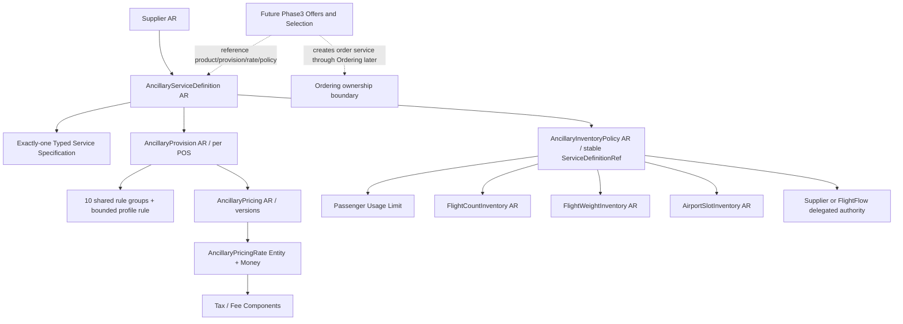

# 02 — Full aggregate graph and identity/lifecycle contracts

## 1. Canonical graph

## 2. Existing ARs retained (all current fields unless explicitly overridden)

| AR | Key / cardinality | Scalars (types; existing fields remain) | Owned children | lifecycle / immutability |
|---|---|---|---|---|
| `Supplier` | `Id:long` | existing FulfillmentKind, ProviderKey, Status, external supplier information | existing | unchanged |
| `AncillaryServiceDefinition` | `Id:long`; version key `(OwnerAirlineId:int,ServiceDefinitionRef:string(30),Version:int)`; one Active version per stable ref | `SupplierId:long`; `ServiceTypeCode:string(1)`, `ServiceSubCode:string(3)`, `SubCodeSource`, `GroupCode`, `SubGroupCode?`, `Description1Code?`, `Description2Code?`, `CommercialName:string(100)`, `Description:string(500)?`, `PricingUnit`, `ServiceDateBasis`, `SalesEffectiveFrom:DateOnly?`, `SalesDiscontinueOn:DateOnly?`, `Status`, UTC audit timestamps; **NEW `Profile:enum` + `Variant:enum within profile` + one typed `Specification`** | `BookingDefinition` / `DocumentDefinition` + `DocumentRouting` and typed spec | Draft editable; Active immutable; Revise creates new Draft version; Suspend/Retire; publication demands complete spec and reference validity |
| `AncillaryProvision` | `Id:long`; `ServiceDefinitionId:long` version-scoped; many per definition, different POS; unique applicable sequence per definition/POS/variant context | `Sequence:int>0`; `CoverageScope`, `PurchaseStage`, `QuantityRule`, `ApplicationType`, `Outcome`, `Settlement`, `Availability`, `Fulfillment`, `Status`, timestamps; **NEW `PriceOrigin` (invariant), `InputContract` profile-specific requirements, optional `FamilyRule`** | exactly existing ten Rule groups, plus narrow typed rule and selection requirements | Draft editable; Active immutable; Published validates pairing with exact version, real POS and typed semantics; no Price for Free/NotAvailable |
| `AncillaryPricing` | `Id:long`; 1..N version per Provision, <=1 Active | `AncillaryProvisionId`, `Version`, `PricingUnit`, Status, timestamps | `AncillaryPricingRate(1..N)` with typed `Money`, `AncillaryPriceComponent(0..N)` | already v12.1. Paid+Filed needs Active; Paid+ExternalQuote not forced to fake Active; Free/NotAvailable forbids active Pricing |
| `AncillaryInventoryPolicy` | `Id:long`, unique current `(OwnerAirlineId,ServiceDefinitionRef)` across Draft/Active/Suspended | `ServiceDefinitionId` diagnostic/version last validated; `CurrentServiceDefinitionId` read-only resolved; Authority, LocalPattern, ProviderKey, Version, Status, audit | `FlightCountConsumption?`, `FlightWeightConsumption?`, `AirportSlotConsumption?`, `PassengerUsageLimit[]` | no local source absent proof; current version selection rule preserved; immutable binding once active except supported suspend/revise/retire |
| `FlightCountInventory` | unique current `(OwnerAirlineId,FlightId,ResourceId)` | `CountUnit`, `TotalCapacity:int>=0`, `ClosedForSale`, Status, Version, RowVersion, audit | append-only CountAdjustments | optimistic concurrency; immutable physical key |
| `FlightWeightInventory` | unique current `(OwnerAirlineId,FlightId,WeightResourceId)` | `CapacityKg:decimal(18,3)>=0`, ClosedForSale, Status, Version, RowVersion, audit | append-only WeightAdjustments | commercial quota in kg, NOT aircraft payload safety |
| `AirportSlotInventory` | nonoverlapping current intervals `(OwnerAirlineId,AirportId,FacilityId,StartUtc,EndUtc)` | `CapacityPersons:int>=0`, ClosedForSale, Status, Version, RowVersion, audit | append-only SlotAdjustments | half-open UTC slots; transaction/locking prevents overlap |
| `AncillaryReservation` | existing | existing OrderId, IdempotencyKey, Reference, units, expiry, statuses | existing Unit has legacy `StockPoolId?` | **FROZEN Phase3; existing shallow Hold must not be called capacity allocation** |

## 3. Reuse unmodified existing VOs and rule rows
`BookingDefinition(Method, SsrCode?, SsimCode?, ConfirmationRequirement)`; `DocumentDefinition(Type, Rfic?, Rfisc?)`; `QuantityRule(Unit:Each|Piece|Kilogram, MinQuantity:int>=1, MaxQuantity:int>=Min)`; `CommercialOutcome(Paid|Free|NotAvailable + DocumentRequired/BookingRequired)`; `SettlementDefinition`, `AvailabilityDefinition`, `FulfillmentDefinition`.

Ten existing Rule Entity groups and their typed child rows: `PassengerEligibility` (PassengerTypes, AgeBands), `SalesRestrictions` (SalesEffectiveFrom/DiscontinueAt; POS; Customers; CustomerTypes), `Geography` (origin/destination/via; route pairs; service locations; countries), `FlightApplication` (carriers/flight number/FlightId/aircraft), `FareApplication` (AirFare/FareFamily/FareBasis/Cabin/RBD), `TravelDate` (permitted intervals & blackout), `DayTimeApplication` (weekday/time Allow/Deny), `AdvancePurchase` (minimum/maximum period and unit, same-time-as-ticketed), `BaggageApplication` (free/excess pieces, weight unit, travel/purchase application, ChargeKind, AllowanceConcept), `SeatApplication` (commercial seat-number/characteristic filters). Preserve types and numeric enum values from source; do not delete/rename the ten groups. They remain internal child Entity references, not extra ARs.

## 4. Aggregation invariants
- Cross-aggregate references by ID, not EF cross-root owned graph; no cyclic aggregate FK. Aggregate-scoped consistency in one local DB transaction.
- `Profile`/`Variant` immutable once a Definition version is Active. Revise may not mutate service family under same stable ref; new family => new stable ref (avoid type drift and wrong historical order lines).
- Current Definition selection: Active first, otherwise highest non-Retired for editing; Shopping P3 MUST require Active (not fallback Draft). P2 read can include diagnostic Draft statuses but cannot advertise sale.
- New `Specification` exactly once and matching `Profile` + `Variant` for Active. Legacy Draft can be migrated as `NeedsClassification`, blocked from activation until typed values available; never infer medical/pet settings from `Description` text.
- `Profile`/`Variant` are product characteristics, not dynamic per-buyer choice. Buyer values belong to `ServiceOffer`/`Selection` P3.
- `ServiceDateBasis`, `CoverageScope` and Price Unit must agree. Bound may cover multiple flight IDs but represent one billable service unit. No duplicate charging for each leg in a bound.
- One current InventoryPolicy per stable product ref; physical inventory keyed by resource, shared when actually same stock; no product counter cloning.

## 5. Minimized persistence of type differences
Preferred: **one compact owned profile-spec row per current spec type** with `AncillaryServiceDefinitionId` 1:0..1 FK and profile-specific typed columns; EF table splitting/owned JSON **not** used by default; explicit tables/relations simplify SQL queries and constraints. Within nested AssistedTravel variants, use variant-specific VO/owned child tables only when necessary; never one sparse `AncillaryServiceDefinitions` 100-column table. Published root checks exactly one allowed spec and zero others. No inheritance across AR classes; no `Dictionary<string,object>` or arbitrary Rules JSON.
