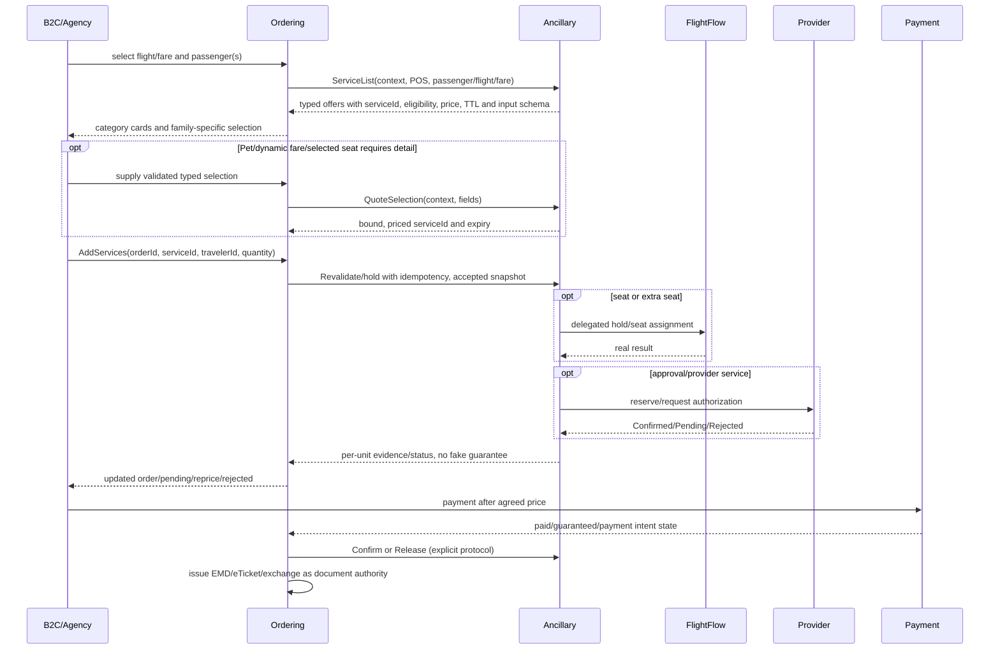

# 09 — Phase 3 complete design, **NO CODE AUTHORIZED in v12.2 implementation**

## Intent
Achieve the thin Lufthansa-style front contract while retaining a fully validated backend: 
`POST /one-booking/v2/purchase/orders/{orderId}/services?lastName=...` with
```json
{"services":[{"serviceId":"VAS.CO2.20-80","travelerId":"all","quantity":1}]}
```
is a **user-observed Lufthansa browser trace**, not proof all services are issued immediately. In AeroTech, external route belongs to Ordering/agency API boundary; `lastName` is NOT sufficient partner authentication and must NOT be adopted as a security model. Phase3 implementation is a later separate authorization.

## Future Shop/Order flow and ownership


## A. Shopping / ServiceList logical contract
**Owner:** Ancillary provides eligibility/price/authorization facts to Ordering. Agency-facing API can hide internal calls. Future `POST /ancillary/v1/service-list` (internal logical semantics only) request:
```
OrderOrOfferRef, OwnerAirlineId, POS/ActorScope, CurrencyId,
Travellers[{Ref,PTC,Age}], FlightOccurrences[{Ref,Carrier,Airport,Date,Aircraft}],
FareSnapshot[{Traveller/Flights,FareBasis,Cabin,RBD,FareFamily}], JourneyBoundRefs,
PurchaseStage, QuoteAtUtc, optional requestedFamilies.
```
Response an `AncillaryServiceOffer[]`, each:
```
ServiceOfferId:string opaque unique, ServiceDefinitionRef, DefinitionVersionId, ProvisionId,
Profile, Variant, Eligibility (covered traveller+flight/bound), SelectionKind,
SelectionRequirements[] closed typed metadata, AllowedQuantity(min/max), UnitPrice:Money? or QuoteRequired,
PricingRevisionId?, PriceMode, RequiredConfirmationMode,
InventoryState (NOT same as fulfilment), SourceProviderRef?, DocumentPolicy,
OfferExpiryUtc, ContextHash/Version; never expose internal PII in ID.
```
**Offer `serviceId` is bound to** active Definition version, specific matching Provision/POS, traveller(s), flights/bound, price/currency/taxes, quantity constraints, supplier quote when relevant, authorization, expiration. Generate short-lived server-stored or tamper-protected opaque ref; no mutable SKU can be used as bearer authority. No price from client.

## B. Product-specific customer selection
- `SimpleOptIn`: Priority, CO2, free assistance; Buyer only chooses offer/traveller(s)/qty.
- `QuantityChoice`: Baggage 0..6 stepper; *0 means no POST*, accepted quantity >0, cumulative cap after existing orders; unit Kg is not package count.
- `TypedForm`: Pet Cat/Dog+kg+dims/docs, UMNR guardian details, medical evidence refs, Airport venue/time/guests; send to `QuoteSelection` / Validation API to bind values to final service offer before Add. Buyer values never added as a Spec column.
- `SeatMapSelection`: precise seat, traveller+flight, flight provider availability; seat group offer quote bound to actual seat assignment.
- `ExternalQuote`: Upgrade, insurance-style third-party products; supplier quote with currency, expiry, approval and `SourceProviderRef`; refused if no reliable quote.
- `MultiFlightBound`: Rail&Fly/UMNR, one billed service association across `[ST1,ST2]` when permitted. Do not charge for each linked segment.

## C. Thin public `Add Services` request
```http
POST /orders/{orderId}/services
Authorization: Bearer <agency-token>
Idempotency-Key: <unique-request-key>
If-Match: <order-version>
Content-Type: application/json
```
```json
{"services":[{"serviceId":"offer-co2-v24","travelerId":"all","quantity":1}]}
```
**Exactly three fields per line** sufficient if quote/selection bound beforehand. `travelerId=all` only if offer explicitly grants all travellers and can be expanded; quantity-per-traveller semantics unambiguous. Some providers instead require a `selectionRef` issued during input capture; this is encapsulated *inside* the `serviceId` token resolution, not a 50-field public Add DTO. If quote missing, error `SelectionRequired`; do not treat such a SKU as valid offer.

Response example (illustrative):
```json
{"orderId":"o-123","orderVersion":"v10","services":[
 {"orderServiceId":"os-1","travelerId":"PT1","status":"PendingPayment","quantity":1},
 {"orderServiceId":"os-2","travelerId":"PT2","status":"PendingPayment","quantity":1}]}
```
Not every service is `PendingPayment`: Free SSR may be `PendingConfirmation`, rejected/unavailable before add or confirmed only with evidence. **Add != Held != ProviderConfirmed != Paid != EMD Issued.** Ordering decides final response contract and owns order mutation. Future ACL must perform version check, idempotency, revalidation, payment separation and retry/partial failure handling.

## D. Reservation protocol needed for real Phase3
Future `AncillaryReservation` must evolve beyond current shallow Held root. Future VOs/Entities designed (do not create now):
- `ReservationIntent`: `OrderId`, `OrderServiceId`, `OfferId`, `TravellerId`, `Coverage`, `Quantity`, `AcceptedPriceSnapshot`, `ProviderKey`, `IdempotencyKey`, TTL.
- `CapacityAllocation`: `ReservationUnitId`, typed `ResourceKind`, `ResourceId`, flight or slot, `UnitsConsumed`, `AllocationStatus`, unique correlation, expiry; **only** from trusted source.
- `ProviderReservation`: request ID, supplier key, evidence, Pending/Confirmed/Rejected/Expired, external ref, audit and retry state.
- `ReservationUnitStatus`: Requested, HeldWithEvidence, PendingSupplier, Confirmed, Rejected, Released, Expired with explicit finite state transitions, no Held false guarantee.
- Counter invariants: `ActiveHeld + Confirmed <= ConfiguredTotal` for a real source, with SQL lock/version and exactly-once allocation; 100 parallel holds capacity=1 => 1 success, 99 failed, different correlation must not double reserve. Cancel/refund and reissue/EMD are independently traced and idempotent.
- `Hold` for `SupplierManaged` must honor provider confirmation/restrictions; `FlightFlowManaged` calls FlightFlow for seat occupancy; `Unlimited+check` cannot report guaranteed without provider result.
- `Confirm`, `Release`, `Expire`, retries are idempotent; outbox/inbox as appropriate to existing framework (not invented in P1/P2); mixed supplier partial success returns per-unit statuses.

**Existing P3 slice reality:** current `HoldAncillaryServicesService.NewHoldAsync` verifies referenced Definition, Provision, Supplier and uniqueness then persists a Held AR. It does not decrement FlightCount/FlightWeight/Slot, call provider approval or create real allocation. Existing `StockPoolId?` legacy is not an active resource binding. Therefore **never connect this endpoint to live B2C/agency as a truthful capacity guarantee before an authorized P3 rewrite**.

## E. Documentation and issuance ownership
Ordering is source of truth for `Order`, `OrderItem`, `OrderService`, ticket/EMD/coupons and accepted price snapshot. Ancillary supplies published Document policy and fulfilment evidence, not issuance itself. EMD-A associated service vs EMD-S standalone depends on industry source and ticket association; EXST/Upgrade may involve an eTicket or exchange, not automatically EMD. Issue only after appropriate payment/guarantee and successful confirmation. Refund/void/release independently modelled with original order history immutable.

## F. Explicit no-implementation / readiness tests
Documentation tests now: P3-D01..D18 contract completeness, 24 variant buyer schemas, offer binding fields, state-machine transition table and error codes. Runtime `ServiceList`, Add/Modify Order, supplier Hold/Confirm, authoritative Stock, EMD **deferred** until a new Stage3 request and fresh authority check. No dummy implementations and no API endpoint stubs advertised as working production shopping.

## G. External patterns we actually observed
- LH owner-supplied POST exemplifies thin JSON but does **not** prove a single post issues EMD.
- Condor NDC 21.3 `/shopping/serviceList` returns eligible ALaCarteOfferItems; `/shopping/seatmap` separate; `/offer/price` final pricing; `/order/changeInquiry` may preview without changing order; `/order/change` applies changes. (official docs, see 15.)
- flydubai OTA modify sequence uses Ancillary API (bags/meals), Seat API + optional hold/assign, ModifyPNR and commit/payment as separate steps (official docs).
