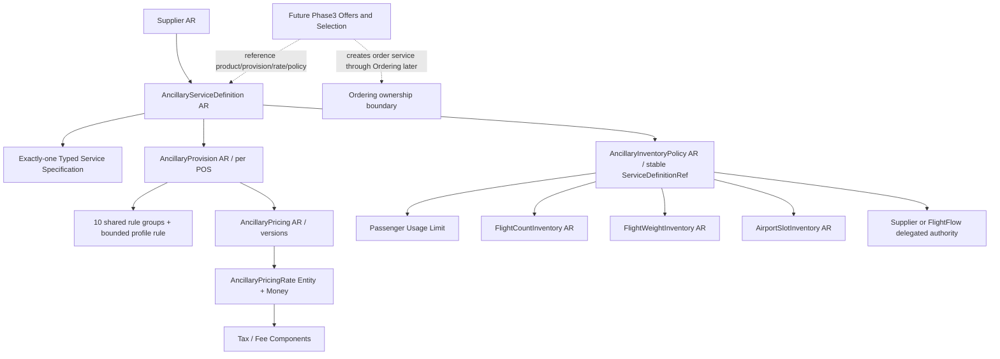
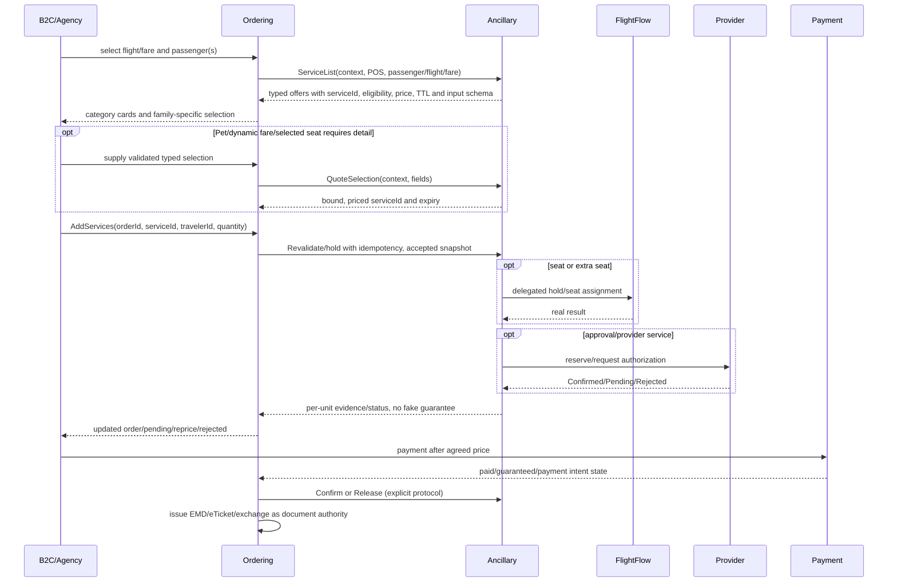

# AeroTech Ancillary v12.2 — COMPLETE implementation authority

**Phase 1+2 rebuild executable; Phase 3 design only.**

**Contents:**
- [00-START-HERE-AND-AUTHORITY.md](#00-start-here-and-authority)
- [01-CLOSED-ADR-AND-IMPLEMENTATION-STRATEGY.md](#01-closed-adr-and-implementation-strategy)
- [02-DOMAIN-GRAPH-IDENTITIES-AND-LIFECYCLES.md](#02-domain-graph-identities-and-lifecycles)
- [03-TYPED-SPECIFICATION-AND-FIELD-DICTIONARY.md](#03-typed-specification-and-field-dictionary)
- [04-A01-A24-AUTHORING-PRICE-CAPACITY-SCENARIOS.md](#04-a01-a24-authoring-price-capacity-scenarios)
- [05-PROVISION-ELIGIBILITY-LIMITS-AND-SELECTION-CONTRACT.md](#05-provision-eligibility-limits-and-selection-contract)
- [06-PRICING-FX-FEES-AND-DOCUMENT-RULES.md](#06-pricing-fx-fees-and-document-rules)
- [07-INVENTORY-CAPACITY-PASSENGER-LIMITS.md](#07-inventory-capacity-passenger-limits)
- [08-BACKOFFICE-COMMANDS-QUERIES-AND-UI-UX.md](#08-backoffice-commands-queries-and-ui-ux)
- [09-PHASE3-FUTURE-DESIGN-ONLY.md](#09-phase3-future-design-only)
- [10-SQL-MIGRATION-COMPATIBILITY-AND-ROLLBACK.md](#10-sql-migration-compatibility-and-rollback)
- [11-TEST-TRACEABILITY-MATRIX-AND-RELEASE-GATES.md](#11-test-traceability-matrix-and-release-gates)
- [12-NEGATIVE-AND-STRESS-JOURNEYS.md](#12-negative-and-stress-journeys)
- [13-BASELINE-SOURCE-DELTA-AND-STOP-CONDITIONS.md](#13-baseline-source-delta-and-stop-conditions)
- [14-CODING-AGENT-FULL-IMPLEMENTATION-PROMPT.md](#14-coding-agent-full-implementation-prompt)
- [15-BENCHMARK-AND-SOURCE-TRACEABILITY.md](#15-benchmark-and-source-traceability)
- [16-NEXT-CHAT-CONTINUATION-PROMPT.md](#16-next-chat-continuation-prompt)
- [17-ENUM-VALUES-EXISTING-RULE-CATALOG-AND-DOCUMENT-ROUTING.md](#17-enum-values-existing-rule-catalog-and-document-routing)

---

<a id="00-start-here-and-authority"></a>
<!-- BEGIN 00-START-HERE-AND-AUTHORITY.md -->

# AeroTech Ancillary v12.2 — Master Domain & Implementation Authority

**Status:** APPROVED ARCHITECTURAL DIRECTION; executable specification for rebuilding and fully implementing **Phase 1 + Phase 2** on the existing Ancillary solution. **Phase 3 is architecturally designed here but NOT authorized to implement.** Date: 2026-10-09.

## 1. Non-negotiable mission
Build the *smallest real airline-credible Ancillary Domain* that can **author, validate, publish, price/configure capacity and retrieve configuration for ALL 24 primary airline scenarios A01–A24** before Phase 3. Leave a clean foundation for shopping, passenger-specific offers, reserve, Order change and EMD after this stage. No decorative empty profiles, TODO-only entities, fake capacity, provider guarantees or claim that a tested fixture means real fulfilment.

Target: `https://github.com/aliifarhadi/AeroTech.Ancillary`, branch `feat/ancillary-v12.1-phase2-stock` (Agent shall branch for v12.2 from reviewed SHA `e23ba293b2578362005840967c3c07aa77dbd174` after checking actual HEAD, with no silent rebase). Baseline `k8s-stg@933b7b7a793b426dbcb6362bbf8519886edf9080` carries the merged v12.1 Phase1; feature branch contains Phase2 and pricing rewrites plus Lufthansa samples. **If HEAD advanced, Agent first produces changed-file impact diff then proceeds only with compatible delta.**

## 2. Authority order and scope
1. **This v12.2 pack**, ADR + field contracts + scenarios + invariants + conformance matrix (normative for changes).
2. Current airline business/industrial contract and valid external codes where v12.2 does not replace them.
3. Current repo code (reuse patterns, solution structure, framework, error handling); do not duplicate.
4. v12.1 packs/older donors ONLY for historical behavior/source tracing; v12.2 replaces conflicting provisions.

Scope **inside Ancillary repository only**: Supplier (preserve), ServiceDefinition, Provision and its rule groups, Pricing, InventoryPolicy, FlightCountInventory, FlightWeightInventory, AirportSlotInventory, CommandDb/QueryDb, Backoffice DTO/handlers, solution-owned enums/contracts, migrations and tests. Retain v12.1 domain conventions, existing IDs and lifecycle. Preserve the existing AncillaryReservation/Phase3 slice, except a strictly unavoidable compile-only change that must be justified; do NOT make any Hold/Confirm/Release semantics appear production-capable.

**No changes** to AirAvail, AirOffer, AirPrice, FlightFlow, Ordering, JetPay, AirInfo, other repositories or their contracts. No real Shopping/ServiceList, OrderChange, payment, allocation, reserve/confirm/release/expire, fulfilment, eTicket/EMD emission or new distributed infrastructure in Phase1+2 work. Model Phase3 *interfaces and examples only*, with separate future approval gate.

## 3. Three deliverables and strict meaning of DONE
- P1: Every A01–A24 carrier-admin authoring scenario has typed schema, valid lifecycle, applicable Provision and price policy; query/DTO round trip and rejection of wrong-family fields. Free/NotAvailable/paid/external-quote cases represented correctly. All 10 existing shared Provision rule groups preserved.
- P2: Explicit inventory authority/binding and its actual evidence; Count/Weight/Slot configuration + adjustments/locking/audit; purchase/usage limits not confused with physical stock; unavailable sources not silently mapped to Unlimited/Guaranteed; each A01–A24 has a truthful configuration snapshot and domain tests.
- P3: Complete **design only** of Offer/Selection/AddService/Reserve/Confirm/Release/Issue interfaces and invariants compatible with a minimal Lufthansa-like external API. **Do not code P3.**

Accept P1+2 only with SQL Server integration tests, migration dry-runs, real HTTP Backoffice smoke, all scenario tests and complete gap register. `PASS_DOMAIN` and `BLOCKED_PROVIDER_SOURCE` are distinct statuses. No unilateral Agent push/merge/deployment; stop at Owner audit and submit report. The previous Currency Reference defect is a real external source issue: do not adjust AirInfo or fake currency decimals in production.

## 4. Reading order
`01-DECISIONS` → `02-DOMAIN-GRAPH-AND-LIFECYCLES` → `03-PROFILES-AND-TYPED-FIELDS` → `04-24-SCENARIOS` → `05-PROVISION` → `06-PRICING` → `07-INVENTORY` → `08-BACKOFFICE` → `09-PHASE3-BLUEPRINT` → `10-PERSISTENCE-MIGRATIONS` → `11-CONFORMANCE` → `12-STRESS` → `13-CODE-AUDIT-DELTA` → `14-AGENT-PROMPT` → `15-TRACEABILITY` → `16-CONTINUATION` → `17-ENUMS-AND-RULE-ROWS`.

## 5. Definition of evidence
- **LH-S:** exact three `samples/lufthansa-*.json` files in branch (sample data, not internal Lufthansa database design); owner-provided screenshots and observed POST request.
- **PUBLIC:** official API/public policy docs specified in `15-TRACEABILITY` (prove commercial and wire behavior, not internal aggregate graph).
- **DESIGN:** AeroTech design decision to implement the supported behavior with minimal invariants; not claimed as an identical Lufthansa/Sabre internal implementation.
- **DEFERRED_P3 / BLOCKED_REFERENCE:** no fabricated PASS or guaranteed capacity.

<!-- END 00-START-HERE-AND-AUTHORITY.md -->

---

<a id="01-closed-adr-and-implementation-strategy"></a>
<!-- BEGIN 01-CLOSED-ADR-AND-IMPLEMENTATION-STRATEGY.md -->

# 01 — CLOSED architecture decision register

| ID | Binding decision | Reason and boundary |
|---|---|---|
| ADR-01 | **One `AncillaryServiceDefinition` AR**, **one `AncillaryProvision` AR type**, **one `AncillaryPricing` AR type**, existing `Supplier` and typed source Inventory roots. **No inheritance tree of 24 ARs.** | Same identity/version/publication/eligibility/price invariants; independent category ≠ independent transaction boundary. |
| ADR-02 | **9 closed behavior profiles**: `Baggage`, `Seat`, `Upgrade`, `Meal`, `Pet`, `AssistedTravel`, `AirportService`, `Priority`, `Connectivity`; each has a closed Variant code. The 24 scenarios map to variants. | Typed controls without EAV/JSON/free-form script engine; nine ≠ nine new roots. |
| ADR-03 | **One profile discriminator + exactly one matching typed specification** (owned VO or owned child), optional only for legacy Draft data; Active v12.2 requires fully populated matching spec. Reject foreign profile fields. | Invalid states cannot publish. Reuse existing Baggage/Seat fields where possible, do not fork them into conflicting sources. |
| ADR-04 | Shared commercial eligibility remains 10 existing Rule entities on `AncillaryProvision`. Profile-specific rule fields only if genuinely based on provision context; immutable product characteristics belong in specification. | No 24 copies of PassengerEligibility/SalesRestrictions. |
| ADR-05 | **Different Provision per POS** (owner decision). No POS selector on Pricing Rate. One explicitly linked POS per published provision; when channel-wide behavior is intended use separate well-defined POS identity, not implicit "all". | Prevent cross-POS leakage and hidden rate selection. |
| ADR-06 | `AncillaryPricingRate + Money + Tax/Fee components` v12.1 remains. Add explicit `PriceOrigin = Filed|ExternalQuote|Free|NotAvailable` at Provision level with invariant vs existing CommercialOutcome; *do not add a second contradictory outcome state machine*. `Paid+ExternalQuote` requires authoritative quote in P3 and **no fake filed rate**. | Dynamic upgrade/provider pricing without inventing arbitrary static prices. Maintain Paid/Free/NotAvailable semantics. |
| ADR-07 | **Four independent concepts**: per-selection UI cap; cumulative passenger entitlement; physical resource capacity; offer/fulfilment approval state. `QuantityRule` must permit a UI initial `0` yet accepted purchase units `>=1`; do not set `MinQuantity=0` to manufacture this. | LH `IBAG 0..6` is a UI stepper; Add with 0 is no-op/not a sold unit. |
| ADR-08 | **Coverage** is a typed scope `Sector / Bound / Journey / Order / ServiceOccurrence` conceptually. Reuse existing enum numerics, extend only when not expressible with compatible migration; no assumption that a multi-segment bound is several chargeable items. | LH `RLFY` multi-flight association; no duplicated per-segment charge. |
| ADR-09 | Inventory authority is `Unlimited|Supplier|FlightFlow|Local`, with Local typed `FlightCount`, `FlightWeight`, `AirportSlot` and documented Count+Weight composition. Airline does not invent baggage allowance as physical stock. Seat/EXST always FlightFlow. | No universal StockPool; no quota inferred from category. |
| ADR-10 | Keep `PassengerUsageLimit` and add smallest **Portion-scoped** cumulative purchase limit if missing; exactly one sharing family/identity and Scope. No cross-order ledger until P3. Policy stores config only; evidence dependent on source. | LH max IBAG stepper vs cross-order commercial cap distinct. |
| ADR-11 | **Customer selection definition** is typed **metadata schema** in P1 (what input must be provided and validated), not storage of a buyer's particular `Cat`, weight, seat or guardian in Provision. Runtime selected values and durable accepted snapshots are P3. | Metadata/instance separation; future API can be 3 fields with resolved offer. |
| ADR-12 | **9 Backoffice templates** share header, eligibility, pricing, capacity, lifecycle; only relevant profile/variant fields shown. Use same backend aggregate/application services and typed input DTOs; distinct pages without duplicated backends. | Cost and operational simplicity. |
| ADR-13 | Supplier confirmation and resource acceptance may be Pending/Unknown; `Unlimited` means no LOCAL finite counter, **not guaranteed**. A free WCHR may require approval; per-flight PETC may have a proven quota. | LH `quotaStatus` distinct from capacity; P2 cannot claim confirmation. |
| ADR-14 | `serviceId` on shopping API denotes **an offer/selection reference scoped to Order/Offer, passenger, flight, POS, price, TTL and typed selection**; never bare `ServiceDefinitionId` and never trusting client price. | Lufthansa thin POST only safe after richer offer context. |
| ADR-15 | **Ordering owns Order mutation / payment / Ticket & EMD**, Ancillary owns its commercial facts and future evaluator/reservation, FlightFlow owns seats. No other-service changes in P1/P2. | Conforms current project boundary. |
| ADR-16 | **v12.2 replaces conflicting v12.1 documents but not all code wholesale.** Smallest correct diff, expand/migrate/verify/contract cleanup, no data wiping without explicit new Owner instruction, frozen Phase3 implementation. | Avoid rebuilding framework and unnecessary migration risk. |
| ADR-17 | No `MedicalRecord`/`Guardian` actual PII in product configuration; only field requirements and policy. Minimal personal fields in future operational request with retention/security design. | Do not leak passenger secrets into Catalog. |

## Key design distinction
- A `ServiceDefinition` is **what can be sold/requested**.
- A `Provision` determines **to whom/where/when/in what bounded quantity** and Free/Paid/etc.
- A `Pricing` is **filed prices** or an explicit external quote policy, not a duplicate pricing engine.
- A `CapacityPolicy` decides **who controls availability and what is consumed**; a named service code does not mean it has a physical counter.
- A `SelectionContract` describes **required input at purchase time**, but stores no actual shopper data until P3.
- A `ServiceOffer` in future P3 is a **short-lived accepted context token**, not a catalog SKU.

## No-overengineering constraints
No aggregate base-class inheritance tree, 24 repositories/controllers, arbitrary JSON/EAV, configurable expressions, general workflow engine, bespoke 24 price engines, local seat stock, seat-map clone, imaginary dynamic quote source, fake `guaranteed`, or changing other repositories. For type-specific P1/2 use explicit narrow VOs and `switch` at variant dispatch with exhaustive validation; if type switch becomes large, move to a profile-specific validator, not an aggregate split.

<!-- END 01-CLOSED-ADR-AND-IMPLEMENTATION-STRATEGY.md -->

---

<a id="02-domain-graph-identities-and-lifecycles"></a>
<!-- BEGIN 02-DOMAIN-GRAPH-IDENTITIES-AND-LIFECYCLES.md -->

# 02 — Full aggregate graph and identity/lifecycle contracts

## 1. Canonical graph


## 2. Existing ARs retained (all current fields unless explicitly overridden)

| AR | Key / cardinality | Scalars (types; existing fields remain) | Owned children | lifecycle / immutability |
|---|---|---|---|---|
| `Supplier` | `Id:long` | existing FulfillmentKind, ProviderKey, Status, external supplier information | existing | unchanged |
| `AncillaryServiceDefinition` | `Id:long`; version key `(OwnerAirlineId:int,ServiceDefinitionRef:string(30),Version:int)`; one Active version per stable ref | `SupplierId:long`; `ServiceTypeCode:string(1)`, `ServiceSubCode:string(3)`, `SubCodeSource`, `GroupCode`, `SubGroupCode?`, `Description1Code?`, `Description2Code?`, `CommercialName:string(100)`, `Description:string(500)?`, `PricingUnit`, `ServiceDateBasis`, `SalesEffectiveFrom:DateOnly?`, `SalesDiscontinueOn:DateOnly?`, `Status`, UTC audit timestamps; **NEW `Profile:enum` + `Variant:enum within profile` + one typed `Specification`** | `BookingDefinition` / `DocumentDefinition` + `DocumentRouting` and typed spec | Draft editable; Active immutable; Revise creates new Draft version; Suspend/Retire; publication demands complete spec and reference validity |
| `AncillaryProvision` | `Id:long`; `ServiceDefinitionId:long` version-scoped; many per definition, different POS; unique applicable sequence per definition/POS/variant context | `Sequence:int>0`; `CoverageScope`, `PurchaseStage`, `QuantityRule`, `ApplicationType`, `Outcome`, `Settlement`, `Availability`, `Fulfillment`, `Status`, timestamps; **NEW `PriceOrigin` (invariant), `InputContract` profile-specific requirements, optional `FamilyRule`** | exactly existing ten Rule groups, plus narrow typed rule and selection requirements | Draft editable; Active immutable; Published validates pairing with exact version, real POS and typed semantics; no Price for Free/NotAvailable |
| `AncillaryPricing` | `Id:long`; 1..N version per Provision, <=1 Active | `AncillaryProvisionId`, `Version`, `PricingUnit`, Status, timestamps | `AncillaryPricingRate(1..N)` with typed `Money`, `AncillaryPriceComponent(0..N)` | already v12.1. Paid+Filed needs Active; Paid+ExternalQuote not forced to fake Active; Free/NotAvailable forbids active Pricing |
| `AncillaryInventoryPolicy` | `Id:long`, unique current `(OwnerAirlineId,ServiceDefinitionRef)` across Draft/Active/Suspended | `ServiceDefinitionId` diagnostic/version last validated; `CurrentServiceDefinitionId` read-only resolved; Authority, LocalPattern, ProviderKey, Version, Status, audit | `FlightCountConsumption?`, `FlightWeightConsumption?`, `AirportSlotConsumption?`, `PassengerUsageLimit[]` | no local source absent proof; current version selection rule preserved; immutable binding once active except supported suspend/revise/retire |
| `FlightCountInventory` | unique current `(OwnerAirlineId,FlightId,ResourceId)` | `CountUnit`, `TotalCapacity:int>=0`, `ClosedForSale`, Status, Version, RowVersion, audit | append-only CountAdjustments | optimistic concurrency; immutable physical key |
| `FlightWeightInventory` | unique current `(OwnerAirlineId,FlightId,WeightResourceId)` | `CapacityKg:decimal(18,3)>=0`, ClosedForSale, Status, Version, RowVersion, audit | append-only WeightAdjustments | commercial quota in kg, NOT aircraft payload safety |
| `AirportSlotInventory` | nonoverlapping current intervals `(OwnerAirlineId,AirportId,FacilityId,StartUtc,EndUtc)` | `CapacityPersons:int>=0`, ClosedForSale, Status, Version, RowVersion, audit | append-only SlotAdjustments | half-open UTC slots; transaction/locking prevents overlap |
| `AncillaryReservation` | existing | existing OrderId, IdempotencyKey, Reference, units, expiry, statuses | existing Unit has legacy `StockPoolId?` | **FROZEN Phase3; existing shallow Hold must not be called capacity allocation** |

## 3. Reuse unmodified existing VOs and rule rows
`BookingDefinition(Method, SsrCode?, SsimCode?, ConfirmationRequirement)`; `DocumentDefinition(Type, Rfic?, Rfisc?)`; `QuantityRule(Unit:Each|Piece|Kilogram, MinQuantity:int>=1, MaxQuantity:int>=Min)`; `CommercialOutcome(Paid|Free|NotAvailable + DocumentRequired/BookingRequired)`; `SettlementDefinition`, `AvailabilityDefinition`, `FulfillmentDefinition`.

Ten existing Rule Entity groups and their typed child rows: `PassengerEligibility` (PassengerTypes, AgeBands), `SalesRestrictions` (SalesEffectiveFrom/DiscontinueAt; POS; Customers; CustomerTypes), `Geography` (origin/destination/via; route pairs; service locations; countries), `FlightApplication` (carriers/flight number/FlightId/aircraft), `FareApplication` (AirFare/FareFamily/FareBasis/Cabin/RBD), `TravelDate` (permitted intervals & blackout), `DayTimeApplication` (weekday/time Allow/Deny), `AdvancePurchase` (minimum/maximum period and unit, same-time-as-ticketed), `BaggageApplication` (free/excess pieces, weight unit, travel/purchase application, ChargeKind, AllowanceConcept), `SeatApplication` (commercial seat-number/characteristic filters). Preserve types and numeric enum values from source; do not delete/rename the ten groups. They remain internal child Entity references, not extra ARs.

## 4. Aggregation invariants
- Cross-aggregate references by ID, not EF cross-root owned graph; no cyclic aggregate FK. Aggregate-scoped consistency in one local DB transaction.
- `Profile`/`Variant` immutable once a Definition version is Active. Revise may not mutate service family under same stable ref; new family => new stable ref (avoid type drift and wrong historical order lines).
- Current Definition selection: Active first, otherwise highest non-Retired for editing; Shopping P3 MUST require Active (not fallback Draft). P2 read can include diagnostic Draft statuses but cannot advertise sale.
- New `Specification` exactly once and matching `Profile` + `Variant` for Active. Legacy Draft can be migrated as `NeedsClassification`, blocked from activation until typed values available; never infer medical/pet settings from `Description` text.
- `Profile`/`Variant` are product characteristics, not dynamic per-buyer choice. Buyer values belong to `ServiceOffer`/`Selection` P3.
- `ServiceDateBasis`, `CoverageScope` and Price Unit must agree. Bound may cover multiple flight IDs but represent one billable service unit. No duplicate charging for each leg in a bound.
- One current InventoryPolicy per stable product ref; physical inventory keyed by resource, shared when actually same stock; no product counter cloning.

## 5. Minimized persistence of type differences
Preferred: **one compact owned profile-spec row per current spec type** with `AncillaryServiceDefinitionId` 1:0..1 FK and profile-specific typed columns; EF table splitting/owned JSON **not** used by default; explicit tables/relations simplify SQL queries and constraints. Within nested AssistedTravel variants, use variant-specific VO/owned child tables only when necessary; never one sparse `AncillaryServiceDefinitions` 100-column table. Published root checks exactly one allowed spec and zero others. No inheritance across AR classes; no `Dictionary<string,object>` or arbitrary Rules JSON.

<!-- END 02-DOMAIN-GRAPH-IDENTITIES-AND-LIFECYCLES.md -->

---

<a id="03-typed-specification-and-field-dictionary"></a>
<!-- BEGIN 03-TYPED-SPECIFICATION-AND-FIELD-DICTIONARY.md -->

# 03 — Authoritative typed profiles, variant identifiers and field-level contracts

## 0. Type discipline (mandatory)
The named records below are **specification value objects/owned children**, never 24 independent ARs. Define `AncillaryProfile` enum with explicit stable numeric values: Baggage=1, Seat=2, Upgrade=3, Meal=4, Pet=5, AssistedTravel=6, AirportService=7, Priority=8, Connectivity=9. Define `ServiceVariant` stable codes A01..A24 in a typed source-controlled catalog, **not 24 additional domain aggregates**. `Definition.Profile` must equal `Variant.Profile`. Do not reuse numeric enum values of pre-existing `ProvisionApplicationType` (Standard=1,Baggage=2,Seat=3). Prefer typed code `ServiceVariantCode:string(8)` for future extensibility with a closed v12.2 registry; strong VO validates membership before creation. Carrier-defined new variants require code + typed contract registration, not a dynamic rules engine.

All types below specify fields **owned by airline authoring**. `?` means optional with exact context-dependent activation rules, NOT `null` because unfinished feature. Monetary fields ALWAYS in Pricing and not duplicated in Spec. `OffsetDateTime` means DateTimeOffset UTC canonical time; dimensions in decimal centimeters (18,3) with positive components; `WeightKg:decimal(18,3)`; durations in positive minutes/hours. Existing global AirportId/CabinId/Fare ids reused; don't create parallel catalog entities.

### 1. Baggage (A01–A06)
`BaggageSpecification` one per Definition:
| Member | Type | Mandatory when | Invariant |
|---|---|---|---|
| `ChargeKind` | **existing** `ExtraPiece|WeightPackage|Overweight|Oversize|SpecialEquipment` | always | A05 CabinBag uses Variant=A05 + ExtraPiece, not a new numeric ChargeKind value; preserve existing values 1–5 |
| `AllowanceConcept` | `Piece|Weight` | A01,A02,A05 | No global assumed Piece/Weight; actual fare/route authority at evaluation |
| `PackageWeightKg` | decimal(18,3)? | A02 | >0; e.g. 5kg,10kg sold as `PerItem`; choose units explicitly |
| `MaxKgPerPiece` | decimal(18,3)? | A01,A03,A04,A05,A06 when advertised | Max actual physical piece limit, not capacity |
| `WeightFromExclusiveKg / WeightToInclusiveKg` | decimal? | A03 | coherent positive bracket; exact acceptance based on measured baggage |
| `MaxSize` | `DimensionsCm?` | A04/A05/A06 when advertised | positive L/W/H; if linear-sum constraint also used see `MaxLinearSumCm` |
| `MaxLinearSumCm` | decimal? | A04/A06 if airline terms use linear dimensions | >0; do not confuse with individual dimensions |
| `EquipmentKind` | enum/code? | A06 | Valid industrial code or carrier-defined whitelisted kind (BIKE/SKI/GOLF/etc.) |
| `BaggageChargeCombination` | `Separate|Combined|MutuallyExclusive`? | A03/A04 when overlapping | Avoid charging overweight+oversize twice unless actual airline rule explicitly permits it |

Keep existing `ProvisionBaggageApplicationRule` for conditions (FreePieces, excess piece ordinal ranges, TravelApplication, PurchaseApplication, RuleDeference, applicable weight/charge kind); **single commercial source** for `ChargeKind` is Spec; existing Provision `ChargeKind` must be treated as a bounded override only if evidenced and with equality/explicit predicate, otherwise migrate/derive, not duplicate editable fields. `FirstExcessPiece`/`LastExcessPiece` permit different filed prices for first/second/etc.; owner approved separate POS provisions. External base Fare allowance is resolved at future Offer time, not manually re-filed as inferred number from SKU label. `QuantityRule` applies to purchased units per selection, not remaining aircraft capacity.

### 2. Seat (A07–A09)
`SeatSpecification`:
| Member | Type | Rule |
|---|---|---|
| `SeatPurpose` | `Standard|Preferred|ExtraSeat` | required; A07/A08/A09 |
| `SeatCharacteristicCodes` | `set<string(25)>` | optional for Standard, required for Preferred when category defined |
| `ApplicableCabinIds` | `set<int>` | eligible cabin, if restricted |
| `RequiresExitRowEligibility` | bool | true only if exit-row option |
| `RequiresAdjacentSeat` | bool | A09 only when selling an adjacent extra seat |
| `ExtraSeatPurpose` | `PassengerComfort|CabinBaggage`? | A09 required |
| `ExtraOccupiedSeatCount` | int? | A09 >=1; actual available seats checked by FlightFlow in P3 |
| `RequiresExternalTicketAction` | bool | A09 true when airline EXST/CBBG document policy requires ticketing rather than EMD; no actual Ticket issued in P1/2 |

Reuse ProvisionSeatApplicationRule (seat characteristics / number filters). **Do not store seat occupancy or seat-map availability in Ancillary**. Cabin upgrade is NOT SeatSpec; A10 below.

### 3. Upgrade (A10)
`UpgradeSpecification`: `FromCabinId:int`, `ToCabinId:int`, `AllowedUpgradeKind:FixedAncillary|DynamicQuote|TicketReprice`, `RequiresTicketExchange:bool` (policy derived from documented issuer contract; if unknown mark RequiresExternalQuote rather than fake EMD), `EligibleFareFamilyIds:set<long>`. `FromCabinId != ToCabinId` and class hierarchy validation from real cabin reference; no local flight seats. Dynamic quote mode uses `PriceOrigin=ExternalQuote` and requires trusted provider quote later; no 0.00 amount in `AncillaryPricingRate`.

### 4. Meal (A11–A12)
`MealSpecification`: `MealKind:SpecialRequest|PaidPreorder`, `MealCode:string(4)?` (mandatory for standardized SSR meal), `MenuItemRef:string(40)?` (mandatory paid menu SKU), `DietaryCode:string(20)?`, `CateringLeadTimeMinutes:int>=0`, `ExclusiveMealFamilyCode:string(30)?` (one selection per traveller/segment if configured). Menu variants are separate Definition versions/products where meaning/price differs, not generic arbitrary form JSON. Free SSR A11 uses `PriceOrigin=Free`; A12 filed paid (or supplier quote with explicit origin). Catering supplier checks are not physical stock unless backed by verified allotment.

### 5. Pet (A13–A14)
`PetSpecification`:
| Member | Type | Rule |
|---|---|---|
| `TransportMode` | `Cabin|Hold` | required |
| `AllowedAnimalTypes` | non-empty set `Cat|Dog|RegisteredOther(code)` | country/route restrictions via Provision; real carrier code validated |
| `MaxCombinedWeightKg` | decimal(18,3) | >0; include carrier when the product specifies combined limit |
| `CarrierDimensionsMaxCm` | `DimensionsCm` | every component >0 |
| `MinAnimalAgeWeeks` | int? | >=0; route-specific exception in Provision via explicit typed override |
| `RequiredDocumentCodes` | set<string(30)> | nonempty if travel terms require; codes are airline-approved documentation types |
| `AllowedHoldAnimalSizeBrackets` | set<typed bracket> | A14 if different priced medium/large categories; brackets disjoint |
| `AcceptanceRequirement` | `SubjectToConfirmation` | default for A13/A14 unless authority explicitly proves immediate confirmation |

**P1/2 input schema**: `AnimalType:enum required`, `CombinedWeightKg:decimal required`, `CarrierDimensionsCm:Dimensions required`, `DocumentAcknowledgementCodes:codes[] required if configured`; actual values future P3 only. `quota=2` shown by Lufthansa is NOT shopper's max and NOT authorable unconditional active stock; v12.2 can bind verified animal-carrier FlightCount.

### 6. AssistedTravel (A15–A19) — tagged variants, never one all-null medical entity
`AssistedTravelSpecification`: `AssistanceKind:Wheelchair|DisabilityAssistance|MedicalEquipment|Bassinet|UnaccompaniedMinor` required; **exactly one** typed detail matching kind:
- `WheelchairDetails { AllowedSsrCodes:set<WCHR|WCHS|WCHC>, AssistanceLevelCode?, LeadTimeMinutes:int>=0 }` (A15); WCHR/WCHS/WCHC meanings not merged.
- `DisabilityAssistanceDetails { AllowedSsrCodes:set<BLND|DEAF|DPNA|...>, RequiredCommunicationMethod?:enum }` (A16); do not collect protected health details as catalog fields.
- `MedicalEquipmentDetails { MedicalServiceCode:AOXY|MEDA|STCR|approved-code, RequiresMedicalApproval:bool, EquipmentKind:enum, OxygenUnits?:decimal, EvidenceTypeCodes:set<string> }` (A17); when pricing requires supplier quotation use ExternalQuote.
- `BassinetDetails { MaxInfantWeightKg:decimal?, MaxInfantAgeMonths:int?, CompatibleSeatGroups:set<string>, RequiresInfantAndGuardian:bool=true }` (A18); physical bassinet stock only verified; seat-linked resource belongs external FlightFlow when assignment is required.
- `UnaccompaniedMinorDetails { MinAgeYears:int, MaxAgeYearsExclusive:int, GuardianContactRequired:bool=true, ConnectionPolicy:DirectOnly|ApprovedConnections, AllowedTransitAirportIds?:set<int> }` (A19); guardians' actual identities are P3 buyer inputs, not product configuration. Ages `0<=min<max`.

**Buyer schema by kind:** Wheelchair = choose SSR level; disability assistance = service selection; Medical = approved minimum document refs and equipment quantities; Bassinet = infant+guardian relation; UMNR = traveller DOB, guardian hand-off contacts/pick-up contacts (security/retention policy P3). A17/A19 may be pending, never automatic confirmed due to Paid status.

### 7. AirportService (A20–A22)
`AirportServiceSpecification`:
`Kind:Lounge|FastTrack|CIP`, `AirportId:int`, `TerminalRef:string(30)?`, `FacilityId:long?` (mandatory for Local slot), `Direction:Departure|Arrival|Transfer|Any`, `ServiceWindowStart:TimeOnly?`, `ServiceWindowEnd:TimeOnly?`, `IanaTimeZone:string(64)` if service-local windows are defined, `VisitDurationMinutes:int?`, `MaxGuestsPerPrimary:int?`, `IncludedComponentCodes:set<string(30)>`, `RequiresSpecificAppointment:bool`. 
- A20 lounge: terminal/facility and guests; supplier capacity unless proven airline allotment.
- A21 FastTrack: lane/operating window and passenger.
- A22 CIP: package inclusions (lounge+fast track etc.) and guest surcharge **without duplicate charges**; chosen booking time must resolve an actual facility source. The service spec is not owner of `AirportSlotInventory`; Policy binds to actual facility if verified.
- UTC slot `[start,end)` resolved from IANA timezone; nonexistent/ambiguous DST times rejected without explicit offset. No negative/no-source-guaranteed.

### 8. Priority (A23)
`PrioritySpecification`: `Kind:Boarding|Checkin`, `PriorityZoneCode:string(20)?`, `PriorityGroupCode:string(20)?`, `FareBenefitRef:string(40)?`, `AirportScope:AirportId set?`; never sell an entitlement already included in fare. Buyer input may be simple opt-in per traveller/flight. No fake physical capacity.

### 9. Connectivity (A24)
`ConnectivitySpecification`: `PlanKind:Messaging|Time|Data|FullFlight`, `DurationMinutes:int?`, `IncludedDataMb:int?`, `MaxDevices:int?`, `EligibleAircraftIds:set<int>?`, `DeliveryStage:PreOrder|PostTicketed|OnBoard`, `FulfillmentProviderRef:string(50)?`. At least one plan dimension (duration/data/full-flight); mandatory fields by plan kind; no fabricated airplane bandwidth. If onboard-only, v12.2 enables authoring and excludes invalid preflight sell stage.

## Exactly nine profile-specific tables / owned graphs: constrained storage
Use one owned/child spec record corresponding to 9 profiles (with a small variant-specific subordinate VO/table only where it is really needed). Names: `BaggageSpecification`, `SeatSpecification`, `UpgradeSpecification`, `MealSpecification`, `PetSpecification`, `AssistedTravelSpecification`, `AirportServiceSpecification`, `PrioritySpecification`, `ConnectivitySpecification`. Existing `BaggageApplication/SeatApplication` stay owned by Provision. Child collection tables only for non-scalar `AllowedTypes`, `ApplicableCabins`, `DocumentCodes`, `IncludedComponents`, etc., with typed PK `(DefinitionId,Code)` and unique guards; avoid 24 main tables. Reuse existing owned JSON? **No**: use EF owned relational mapping. All strings length-limited. All decimals explicit precision. No uncontrolled `JsonDocument` or attribute-value bag.

## Variant/profile matching and activation validator
```
ServiceDefinition.Draft:
  profile ∈ 1..9; variant ∈ A01..A24; validated mapping; exactly one spec, family correct
  required characteristic fields complete and normalized
  Booking/Document/ServiceDateBasis/PricingUnit/PriceOrigin compatible
  no contradictions in applicable Rule groups, no mismatched BaggageApplication/SeatApplication
  references are present/valid or activation rejected; unknown source never defaulted
  then Activate/Publish
```

Existing ServiceDefinition and Provision publication logic must be **extended** not bypassed, including `ProvisionApplicationType` old enum compatibility and the `QuantityUnits` map. Do NOT map A10 Upgrade to bogus `Seat=3` simply because it uses flight availability.

<!-- END 03-TYPED-SPECIFICATION-AND-FIELD-DICTIONARY.md -->

---

<a id="04-a01-a24-authoring-price-capacity-scenarios"></a>
<!-- BEGIN 04-A01-A24-AUTHORING-PRICE-CAPACITY-SCENARIOS.md -->

# 04 — All 24 airline primary scenarios: exact authoring/price/quantity/availability/selection decisions

**All 24 MUST be real authoring workflows by P1/P2 DONE** — typed persistence, Define/Change/Publish/Read/Revise and actual validations, not narrative rows only. Each uses shared header: Airline/StableRef/Version/Supplier/ATPCO-compatible codes/Name/Description/Booking/Document/Status, POS-scoped Provision with PTC/Fare/route/flight/travel date/cutoff/Outcome, price origin, currency rate (if filed), inventory authority and limit. `Selection` column defines the *future input contract* authored now; individual shopper values are P3.

| ID | Variant → Profile | Carrier's required specific authoring fields | Price config / charging scope | Quantity, passenger limit, physical authority | Buyer input to define in P1 / collect P3 | Publish rejection / domain stress |
|---|---|---|---|---|---|---|
| A01 | ExtraCheckedBag→Baggage | Piece concept, piece weight/dim caps, first/last excess-piece ordinal, route/aircraft exceptions | Filed PerPiece; separate rate for piece-number tiers by distinct applicable Provision | accepted qty 1..N, per-selection cap, cumulative passenger-bound cap; **no automatic local pool** | traveller+bound, additional piece count | First>Last, already included Fare allowance, exceeded cumulative bound cap |
| A02 | ExtraWeightPackage→Baggage | Weight concept, package Kg (5/10 etc), permitted package count per bound | Filed **PerItem per package**, never kg-cost times airplane stock by default | qty purchased packages, passenger-bound max total kg; Unlimited if no physical local quota | traveller+bound, selected package SKU+qty | Weight concept mismatch, 10kg package priced as 1kg, 5+10kg total exceeds cap |
| A03 | Overweight→Baggage | FromExclusive/ToInclusive Kg, normal bag cap, surcharge combinability | Filed PerPiece / fee per affected piece | purchase per affected piece, approval if required; no imaginary FlightWeight | bag reference, measured bracket | invalid interval, bag outside bracket, duplicate surcharge |
| A04 | Oversize→Baggage | Dimension maxima/linear sum, allowable types, fee-combination rule | Filed PerPiece or QuoteOnly with signed authoritative quote | equipment acceptance or verified quota only | dimensions/type + traveller/bound | invalid dimensions, inconsistent overlap with A03 |
| A05 | CabinBag→Baggage | cabin piece limit, dimension+weight, Fare included allowance | Filed PerPiece or Free | per passenger-bound limit, no duplicate physical stock inferred | extra cabin bag count | personal item incorrectly charged, included Fare duplicate |
| A06 | SportsSpecialEquipment→Baggage | equipment kind BIKE/SKI/GOLF/etc, size/weight, notice, approval | Filed PerEquipment as PerItem or ExternalQuote | provider confirmation; local count only verified | equipment kind, dimensions/weight if requested | equipment code not allowed, late booking, approval pending claimed confirmed |
| A07 | StandardSeat→Seat | cabin/seat group; booking and document policy | Filed PerSeat or Free depending Fare/Provision | exactly 1 selected seat/traveller/flight; **FlightFlow owner** | seat-map number and flight | selection unavailable, duplicate occupied seat, wrong Fare |
| A08 | PreferredSeat→Seat | extra-legroom/exit row characteristic, safety/age exclusions | Filed PerSeat or fare-included | 1/traveller/flight, FlightFlow | seat number and accepted exit-row terms | underage/unsafe exit row, seat group mismatch |
| A09 | ExtraSeat→Seat | purpose EXST/CBBG, adjacency, number additional seats, cabin | documented extra-seat/ticket pricing; do not invent EMD-only | actual 2+ seats in FlightFlow; selected adjacent seat requirement | traveller/flight, purpose, seat group/adjacency | one real seat only, wrong document policy |
| A10 | CabinUpgrade→Upgrade | target cabin, eligible origin cabin/Fare, quote/ETKT exchange mode | **ExternalQuote** by default; fixed filed only when genuine airline product | airline inventory/FlightFlow, no local count | traveller/flight, target cabin, accepted quote | quote expired, no cabin inventory, pretending ordinary EMD when ticket exchange required |
| A11 | FreeSpecialMeal→Meal | SSR meal code VGML/CHML/KSML etc, lead time and exclusive meal family | **Free** with no active Pricing | ≤1 active meal family/traveller/segment if airline rule; Supplier request | traveller/flight, specific meal code | expired catering cutoff, simultaneous mutually exclusive meals |
| A12 | PaidPreorderMeal→Meal | MenuItemRef, dietary, lead time, applicable flights | Filed PerItem or trusted external quote | qty cap per traveller/segment; SupplierCatering or proven LocalCount | meal SKU/quantity and traveller+flight | unavailable menu, after catering cutoff, false physical stock |
| A13 | PetInCabin→Pet | cabin mode, animal type set, combined Kg, carrier dimensions, min age, route docs | Filed PerPet represented PerItem / Bound | max per passenger/bound plus **verified** per-flight AnimalCarrier quota or delegated confirmation | Cat/Dog, combined kg, L/W/H, document acknowledgements | outbound unavailable while return available, `pending` ≠ guaranteed, oversize/overweight |
| A14 | PetInHold→Pet | Hold mode, size brackets MEDIUM/LARGE, docs/country/temperature rules | Filed PerItem by type/size bracket or quote | verified provider approval / real count + weight composition when actually owned | animal type, weight, dimensions, bracket | weight/dim mismatch, no hold capacity, missing required docs |
| A15 | Wheelchair→AssistedTravel | WCHR/WCHS/WCHC distinct assistance level, notice, service airport | Free SSR, no Pricing | service request with possible pending, **no obligatory wheelchairs=stock** | traveller/flight, wheelchair level, optional minimum assistance details | wrong SSR code, guaranteed without confirmation |
| A16 | DisabilityAssist→AssistedTravel | BLND/DEAF/DPNA approved code and min communication needs | Free SSR by default; paid only if a different genuine commercial service | provider request, no invented counter | traveller/flight, selected assistance code | excessive sensitive data requirements, misclassified paid WCHR |
| A17 | MedicalEquipment→AssistedTravel | AOXY/MEDA/STCR, medical approval rule, equipment/oxygen info requirements, cutoff | Filed if airline quotes fixed amount; else **ExternalQuote** | Pending until medical + provider approval; verified limited equipment if source real | minimum equipment/detail refs, document requirement | immediate confirmed without medical approval, 0 quote |
| A18 | Bassinet→AssistedTravel | infant max weight/age, seat compatibility and guardian link rule | Free or filed if airline policy | verified bassinet resource count and flight seat compatibility | infant/guardian/flight reference | no guardian, incompatible seats, oversell quota |
| A19 | UnaccompaniedMinor→AssistedTravel | eligible ages, connection policy, guardian contact requirement, notice | Filed PerPassenger/Bound or external provider quote | source-authorized UMNR quota per flight/bound (LH sample 2/6); otherwise approval | passenger age + guardian handoff/pickup contacts in P3 | age outside range; prohibited connection; missing guardian; no actual source quota |
| A20 | Lounge→AirportService | airport/terminal/facility, direction, hours, visit duration, guests | Filed PerPassenger/Visit or provider quote | Supplier; Local AirportSlot only real airline allotment | traveller, location, time and guests | sold when lounge closed or unknown provider availability |
| A21 | FastTrack→AirportService | airport/terminal, lane, service window, direction | Filed per person/visit | Supplier or validated Local AirportSlot | passengers + slot/time | terminal mismatch, invalid DST time, unavailable lane |
| A22 | CIPMeetAssist→AirportService | airport/terminal, arrival/departure/transfer, bundle components, guests and visit duration | Filed PerPackage/Passenger; component fee basis explicit | Supplier or validated Local slot; same facility shared where appropriate | package/guests/time/travellers | double charge lounge included in package, overlapping slot allocations in P3 |
| A23 | PriorityBoardingCheckin→Priority | boarding/check-in kind, Fare benefit, zone, airport scope | Free when fare-included, else Filed PerPassenger | entitlement and duplicate-per-flight usage limits; no physical stock | passenger/flight opt-in | already included in Fare, duplicate entitlement charged |
| A24 | OnboardWifi→Connectivity | Messaging/Time/Data/FullFlight plan, duration/data/device cap, aircraft eligibility and purchase stage | Filed Plan/PerItem, Free loyalty or supplier quote | capability/provider availability, never assumed guaranteed bandwidth | plan choice, eligible traveller/devices when required | preflight sale of onboard-only plan, unsupported aircraft |

## Worked-authoring facts (no ambiguity on parameter meanings)

### A01 Lufthansa IBAG screenshot and samples
- Shopping widget Stepper `0..6`; customer may leave `0` meaning **no purchase**. Sale event requires >=1 accepted piece.
- LH sample `IBAG` for one traveller/flight has `reasonForIssuance code=C subCode=0FM`, `quantity=1`, `prices.base=12000 currencyCode=EUR` in raw source. Treat scale as unverified raw units; DO NOT hardcode EUR120.00 without currency minor-unit contract.
- Outbound/inbound may differ in free baggage allowance and sellability; match Bound + traveller + applicable Fare and airport/carrier policy. A04 `KBAG` oversize offer is not a generic "extra kg".

### A13 PETC evidence
- LH source `PETC`: `TYPE` (CAT|DOG), `LGTH`, `WDTH`, `HGHT`, `WVAL`; quota field=2 in this Offer sample; visual return-leg shows "1 space left" and outbound unavailable. **`quota=2` is not necessarily Available=2**. Setup max dimensions/weight as airline spec, validate chosen values at Offer/Selection time (P3). Count inventory only from trusted source.

### A15/A19/Priority
- LH `WCHC` has both `pending` and `guaranteed` depending flight; A19 `UMNR` `AGE` input, quota differs by flight/bound; A23 `Priority` should be Free on qualifying Fare without pricing. All are separate outcomes from actual physical count.

### A07/A09 and A22
- Seatmap authority FlightFlow even if Booking frontend shows its own specialist page. EXST requires real additional seat allocation, not a product counter. CIP may be a package of multiple rights with different fee bases; no double billing and no arbitrary multilevel stock engine.

## Mandatory 24x6 proof per row
For every Axx, Agent must provide Test IDs `Axx-D` (Define/typed shape), `Axx-R` (Provision+POS/eligibility), `Axx-P` (Price mode), `Axx-I` (Stock authority and limits), `Axx-Q` (Round-trip read API), `Axx-N` (at least one rejection invariant). Total **144 case groups** plus cross-cutting/concurrency tests. Mark actual PASS/FAIL per test method and actual run log; P3-runtime checks are separately deferred, never counted among completed P1+2 assertions.

<!-- END 04-A01-A24-AUTHORING-PRICE-CAPACITY-SCENARIOS.md -->

---

<a id="05-provision-eligibility-limits-and-selection-contract"></a>
<!-- BEGIN 05-PROVISION-ELIGIBILITY-LIMITS-AND-SELECTION-CONTRACT.md -->

# 05 — Precise Provision contract and buyer selection metadata (P1+2)

## 1. Provision responsibilities
Keep existing ten typed Rule Entity groups as defined in 02. `AncillaryProvision` is a **commercial rule instance**, not an independent rule-engine type per profile. Exactly one matching `ServiceDefinitionId` version. A published Provision can match exactly one effective POS and a set of carrier/Fare/route/time/passenger predicates, then supply one `Outcome` and `PriceOrigin`, one coverage scope, accepted `QuantityRule` and an optional `ProfileRule`.

**POS decision:** One separately addressable published Provision per POS; `SalesRestrictions.PointsOfSale` must contain **exactly one POS** for new v12.2 published rows. (Any shared groups of shops must be pre-defined POS identities, not a magically unconstrained empty set.) A full copy per POS is expected business authoring; reuse UI templates and common eligibility builders rather than clone Domain aggregate classes.

## 2. Shared field-level contract
| Name | Type | Domain check |
|---|---|---|
| `ServiceDefinitionId` | long required | existing and matching version |
| `Sequence` | int > 0 | deterministic winner among overlapping Active rules; tie in same exact evaluation context must not publish |
| `PointOfSaleId` | long required logically, stored in existing SalesRestrictions rule row | one for v12.2; no silent global POS |
| `PurchaseStage` | PreOrder/PostTicketed/Both; additionally OnBoard **only for A24** if needed | legacy value never newly published; unsupported OnBoard vs API stage explicitly rejected |
| `CoverageScope` | existing enum, semantic Sector, Bound, Journey, Order, ServiceOccurrence | consistent PriceUnit + ServiceDateBasis and selected flight list |
| `Outcome` | existing Paid, Free, NotAvailable | paid pricing origin matches valid price; Free no paid price |
| `PriceOrigin` | Filed, ExternalQuote, Free, NotAvailable | constrained by Outcome; NOT two independent inconsistent Booleans |
| `QuantityRule` | Existing `(Unit,MinQuantity>=1,MaxQuantity>=Min)` | accepted units >=1, UI may show 0 no selection; kg vs packaged kg distinguished |
| `PassengerEligibility` | rule children PTC + age bands | no overlapping age bands with contradictory acts; child ages derived from verified date-of-birth later |
| `SalesRestrictions` | EffectiveDateTime?, discontinued?, single POS, customer type/customer filters | from<to; stable tenant owner; per POS separate |
| `Geography` | existing route/airport/via, country location rows | reject unsupported branch scope |
| `FlightApplication` | existing marketing/operating carrier, flight/aircraft | no spoofed flight occurrence |
| `FareApplication` | existing Fare/FareFamily/Cabin/RBD/FareBasis | don't infer inclusion from raw text |
| `TravelDate` | permitted+blackout DateOnly intervals | blackout first, then allow, inclusive dates |
| `DayTimeApplication` | explicit weekday masks, time windows, allow/deny | deny over allow; timezone source mandatory at airport-bound evaluation |
| `AdvancePurchase` | min/max + AirPrice TimeUnit + same-time-as-ticketed | min<=max; cutoff semantics tested at exact boundary |
| `BaggageApplication` | existing group fields only if Baggage profile | must agree with typed spec or explicit value-restricted override; never an arbitrary field on Pet/Meal |
| `SeatApplication` | existing group fields only if Seat profile | forbid Pet/Meal; no physical occupancy stored |
| `Availability` | existing MustCheckAvailability flag | flag not equivalent to Local quota/guaranteed; true permitted even for Unlimited |
| `Fulfillment` | existing ProviderKey | can name a supplier that requires confirmation but not fake completed provider call |

## 3. Minimum additional closed `ProfileRule` (as needed for published P1/2)
Do not duplicate common Passenger/Flight/Geography Rule groups. Provide only narrow typed **per-profile predicate** held by Provision, with correct mapping/ETag/EF:
- `PetRule` optional: `CountryExceptionCode?`, `MinAnimalAgeWeeksOverride?`, `MaxCombinedKgOverride?`, `AcceptanceMode`. Overrides cannot **widen** Definition safety maxima without new Definition version.
- `AssistedTravelRule`: minimum lead time, allowed connection classes, `MedicalApprovalRequired` where genuinely narrower than Definition. Uses variant tags to avoid medical fields on wheelchair.
- `AirportServiceRule`: terminal/time window/direction overrides, allowed facility, guest maximum not exceeding Spec.
- `UpgradeRule`: eligible from/to Cabin filtering beyond shared FareApplication, no fabricated class availability.
- `BaggageRule` and `SeatRule` existing two Rule groups remain, adjusted to enforce variant compatibility.
- `Meal/Priority/Connectivity` rely on existing Shared Rule groups + Definition constraints unless a test demonstrates otherwise; do **not** create placeholder empty tables.

## 4. Limits are *three distinct objects*
1. `QuantityRule` accepted amount **per Add selection**. Existing max and min; UI stepper may present 0 to skip.
2. `PassengerUsageLimit` cumulative allowed quantity per `CountingFamilyCode` and a typed scope: existing `PerOrder`, `PerFlightOccurrence`, `PerServiceDate`; **add `PerPortion=4`** (preserve values 1–3). v12.2 Config stores max but no cross-order ledger. If per-selection cap differs, both apply: AcceptedQty <= Min(current-step remaining, cumulative eligibility remaining). Do not count purchased `10kg package` as one *kilogram*: support explicit `ConsumptionUnit=PurchasedUnit|Kilogram` and `UnitsPerPurchase` in the commercial limit if the same family combines packages; otherwise forbid mixed-unit family rather than miscount.
3. `PhysicalCapacity`: verified resource slot/Count/Weight owned and provisioned in P2, with a separate resource ref; never infer from a passenger limit. Actual Remaining requires P3 Hold/Allocation.

## 5. Define `CustomerSelectionContract` (authored P1, instantiated P3)
Immutable typed metadata attached to Definition/variant: a closed list of *known fields required for this variant*, **no arbitrary input names or regex execution**. Examples:
| Variant | Allowed selector fields (type) | Required when |
|---|---|---|
| Baggage piece | `Quantity:int`, `BoundRef:string`, `TravellerRef:string` | A01 |
| Baggage weight package | `PackageProductRef:string`, `Quantity:int`, Bound/Traveller | A02; `PackageWeightKg` fixed in spec |
| Pet cabin/hold | `AnimalType:enum`, `CombinedWeightKg:decimal`, `DimensionsCm`, `DocumentAcknowledgements:set<code>` | A13/A14 |
| Seat | `FlightRef`, `SeatNumber:string`, `Purpose?:enum` | A07/A08/A09 |
| Meal | `MealCode` or `MenuItemRef`, `FlightRef`, `Quantity:int` | A11/A12 |
| Wheelchair/Assistance | `AssistanceSsrCode`, `FlightRef` | A15/A16 |
| Medical | `EquipmentCode`, required validation documents/quantity | A17 |
| Bassinet | `InfantRef`, `GuardianRef`, `FlightRef` | A18 |
| UMNR | `ChildRef`, `GuardianHandoffContact`, `GuardianPickupContact` (types only, sensitive values future) | A19 |
| Airport service | `AirportId`, `FacilityRef?`, `TimeWithOffset`, `GuestCount:int` | A20–A22 based on appointment requirement |
| Priority | `OptIn:bool`, `FlightRef` | A23 |
| WiFi | `PlanCode`, `DeviceCount:int?` | A24 |

`Required/Optional` is determined by closed variant schema and airline spec, not stored as unvalidated arbitrary user-provided fields. Code can return a schema DTO for Backoffice UI; **P1/P2 must round-trip the schema**, but must NOT persist actual traveller's declared medical/pet/guardian details. Avoid sensitive fields in logs and reporting. A variant cannot be published when mandatory input definition is absent/inconsistent.

## 6. Outcome/booking semantics matrix
| Outcome + Pricing Origin | Publish pricing rule | Future selection behavior |
|---|---|---|
| Paid + Filed | Active PricingRate required with valid Money; exact currency/PTC selection | price accepted snapshot P3 |
| Paid + ExternalQuote | no fake PricingRate; trusted quote provider/mode and Booking policy required | no sale without quote; expired quote -> reprice |
| Free + Free | no Active Pricing, no amount zero-valued fake line | Service Request, possible Pending confirmation |
| NotAvailable + NotAvailable | no Active Pricing | no purchasable service offer |
| any other pair | reject | N/A |

P1/P2 authoring must make all four pathways selectable as *contracts* even if real supplier quote execution is P3. Preserve `CommercialOutcome.DocumentRequired` and `BookingRequired` validity; a booking without payment can be valid where airline defines Free, but without appropriate confirmation is not automatically fulfilment.

<!-- END 05-PROVISION-ELIGIBILITY-LIMITS-AND-SELECTION-CONTRACT.md -->

---

<a id="06-pricing-fx-fees-and-document-rules"></a>
<!-- BEGIN 06-PRICING-FX-FEES-AND-DOCUMENT-RULES.md -->

# 06 — Exact Pricing & document semantics for Phase1+2

## Current retained v12.1 aggregate (do not redo old broken Flat Pricing)
`AncillaryPricing` (AR): `Id:long`, `AncillaryProvisionId:long`, `Version:int`, `PricingUnit`, `Status`, audit timestamps. `AncillaryPricingRate` child: `Id:long`, `(CurrencyId:int,PassengerTypeCode?,AgeFromInclusive?,AgeToExclusive?)`, `BasePrice:Money`. `AncillaryPriceComponent` child: `Category:Tax|Fee`, `Code:string(10)`, `Name:string(100)?`, `CountryId:int?`, `StationAirportId:int?`, `Amount:Money`, `FeeApplicationUnit:enum?`, `TaxIncludedInSource:bool?`. Money: `Amount:decimal(19,6)>=0`, `CurrencyId:int` with currency reference decimal scale; one rate's base/components same currency. One active Pricing revision per Provision. Keep `AncillaryPricingLine` removed; *no root CurrencyId*.

## Required v12.2 corrections (the smallest diff)
1. **Explicit price origin:** `Paid+Filed` / `Paid+ExternalQuote` / `Free` / `NotAvailable` consistent with existing Outcome. Filed requires priced published Rates; Quote-based does not publish a fake zero-price record. `QuoteProviderKey:string(50)?` must resolve to authorized Supplier/owner quote capability, or activation `BLOCKED_REFERENCE`. A reference not configured may remain Draft but never be advertised as guaranteed sale.
2. **Charge basis per monetary component:** Fee `Item|Ticket|OneWay|RoundTrip|SectorOrPortion` (reuse existing enum). Rate's `UnitTotal` includes Base + taxes and Fee only if actually per Item and tax semantics reconciled; `UnappliedFees[]` shown separately and `IsUnitTotalComplete=false` when order-level basis cannot be evaluated. Never apply per-Ticket Fee once per traveller; no automatic % fee or FX without sourced rule.
3. **Tax included/excluded correctness:** `TaxIncludedInSource` currently informational. v12.2 must add **unambiguous `TaxTreatment=IncludedInBase|AddedToBase`** or (if backward compatible) validate `TaxIncludedInSource` to mean inclusion *only with documented data definition*. In rate total formula, `IncludedInBase` tax is informative and **must not** add to base again; `AddedToBase` tax adds. Require explicit TaxTreatment on newly authored Tax components, migrate existing rows as `Unknown` and block new publication until classified. No invented statutory tax rates; country/station references reused.
4. **Rounding/scale:** `Money.Amount` retains up to 6 dp stored; writing rate validates authoritative `DecimalPlaces` (0/2/3). Do not round silently; no hardcoded default 2, no double, no currency conversion from a different authorized rate. Report external `ReferenceData.Currencies` wrong decimals and fail closed; do not edit AirInfo outside this repository.
5. **Per-piece tiers:** `A01` uses Provision `FirstExcessPiece/LastExcessPiece` and separate Rate attached to matching rule; require consistent coverage, no ambiguous simultaneous winner. A02 package weight captured in definition, price per package. A04 combination policy prevents mistaken doubles. A10 quote-based by default; only authenticated Provider quote in P3 can give accepted Money.
6. **One POS/Provision:** `CurrencyId` on Rate represents authored offered currency, *not* POS; the Provision holds the POS. For an airline serving two POS with same rate, author two Provisions (UI may offer Copy-as-new-draft, not hidden shared pricing inheritance).
7. **Historical correctness:** Active price immutable; Revision copies every Rate+Component Money + selector with newly generated IDs, with identifiable lineage. Every movement in Definition/Provision/Pricing published status is auditable. Historic Orders/EMDs later use accepted snapshot not mutable catalog.

## Structured calculations and tests
- `GrossUnit = Base + SUM(Tax.Amount WHERE treatment=AddedToBase) + SUM(Fee.Amount WHERE feeUnit=Item)`.
- `IncludedInBase` Taxes reported and reconciled as included amount; included portions may not exceed Base and should not be added a second time; unknown treatment **cannot create a misleading Complete total**.
- Non-unit fees returned as `UnappliedFees`, with basis; in P3 quote/order-level total computes these once at appropriate scope.
- Quotes: `Authoring PriceOrigin=ExternalQuote` allows publication only with a credible provider authorizer; `Public Amount=null`, not zero. `Order service selection` later must use quote TTL, accepted currency/price and idempotent repricing.
- Real LH raw `prices.total=12000` EUR uses a provider representation whose scale is not proved from the JSON alone. Never use `12000` as authored major EUR units nor claim it is `120` unless upstream explicit minor-unit contract is checked.

| Test ID | Proven property |
|---|---|
| PR-01 | EUR 10.50 stored with `decimal(19,6)`, correct reference 2dp |
| PR-02 | KWD 10.125 valid only when source says 3dp; reject when source wrong and fail closed |
| PR-03 | JPY 100.5 rejected, 100 accepted with source 0dp |
| PR-04 | EUR and USD different authored rates, never auto-FX |
| PR-05 | Base 100 + Added Tax 9 + Included Tax 5 = Gross 109; report included 5 separately |
| PR-06 | Base 100 + Ticket Fee 7 = UnitTotal 100; fee unapplied, not 107 |
| PR-07 | 2 travellers/3 items with one Ticket Fee: do not multiply fee per Item |
| PR-08 | one active Pricing revision / provision, stale expectedVersion rejected |
| PR-09 | overlapping PTC/age bands same currency rejected; different currency allowed |
| PR-10 | component currency differs from rate rejected |
| PR-11 | Paid+Filed cannot publish without valid Active Pricing |
| PR-12 | Free/NotAvailable cannot publish with active paid Pricing |
| PR-13 | Paid+ExternalQuote requires verified quote authority, doesn't need fake Active Pricing |
| PR-14 | PriceOrigin/CommercialOutcome incompatible combination rejected |
| PR-15 | unknown tax inclusion treatment cannot publish as accurate UnitTotal |
| PR-16 | legacy migration round-trip rate/component and tax flag without reinterpretation |
| PR-17 | idempotent price activation switch with actual SQL uniqueness |
| PR-18 | 24 variants have valid price mode; no forced EMD assumptions for EXST / Upgrade / SSR |

## Documents / fulfilment (authoring only)
Retain `DocumentDefinition(Type,RFIC?,RFISC?)` and add the small `DocumentRouting(NoAncillaryDocument|Emd|TicketOrExchange)` metadata described in chapter 17, without claiming the existing `AncillaryDocumentType` has a Ticket value. Retain `BookingDefinition(Method, SSR?, SSIM?, ConfirmationRequirement)` from v12.1. For document-required purchasable service, airline authoring must state valid correct EMD-A/EMD-S/Ticket/NoDocument policy **only when supported**; never infer EMD from service group alone. `SSR WCHR` may be Free and no EMD, `EXST` may need Ticket, `Upgrade` may require Ticket exchange. Phase3 does the *actual issue*. P1+2 only validates metadata and refusal of contradictory combinations.

<!-- END 06-PRICING-FX-FEES-AND-DOCUMENT-RULES.md -->

---

<a id="07-inventory-capacity-passenger-limits"></a>
<!-- BEGIN 07-INVENTORY-CAPACITY-PASSENGER-LIMITS.md -->

# 07 — Phase2 complete Inventory and capacity (configuration, not reservation)

## What is and isn't capacity
| Concept | Owner | P2 behavior | P3 behavior (design ONLY) |
|---|---|---|---|
| Stepper max / selectable number | Provision / UI contract | `MaxQuantity` / selection display metadata, with `0` = no sale | enforce quantity positive when accepted |
| Cumulative traveller entitlement | PassengerUsageLimit / commercial family | define Bound/Flight/Date/Order scoped cap | calculate consumed across orders/holds/refunds, idempotently |
| Physical finite resource | typed FlightCount/Weight/Slot AR | create/adjust/close and reference validation | actual Hold/Release ledger |
| Provider approval / supplier limit | external Supplier | policy authority and verified reference only | authorization result Pending/Confirmed/Rejected |
| Seat availability / EXST | FlightFlow | FlightFlowManaged policy, zero local seat buckets | FlightFlow seat Hold/Assign/Release |
| Baggage allowance | fare ticket/airline conditions | typed Piece/Weight concept, not a physical stock balance | eligibility/quote from accepted fare and airline baggage policy |

## Policy exact fields
Retain v12.1 existing `AncillaryInventoryPolicy` fields: `Id:long, OwnerAirlineId:int, ServiceDefinitionRef:string(30), ServiceDefinitionId:long` (last validated version pointer, NOT physical key), `Authority`, `LocalPattern?`, `ProviderKey?`, `CountConsumption?`, `WeightConsumption?`, `SlotConsumption?`, `PassengerUsageLimits[]`, `Status`, `Version`, timestamps, SQL rowversion. Current resolved Definition version exposed read-only as `CurrentServiceDefinitionId` in details/config snapshot.

`Authority` allowed: `Unlimited=NoLocalFinitePool`, `Supplier=OwnerIsSupplier`, `FlightFlow=SeatOrFlightResourceOwner`, `Local=ExplicitAirlinePool`. No implicit no-policy=>Unlimited. If no Policy, return `NotConfigured`. If provider unverified, `DelegatedCheckRequired` or `Unknown`, **NOT** `Guaranteed`. `Unlimited + MustCheckAvailability` supported. `ClosedForSale` distinct from `TotalCapacity=0`.

### Consumption VOs
- `FlightCountConsumption(ResourceId:long,CountPerAcceptedUnit:int>0,CountUnit:Person|Piece|Item|AnimalCarrier|Equipment)` with `units = quantity * CountPerAcceptedUnit`, checked integer overflow. Pet physically counted by carrier count, not by number of Pet products unless explicit binding.
- `FlightWeightConsumption(WeightResourceId:long,ConsumptionMode:FixedKgPerAcceptedUnit|AcceptedWeightKg,FixedKgPerUnit:decimal(18,3)?)`. If fixed, positive fixed weight and accepted unit; if accepted weight requires later trusted input, P2 must NOT magically consume merely purchased 10kg package without correct binding.
- `AirportSlotConsumption(FacilityId:long,OccupancyMinutes:int>0,PeoplePerAcceptedUnit:int>0)`. Timezone in verified facility, actual UTC slots nonoverlap; adjacency allowed.
- `FlightCountPlusWeight` only exact pair above, not generic N-dimensional capacity engine.

### Actual resource aggregates and fields
| AR | Physical uniqueness | Settings | Adjustments |
|---|---|---|---|
| `FlightCountInventory` | owner+FlightId+ResourceId (non-retired unique) | `TotalCapacity:int>=0`, `CountUnit`, `ClosedForSale`, Status, Version, RowVersion | append-only `(Id,ParentId,PreviousTotal,NewTotal,ExpectedVersion,ResultingVersion,ReasonCode,ActorId,CorrelationId,OccurredAt)` |
| `FlightWeightInventory` | owner+FlightId+WeightResourceId | `CapacityKg:decimal(18,3)>=0`, ClosedForSale, Status, Version, RowVersion | same + previous/new `decimal(18,3)` |
| `AirportSlotInventory` | owner+AirportId+FacilityId+half-open `[StartUtc,EndUtc)` | `CapacityPersons:int>=0`, ClosedForSale, Status, Version, RowVersion | same previous/new people; SQL facility-level lock/serializable against overlapping ranges |

Migrations MUST add filtered unique keys, protected concurrent Update and slot range exclusion via SQL transaction/locking. A simple unique index on exact start/end **does not prevent overlapping non-identical ranges**. Unique adjustment `(ParentId,CorrelationId)` idempotency; same correlation/different amount => conflict; immutable append-only record.

## Per-profile capacity outcomes (P2)
- A01–A05 Baggage allowances: `Unlimited` by default only when explicitly authored; passenger Bound max enforced **later P3**; no Count or Weight counter by name alone. Oversize requires confirmation when operational supplier demands it.
- A06 equipment: Supplier (or verified FlightCount/Weight); A07–A10 Seat/Upgrade: FlightFlow (and A10 quote authority); A11 SSR Meals: Unlimited+Check/Catering Supplier; A12 Paid Meal: Supplier/verified local Count; A13/A14 Pet: explicit verified carrier count or Supplier/ground handler; A15/A16 SSR assistance: Unlimited+Check or Supplier; A17 Medical: Supplier approval/verified resource; A18 bassinet: source of real bassinet + seat compatibility; A19 UMNR: supplier operational quota/verified Count; A20–A22 airport: Supplier or Local slot with facility/timezone proofs; A23 Priority: explicitly Unlimited with entitlement limit; A24 WiFi: verified supplier/capability, no capacity guarantee.
- DailyCount, RoomNight, AssignedAsset designed for future only; P2 must reject activation without real ownership/source evidence. Hotel/Car are outside A01–A24 primary coverage.

## Phase2 snapshot truth table
| Situation | P2 State | IsGuaranteed | RequiresAvailabilityCheck |
|---|---|---|---|
| no Policy | NotConfigured | false | from active current Definition Provision only |
| Draft not activated | NotConfigured (or UnsupportedPattern) | false | same |
| Unlimited active | Unlimited | false | from Provision `MustCheckAvailability` |
| Supplier/FlightFlow active & reference valid | DelegatedCheckRequired | false | true as necessary |
| Local active but flight/slot source missing | NotConfigured or Unknown(reason) | false | true |
| Local source configured/open | ConfiguredNotGuaranteed | false | true when finite |
| Local source closed/suspended | ClosedForSale | false | true |
| unknown/unsupported resource | UnsupportedPattern/Unknown | false | true |

**Keep v12.1 fixes**: one current product version resolution for `RequiresAvailabilityCheck`; separate stored `ServiceDefinitionId` vs read-time `CurrentServiceDefinitionId`; source validation fail-closed; no AirAvail SQL updates.

## Backoffice operations phase2
- Policy: Define, Change Draft (expectedVersion), Activate (reference source), Suspend/Reactivate/Retire, Get/List + ConfigurationSnapshot. Unique stable identity and tenant guard.
- Typed inventory: Create Draft, Set/Adjust Total (expectedVersion + correlation + reason + actor), Activate, CloseForSale/Open, Suspend/Reactivate/Retire, Get/List + audit history. Use existing repository/handler/route conventions.
- FlightCount share resource: two commercial SKU policies MAY bind one ResourceId, **not two counters**. Mixed `CountUnit` on same physical resource forbidden.
- Slot: use `[start,end)` UTC, lock facility for overlapping interval decisions, adjacent intervals allowed; timezone and Airport/Facility evidence checked.

## Non-negotiable release gates
SQL Server 100-way concurrency for same physical record expectedVersion (one winner), 100 overlapping slot creations (one winner), idempotent adjustment replay and different-payload same key rejection, shared two products/one resource, 3-decimal Kg round trip, tenant isolation, no `Remaining` reported before P3 ledger. No `Held/Sold/Available` counters invented in P2. `StockPoolId?` existing P3 schema untouched.

<!-- END 07-INVENTORY-CAPACITY-PASSENGER-LIMITS.md -->

---

<a id="08-backoffice-commands-queries-and-ui-ux"></a>
<!-- BEGIN 08-BACKOFFICE-COMMANDS-QUERIES-AND-UI-UX.md -->

# 08 — Backoffice contract: nine specialist editors, one reusable set of application services

## 1. Practical authoring UX
The airline user selects one of nine **family templates**, then variant A01–A24. Common tabs: `General`, `Product-specific`, `Eligibility & POS`, `Pricing`, `Capacity/Availability`, `Review & Publish`. For every variant the specialized tab includes **only relevant variant fields** and informative validation, not a 100-field generic form.

| Editor | Variants | Form-specific widgets | Reuse |
|---|---|---|---|
| Baggage | A01–A06 | Piece/Weight concept, kg/dim controls, bracket, equipment kind, purchase limits | Shared header/POS/fare/route/pricing |
| Seat | A07–A09 | Cabin/characteristics, exit row, extra-seat adjacency | FlightFlow delegated inventory control (configuration) |
| Upgrade | A10 | From/To cabin, reprice vs quote source, ticket exchange | shared provider reference and quote policy |
| Meal | A11/A12 | SSR meal code or menu SKU, catering cutoff, mutual exclusivity | Free or Filed pricing template |
| Pet | A13/A14 | Mode, species, max weight+dimensions, age, document checklist | Supplier/verified FlightCount |
| Assisted Travel | A15–A19 | Conditional subform: Wheelchair / Assistance / Medical / Bassinet / UMNR, never mixed | booking approval and provider |
| Airport | A20–A22 | Airport/terminal/facility/direction/service hours/guest/package | Supplier/verified Slot |
| Priority | A23 | Boarding/check-in zone and included fare | Entitlement without false physical pool |
| Connectivity | A24 | Plan, duration/data/devices/eligible aircraft/stage | Provider check only |

## 2. Commands and DTOs (preserve existing routes where possible)
Use already implemented Backoffice naming and controllers. Expose the following semantic DTOs, composed of typed nested parts. This is a **contract shape**, not a demand for gratuitous endpoint duplication.

```csharp
record ServiceDefinitionDraftInput(
    int OwnerAirlineId, long SupplierId, string StableRef,
    string ServiceTypeCode, string ServiceSubCode, string GroupCode,
    AncillaryProfile Profile, string VariantCode,
    string CommercialName, string? Description,
    PricingUnit PricingUnit, ServiceDateBasis ServiceDateBasis,
    BookingDefinitionInput Booking, DocumentDefinitionInput Document, DocumentRouting DocumentRouting,
    OneOfNineTypedSpecification Specification,
    DateOnly? SalesEffectiveFrom, DateOnly? SalesDiscontinueOn);

record ProvisionDraftInput(
    long ServiceDefinitionId, long PointOfSaleId, int Sequence,
    PurchaseStage PurchaseStage, ServiceCoverageScope CoverageScope,
    CommercialOutcomeInput Outcome, PriceOrigin PriceOrigin,
    QuantityRuleInput AcceptedQuantity,
    CommonEligibilityRulesInput SharedRules,
    TypedProfileRuleInput? FamilyRule,
    CustomerSelectionRequirementsInput SelectionRequirements,
    AvailabilityDefinitionInput Availability,
    FulfillmentDefinitionInput Fulfillment);

record PricingRateInput(
    int CurrencyId, PassengerTypeCode? Ptc, int? AgeFrom, int? AgeTo,
    MoneyInput BasePrice, IReadOnlyList<PriceComponentInput> Components);

record InventoryPolicyDraftInput(
    int OwnerAirlineId, string ServiceDefinitionRef,
    InventoryAuthority Authority, LocalInventoryPattern? Pattern,
    string? ProviderKey, FlightCountConsumptionInput? Count,
    FlightWeightConsumptionInput? Weight, AirportSlotConsumptionInput? Slot,
    IReadOnlyList<PassengerUsageLimitInput> UsageLimits);
```

`OneOfNineTypedSpecification` denotes a **closed typed DTO discriminator**: implementation may use 9 explicitly named request DTOs or a validated discriminated request union with controlled JSON `kind`; DO NOT implement a runtime arbitrary `OneOf` dependency or a `Dictionary<string,object>`. The current framework structure governs controllers/handlers. A `VariantCode` determines the only legal spec schema. Unknown member fields must be rejected where they could alter behavior, not ignored as supposed constraints.

### Endpoint semantic surface (logical, map to existing route conventions)
- `POST/PUT/GET /backoffice/v1/ancillary-service-definitions` and `/{id}` plus `Activate`, `Suspend`, `Revise`, `Retire`; typed spec included in Define and read details.
- `POST/PUT/GET /backoffice/v1/ancillary-provisions` plus `Publish`, `Suspend`, `Revise`, `Retire`, with single `PointOfSaleId`, typed family rules and selection requirements.
- `POST/PUT/GET /backoffice/v1/ancillary-pricings`, Activate, SwitchActive, with `Rates[]`, Money and `PriceOrigin` coherent; for ExternalQuote do not require a Pricing entity.
- `POST/PUT/GET /backoffice/v1/ancillary-inventory-policies`, Activate/Suspend/Retire and configuration snapshots; same for typed Count/Weight/Slot stocks/adjustments.
- Optional `GET /backoffice/v1/ancillary-authoring-schema/{variantCode}` returns **versioned allowlisted UI field descriptors** generated from fixed type schemas. It is read-only metadata, not a generic data-defining rule engine. If expensive, Backoffice frontend may use generated JSON schema from typed DTOs; server contract is still authoritative.

### Minimal create example: PETC (schematic; enum strings per API convention)
```json
{
  "stableRef":"PET_IN_CABIN", "profile":"Pet", "variantCode":"A13",
  "commercialName":"Pet in cabin", "pricingUnit":"PerItem",
  "specification": {
    "kind":"Pet", "transportMode":"Cabin", "allowedAnimalTypes":["Cat","Dog"],
    "maxCombinedWeightKg":8,
    "carrierDimensionsMaxCm":{"length":55,"width":40,"height":23},
    "minAnimalAgeWeeks":12,
    "requiredDocumentCodes":["ENTRY_RULES_ACK"]
  }
}
```
This is a **domain shape illustration**; not an assertion that the real Lufthansa product has globally the same limits. The Backoffice request must also submit verified Supplier/Booking/Document/industrial-code fields required by the actual endpoint. Numeric enum IDs must match source contract or explicit migration, not ad-hoc strings.

### Minimal Provision authoring for separate POS
```json
{
  "serviceDefinitionId":"<actual-definition-version-id>",
  "pointOfSaleId":"<verified-POS-id>",
  "sequence":10, "purchaseStage":"Both",
  "coverageScope":"Portion", "priceOrigin":"Filed",
  "outcome":"Paid", "acceptedQuantity":{"unit":"Each","min":1,"max":1},
  "availability":{"mustCheckAvailability":true}
}
```
`Portion` is the **actual existing `ServiceCoverageScope=2`**; map to a bound only if coverage semantics of that bound are explicitly supplied and validated. Do not invent a new `Bound=2` enum. `PurchaseStage` current values PreOrder=1/PostTicketed=2/Both=3/LegacyUnspecified=4; add **new** OnBoard value 5 with migration for A24, never renumber old. `PricingUnit` must use existing numeric values PerPassenger=1, PerRoom=2, PerItem=3, PerVehicle=4, PerSeat=5, PerPiece=6, PerKilogram=7.

## 3. Exact release behavior
- Saving Draft permitted with typed syntax valid; Activate/Publish requires full mandatory fields and reference checks. Domain Rule on Root controls state, not client page.
- Editing Active prohibited; `Revise` copies all shared Rules, single family spec/FamilyRule, selections, pricing versions/references subject to provenance, with new Definition version and fresh IDs while retaining stable identity.
- `GetDetails`/paged list can show correct profile-specific summary. Never require clients to supply unrelated group fields or default 0/false values that change meaning.
- Backoffice tenancy/auth from current solution; agents not authorized to bypass JWT/owner scope for smoke convenience.
- `Money` rates, `PriceOrigin`, physical State, LastValidatedVersion distinguish from current Definition and last-ref pointer.

## 4. HTTP contract tests
For all 24 variants: (1) Define expected 200/201; (2) Change Draft; (3) Get type round-trip; (4) Publish; (5) invalid wrong-variant field rejects; (6) clone Version preserves exactly one profile spec. At least 9 authenticated real HTTP smoke happy cases + 9 negative cases, plus full 24x SQL acceptance tests. Verify same request DTO serializes with real JSON long IDs and appropriate enum converters, no accidental undocumented breaking route rename.

<!-- END 08-BACKOFFICE-COMMANDS-QUERIES-AND-UI-UX.md -->

---

<a id="09-phase3-future-design-only"></a>
<!-- BEGIN 09-PHASE3-FUTURE-DESIGN-ONLY.md -->

# 09 — Phase 3 complete design, **NO CODE AUTHORIZED in v12.2 implementation**

## Intent
Achieve the thin Lufthansa-style front contract while retaining a fully validated backend: 
`POST /one-booking/v2/purchase/orders/{orderId}/services?lastName=...` with
```json
{"services":[{"serviceId":"VAS.CO2.20-80","travelerId":"all","quantity":1}]}
```
is a **user-observed Lufthansa browser trace**, not proof all services are issued immediately. In AeroTech, external route belongs to Ordering/agency API boundary; `lastName` is NOT sufficient partner authentication and must NOT be adopted as a security model. Phase3 implementation is a later separate authorization.

## Future Shop/Order flow and ownership


## A. Shopping / ServiceList logical contract
**Owner:** Ancillary provides eligibility/price/authorization facts to Ordering. Agency-facing API can hide internal calls. Future `POST /ancillary/v1/service-list` (internal logical semantics only) request:
```
OrderOrOfferRef, OwnerAirlineId, POS/ActorScope, CurrencyId,
Travellers[{Ref,PTC,Age}], FlightOccurrences[{Ref,Carrier,Airport,Date,Aircraft}],
FareSnapshot[{Traveller/Flights,FareBasis,Cabin,RBD,FareFamily}], JourneyBoundRefs,
PurchaseStage, QuoteAtUtc, optional requestedFamilies.
```
Response an `AncillaryServiceOffer[]`, each:
```
ServiceOfferId:string opaque unique, ServiceDefinitionRef, DefinitionVersionId, ProvisionId,
Profile, Variant, Eligibility (covered traveller+flight/bound), SelectionKind,
SelectionRequirements[] closed typed metadata, AllowedQuantity(min/max), UnitPrice:Money? or QuoteRequired,
PricingRevisionId?, PriceMode, RequiredConfirmationMode,
InventoryState (NOT same as fulfilment), SourceProviderRef?, DocumentPolicy,
OfferExpiryUtc, ContextHash/Version; never expose internal PII in ID.
```
**Offer `serviceId` is bound to** active Definition version, specific matching Provision/POS, traveller(s), flights/bound, price/currency/taxes, quantity constraints, supplier quote when relevant, authorization, expiration. Generate short-lived server-stored or tamper-protected opaque ref; no mutable SKU can be used as bearer authority. No price from client.

## B. Product-specific customer selection
- `SimpleOptIn`: Priority, CO2, free assistance; Buyer only chooses offer/traveller(s)/qty.
- `QuantityChoice`: Baggage 0..6 stepper; *0 means no POST*, accepted quantity >0, cumulative cap after existing orders; unit Kg is not package count.
- `TypedForm`: Pet Cat/Dog+kg+dims/docs, UMNR guardian details, medical evidence refs, Airport venue/time/guests; send to `QuoteSelection` / Validation API to bind values to final service offer before Add. Buyer values never added as a Spec column.
- `SeatMapSelection`: precise seat, traveller+flight, flight provider availability; seat group offer quote bound to actual seat assignment.
- `ExternalQuote`: Upgrade, insurance-style third-party products; supplier quote with currency, expiry, approval and `SourceProviderRef`; refused if no reliable quote.
- `MultiFlightBound`: Rail&Fly/UMNR, one billed service association across `[ST1,ST2]` when permitted. Do not charge for each linked segment.

## C. Thin public `Add Services` request
```http
POST /orders/{orderId}/services
Authorization: Bearer <agency-token>
Idempotency-Key: <unique-request-key>
If-Match: <order-version>
Content-Type: application/json
```
```json
{"services":[{"serviceId":"offer-co2-v24","travelerId":"all","quantity":1}]}
```
**Exactly three fields per line** sufficient if quote/selection bound beforehand. `travelerId=all` only if offer explicitly grants all travellers and can be expanded; quantity-per-traveller semantics unambiguous. Some providers instead require a `selectionRef` issued during input capture; this is encapsulated *inside* the `serviceId` token resolution, not a 50-field public Add DTO. If quote missing, error `SelectionRequired`; do not treat such a SKU as valid offer.

Response example (illustrative):
```json
{"orderId":"o-123","orderVersion":"v10","services":[
 {"orderServiceId":"os-1","travelerId":"PT1","status":"PendingPayment","quantity":1},
 {"orderServiceId":"os-2","travelerId":"PT2","status":"PendingPayment","quantity":1}]}
```
Not every service is `PendingPayment`: Free SSR may be `PendingConfirmation`, rejected/unavailable before add or confirmed only with evidence. **Add != Held != ProviderConfirmed != Paid != EMD Issued.** Ordering decides final response contract and owns order mutation. Future ACL must perform version check, idempotency, revalidation, payment separation and retry/partial failure handling.

## D. Reservation protocol needed for real Phase3
Future `AncillaryReservation` must evolve beyond current shallow Held root. Future VOs/Entities designed (do not create now):
- `ReservationIntent`: `OrderId`, `OrderServiceId`, `OfferId`, `TravellerId`, `Coverage`, `Quantity`, `AcceptedPriceSnapshot`, `ProviderKey`, `IdempotencyKey`, TTL.
- `CapacityAllocation`: `ReservationUnitId`, typed `ResourceKind`, `ResourceId`, flight or slot, `UnitsConsumed`, `AllocationStatus`, unique correlation, expiry; **only** from trusted source.
- `ProviderReservation`: request ID, supplier key, evidence, Pending/Confirmed/Rejected/Expired, external ref, audit and retry state.
- `ReservationUnitStatus`: Requested, HeldWithEvidence, PendingSupplier, Confirmed, Rejected, Released, Expired with explicit finite state transitions, no Held false guarantee.
- Counter invariants: `ActiveHeld + Confirmed <= ConfiguredTotal` for a real source, with SQL lock/version and exactly-once allocation; 100 parallel holds capacity=1 => 1 success, 99 failed, different correlation must not double reserve. Cancel/refund and reissue/EMD are independently traced and idempotent.
- `Hold` for `SupplierManaged` must honor provider confirmation/restrictions; `FlightFlowManaged` calls FlightFlow for seat occupancy; `Unlimited+check` cannot report guaranteed without provider result.
- `Confirm`, `Release`, `Expire`, retries are idempotent; outbox/inbox as appropriate to existing framework (not invented in P1/P2); mixed supplier partial success returns per-unit statuses.

**Existing P3 slice reality:** current `HoldAncillaryServicesService.NewHoldAsync` verifies referenced Definition, Provision, Supplier and uniqueness then persists a Held AR. It does not decrement FlightCount/FlightWeight/Slot, call provider approval or create real allocation. Existing `StockPoolId?` legacy is not an active resource binding. Therefore **never connect this endpoint to live B2C/agency as a truthful capacity guarantee before an authorized P3 rewrite**.

## E. Documentation and issuance ownership
Ordering is source of truth for `Order`, `OrderItem`, `OrderService`, ticket/EMD/coupons and accepted price snapshot. Ancillary supplies published Document policy and fulfilment evidence, not issuance itself. EMD-A associated service vs EMD-S standalone depends on industry source and ticket association; EXST/Upgrade may involve an eTicket or exchange, not automatically EMD. Issue only after appropriate payment/guarantee and successful confirmation. Refund/void/release independently modelled with original order history immutable.

## F. Explicit no-implementation / readiness tests
Documentation tests now: P3-D01..D18 contract completeness, 24 variant buyer schemas, offer binding fields, state-machine transition table and error codes. Runtime `ServiceList`, Add/Modify Order, supplier Hold/Confirm, authoritative Stock, EMD **deferred** until a new Stage3 request and fresh authority check. No dummy implementations and no API endpoint stubs advertised as working production shopping.

## G. External patterns we actually observed
- LH owner-supplied POST exemplifies thin JSON but does **not** prove a single post issues EMD.
- Condor NDC 21.3 `/shopping/serviceList` returns eligible ALaCarteOfferItems; `/shopping/seatmap` separate; `/offer/price` final pricing; `/order/changeInquiry` may preview without changing order; `/order/change` applies changes. (official docs, see 15.)
- flydubai OTA modify sequence uses Ancillary API (bags/meals), Seat API + optional hold/assign, ModifyPNR and commit/payment as separate steps (official docs).

<!-- END 09-PHASE3-FUTURE-DESIGN-ONLY.md -->

---

<a id="10-sql-migration-compatibility-and-rollback"></a>
<!-- BEGIN 10-SQL-MIGRATION-COMPATIBILITY-AND-ROLLBACK.md -->

# 10 — Migration strategy / backward compatibility and source-of-truth controls

**Rule: no default destructive rewrite of Phase1/2 rows.** Existing v12.1 D14 cleanup and migrations may have already removed legacy tables. New v12.2 migrations must be additive where possible, replay-safe, idempotent on clean database, and tested against actual existing schema. The old dev-data wipe was a historical, explicitly authorized action and **not** permission to wipe again.

## Migration M0 — Freeze and data snapshot
1. Verify branch HEAD, `git status`, migration history in `AncillaryDbContext` AND `AncillaryQueryDbContext`, current SQL test environment. Create a source/path/line inventory of 24-family fields/validated enums. Do not alter ReferenceData or other service schemas.
2. If data exists, record row counts and primary keys for Supplier, Definition versions, Provision rules, Pricing/Rates/Components, Policy and typed stock tables, all adjustment tables; prepare database backup/restore evidence before destructive operations. No data deletion without explicit Owner instruction.
3. Compare each newly proposed schema field with current `.cs`, EF Configuration, existing migrations. Reuse fields rather than creating duplicates. Produce `v12.2-reuse-and-delta.md` showing each new field and why it cannot be represented today.

## M1 — Expand: add profile/variant and owned specs
- Add typed `AncillaryProfile`, validated `ServiceVariantCode` and family-specific spec tables (up to 9, child typed lists as necessary). **Add nullable for existing rows**, do NOT assume old `XBAG_WEIGHT`/sample catalog has correct package dimension or ServiceDateBasis. New Definitions require exactly one matching spec at creation; old rows may stay `LegacyNeedsClassification`, explicitly blocked from v12.2 new activation until reconciled.
- Preserve `Id`, `StableRef`, Version, Supplier, old industrial service codes, Date/PriceUnit, old child IDs and history.
- Add index uniqueness `(DefinitionId, Profile)` or PK DefinitionId in each spec table; Root publish validation ensures one and only one profile-spec across tables. No one giant sparse table.
- Add ProfileRule typed subordinate only for Pet/AssistedTravel/Airport/Upgrade cases actually needed; don't create empty placeholder spec tables for shared validators.

## M2 — Expand: Provision semantics and selection schema
- Add `PriceOrigin` normalized with existing `CommercialOutcome`. Carefully backfill **only provable**: `Paid + active Pricing => Filed`; Free=>Free; NotAvailable=>NotAvailable. `Paid` with missing pricing => `RequiresClassification` not `ExternalQuote` guessed. New Draft require explicit enum; Active legacy invalid row becomes read-only, do not reactivate until reconciled.
- Enforce new single-POS on **new v12.2 publications**. Old multiple-POS or empty-POS rows must be reviewed and split into new Provisions with duplicate rule trees and correct references **only with migration evidence**; never split automatically and create price collisions. Alternative: preserve old read-only Active for backward compatibility, and publish corrected versions via guided migration before production activation.
- Add `PassengerUsageLimitScope.PerPortion=4` as the next numeric enum value and mapping; retain `PerOrder/PerFlightOccurrence/PerServiceDate` ordinal IDs. Add commercial consumption unit only if needed for weight-package mixed families, otherwise refuse incompatible mixed-use family; not a physical allocation table.
- Type-specific requirement metadata should be derived from Spec/Variant when possible, not need another table; if a configured checklist differs per product, type it and persist only such configuration.
- For A24 onboard-only: append `PurchaseStage.OnBoard = 5` to author the onboard-only A24 case; preserve `LegacyUnspecified=4` as unpublishable. Do not change old enum numeric values.

## M3 — Expand: Pricing tax treatment / external quote
- Keep Rate/Component schema from v12.1 and their IDs, `decimal(19,6)`.
- Add `TaxTreatment:AddedToBase|IncludedInBase|LegacyUnknown` (explicit values and validator). For rows with documented true `TaxIncludedInSource` migrate to Included; documented false to Added only if source semantics proved; else LegacyUnknown and block claiming TotalComplete on new activation. Retain raw old flag for auditing until contract cleanup with reconciliation.
- Quote mode is Provision metadata; it does not insert fake `0` Rate. External quote source reference must point to actual configured provider. If source not connected, v12.2 catalog can persist Draft but cannot assert an operational offer or guaranteed sale.
- Test snapshot and historic prices: money no mixed currencies or extra precision; no tax double addition, no Fee with wrong unit in UnitTotal.

## M4 — ReadModel/Sync and indexing
- Mirror only necessary normalized authoritative fields in AncillaryQueryDbContext; keep current synchronizer and projections, no dead references. Apply Command-side migrations then Query-side in required order, verify both EF snapshots have no pending changes.
- Filtered SQL unique indexes: active/current Policy stable key; one active Pricing revision per provision; one current count/weight physical key. Slot interval overlap requires facility-scoped SERIALIZABLE/UPDLOCK,HOLDLOCK (or equivalent) not unique index alone; test actual SQL Server concurrency.
- Tenant unique indexes include OwnerAirlineId; source confirmation/tax currency IDs remain domain references and are not silently hardcoded.

## M5 — Reconcile and compatibility audit
- Compare before/after row counts, IDs, historic Rule/PTC/POS/tax/fee/Price/StockAdjustment details; record migration exceptions. New profiles can be published only with valid typed data; *do not auto-classify by name or Description/SSR string alone*.
- Round-trip on two databases: clean current migration, and realistic **pre-v12.2 seeded v12.1** DB. All results for failed source reference documented as `BLOCKED_REFERENCE` not test success.
- Backoffice old DTO compatibility: provide explicit versioned validation failure/migration guidance for old flat callers rather than silently mapping unknown fields. For new v12.2, require typed schema; if breaking contract is necessary identify exact paths and JSON changes in the Agent report.
- Production AirInfo currency `DecimalPlaces` observed wrong (168/170 0 in prior audit) => **external data-blocking issue**; no update to AirInfo and no runtime hardcoded ISO override. Domain tests may use accurate test-only reference data.

## Rollback / disaster-recovery truth
- Each migration includes fully checked `Down` shape and honest warning if **data-loss occurs on Down**. Reverting a table populated with v12.2 typed specs cannot reconstruct old `AncillaryPricingLine` without backup; don't claim reversible from schema-only `Down`. Prefer forward repair with tested backup restoration. Never let Agent wipe local dev database without renewed specific authorization.

## Release checklist
`dotnet build` all Solution no new warnings in changed files; `dotnet test` Domain & SQL Acceptance actual counts; CommandDb + QueryDb no pending model changes; migrations clean and seeded v12.1; concurrency 100 stress tests; real authenticated Backoffice smoke for 9 templates + all 24 payload shape; SQL unchanged M1 Phase3 Reservation tables/hashes; zero touched external repo; itemized PASS/FAIL/DEFERRED and SHA of audited commit.

<!-- END 10-SQL-MIGRATION-COMPATIBILITY-AND-ROLLBACK.md -->

---

<a id="11-test-traceability-matrix-and-release-gates"></a>
<!-- BEGIN 11-TEST-TRACEABILITY-MATRIX-AND-RELEASE-GATES.md -->

# 11 — Executable domain conformance contract: 24x6 + cross-cutting

## 0. Proof standard
Every test in this document must be backed by a real implementation test method with exact `Axx-*` ID and actual `PASS/FAIL` result, not merely scenario prose. For P1/2 tests do **not** mark product shopping/allocations/real supplier confirmation as PASSED. `P3-DESIGN_ACCEPTED` means contract described; runtime `DEFERRED_P3`. Real AirInfo/Facility/FlightFlow source unavailable => `BLOCKED_SOURCE` and the given behavior fails closed in configured host. Do not invent fake source refs in real config. Test-only fakes permitted and explicitly labeled.

## 1. Every variant test group `A01`..`A24`
Implement **six** tests per 24 variant = **144 named scenario test groups**:
- `Axx-D`: Define/Change Draft + typed specification, only correct profile fields, mandatory constraints; invalid field rejection.
- `Axx-R`: Provision eligibility/one POS per published rule, coverage, booking stage, age/date/fare/cutoff, paid/free outcome; family rule compatible.
- `Axx-P`: price mode (`Filed|ExternalQuote|Free|NotAvailable`), correct unit and Money, tax/fee basis; provider quote not claimed implemented.
- `Axx-I`: correct InventoryAuthority + commercial usage cap, no fabricated quota; local pool only source evidence; configuration snapshot truthful.
- `Axx-Q`: EF Command/QueryDb round-trip `Define → Change → Publish → GET`, `Revise`/immutable Active and projection, no unrelated fields exposed.
- `Axx-N`: one or more negative boundary examples from chapter 04 (exact rejection business code, not 500).

For every group map to source class/line in report and SQL integration test; use `Theory` rows only if reporting preserves distinct Axx status. **All 144 groups must PASS for true P1/2 Domain DONE**, except explicitly evidence-dependent Activate integration marked `BLOCKED_SOURCE` with correct refusal; don't claim operational readiness.

## 2. Cross-cutting contracts
| Test | Required executable evidence |
|---|---|
| CT-01 | all 24 variant codes map exactly one of 9 closed profiles; no unknown spec publication |
| CT-02 | two profile details attached to one Definition rejected |
| CT-03 | wrong-family Provision Baggage/Seat/Medical rules rejected |
| CT-04 | Active Definition immutable, Revise copies entire single profile spec with correct child rows |
| CT-05 | same stable product ref cannot mutate Profile/Variant in place; new identity required |
| CT-06 | one Active Definition version per stable owner+ref and one Active Pricing per Provision via SQL |
| CT-07 | one v12.2 published Provision = exactly one POS; no cross-POS applicability leak |
| CT-08 | sale item accepted qty>=1, UI 0 means absent; maximum of IBAG 6 not physical remaining |
| CT-09 | Bound/Portion covering 2 flights charged once, not per flight |
| CT-10 | different outbound/inbound A01/A13 eligibility, no assumed symmetry |
| CT-11 | A02 2*10kg package counts purchased 2 items and consumption equivalent 20kg only if defined |
| CT-12 | A03/A04 combined surcharge respects ChargeCombination, no unintended double billing |
| CT-13 | Pet declared weight/dimension/allowed species contract input schema round-trips, no PII buyer values in Catalog |
| CT-14 | Child age/guardian input schema required on UMNR, but zero actual guardian data in published Spec |
| CT-15 | WCHR Free SSR publishes no Active Pricing, `MustCheckAvailability=true` possible with Unlimited |
| CT-16 | WCHC `Pending` vs `Guaranteed` treated as future offer state, not local capacity balance |
| CT-17 | Meal family mutually exclusive per traveller/flight configuration; actual cross-order consumption deferred |
| CT-18 | A10 Paid ExternalQuote without fake zero Money, publisher needs valid quote authority |
| CT-19 | A07/A09 Seat/EXST physical authority FlightFlow only; no local Count seat stock |
| CT-20 | CIP Airport/Facility/ServiceWindow/IANA DST invalid instant rejected in authoring/evidence validation |
| CT-21 | included tax vs added tax = no double addition; per Ticket Fee separate UnappliedFee |
| CT-22 | currency scales 0,2,3 preserved and invalid scale fails closed with test fixture |
| CT-23 | invalid real currency source returns blocked error and does not overwrite ReferenceData |
| CT-24 | malformed profile DTO HTTP 400/422; correct real JWT requests pass through serializer, model binding and mapper |
| CT-25 | same stable physical resource bound to 2 SKUs has one inventory counter |
| CT-26 | Policy version current as only Active/current Definition; retired versions not OR'ed for RequiresAvailabilityCheck |
| CT-27 | stored `ServiceDefinitionId` and read-only `CurrentServiceDefinitionId` distinct and truthful |
| CT-28 | absent policy != Unlimited; `Unlimited`+availability check != guaranteed |
| CT-29 | missing Local source => `SourceUnavailable`, no Activate / no fake capacity |
| CT-30 | Draft/Active/Retired lifecycle and 10 shared Rule groups retained intact |
| CT-31 | legacy v12.1 priced rows and IDs preserved through migration with documented ambiguous exceptions |
| CT-32 | CommandDb and QueryDb model snapshots current; no leftover `AncillaryPricingLine` new mappings |
| CT-33 | Tenant/Airline isolation of family fields, Stock source and Pricing data |
| CT-34 | no changes in Frozen Reservation SHA/files, no P3 runtime new operations |
| CT-35 | 9 specialist Backoffice actual HTTP smoke happy + negative against live bound host |
| CT-36 | all 24 authored Specifications persist/read correctly on SQL Server with real EF mapping |
| CT-37 | `PurchaseStage.OnBoard=5` only when relevant (A24), all old numeric values stable |
| CT-38 | enum code names and numeric values unchanged for `ServiceCoverageScope` and `PricingUnit` |
| CT-39 | no P3 buyer values in product definitions and no sensitive PII in logs |
| CT-40 | contract examples for future `serviceId + travelerId + quantity` include typed selection/TTL binding, no unsourced live P3 claim |

## 3. SQL Server race and migration tests
- `SQL-C01`: exactly one success for 100 concurrent adjustment requests using same expected Version for one source; 99 version conflicts; no lost changes.
- `SQL-C02`: replay same `CorrelationId` and same adjustment returns same result, no 2nd adjustment; different amount same correlation gets business conflict.
- `SQL-C03`: exactly one of 100 nonidentical overlapping AirportSlot intervals for same facility wins; adjacent `[09:00,10:00)`, `[10:00,11:00)` allowed; no overlapping active records.
- `SQL-C04`: 100 different sources do not encounter a global serial lock hotspot; all succeed.
- `SQL-C05`: two valid policies bind same ResourceId on same flight, count source remains one; CountUnit inconsistent binding refused.
- `SQL-C06`: `decimal(18,3)` CapacityKg and `decimal(19,6)` Amount round trip on actual SQL Server, not in-memory.
- `SQL-C07`: migrations Up on v12.1 seeded source DB, all surviving PK/Price/Children/History reconciled; QueryDb synchronized.
- `SQL-C08`: Down test tells truth about restore/loss; backup or forward repair where needed; no deceptive "reversible" PASS.
- `SQL-C09`: filtered unique current policy key + active Pricing versions robust against double activation.
- `SQL-C10`: concurrency same Portfolio Ref across two new Definition revisions one Active; no type drift.

## 4. Architecture proof budget
**Final mandatory matrix:** 144 A-group checks + 40 cross-contract + 10 SQL stress/migration + minimum 18 real HTTP smoke (9 positive,9 negative) = **212 documented checks**. Some test methods may cover multiple checkpoints, but report their separate IDs individually and link exact methods. No meaningless multiplication of assertion counts. No test is considered "PASS" solely because the fixture creates a Default Spec then ignores its specialized fields.

## 5. Report format and closure labels
Create `reports/V12.2-PHASE1-PHASE2-IMPLEMENTATION-AND-CONFORMANCE.md` with:
- branch, base SHA and final unpushed working SHA, `git diff --stat`, commit status;
- per-24 scenario `D/R/P/I/Q/N` PASS/FAIL with test method names; `CT` and `SQL-C` status;
- DTO/EF/DB snapshots and migration commands/output; Count of tests discovered/executed/passed/skipped;
- list of actual external evidence source binding and feature deactivation due to unavailable provider;
- exact classification of any RefData data problem, no overrides;
- show `PHASE1_PHASE2_DOMAIN_READY_FOR_OWNER_AUDIT` **only** if all P1/2 check groups pass and deficits are accurately blocked as source-dependent; no `PRODUCTION_READY` if external currencies/stock source unresolved;
- Phase3 labelled `DESIGN_ONLY_NOT_IMPLEMENTED`;
- test run environment/database details; no CI claims without CI evidence; stop for Owner audit without push.

<!-- END 11-TEST-TRACEABILITY-MATRIX-AND-RELEASE-GATES.md -->

---

<a id="12-negative-and-stress-journeys"></a>
<!-- BEGIN 12-NEGATIVE-AND-STRESS-JOURNEYS.md -->

# 12 — Eight cross-domain scenario stress journeys (realistic PSS fidelity)

**P1/P2 executes commercial setup, validation, backoffice read and capacity authoring. P3 steps below are architectural acceptance criteria only.**

## J1 — LH-style asymmetric trip: FRA→DXB outbound vs DXB→FRA inbound
Fare includes different checked-bag allowance in each direction. Shopper sees IBAG extra piece in one leg/Bound and heavy additional KBAG another. Backoffice setups: A01/A03/A04 variants, separate Provision per POS and route/Fare; `0–6` UI stepper; rate EUR, fee/tax semantics, no invented `FlightCount`. P1/P2 asserts correct typed configs and no assumed symmetry. P3 later asserts `serviceId` bound to exact traveller+portion, 6 allowed if eligibility permits, seventh refused, zero no-op, duplicate order cap enforced.

## J2 — One traveller 5+10kg baggage package
Airline config A02 5kg/10kg products, cap 20kg per person/portion, two separate rates; purchase one of each uses 15kg commercial allowance, **two products**, no `FlightWeightInventory` unless externally validated actual quota. P1/P2 validates proper rate per package and cumulative scope/unit semantics. P3 later computes consumption across accepted orders and rejects >20kg.

## J3 — PETC outbound blocked, return scarce and pending
Definition A13 Cat/Dog combined max+dimensions, min age and document checklists. Outbound Provider Unavailable; return real authoritative quota 2 and one remaining, with actual provider confirmation pending. P1/P2 policy/supplier reference and limits correct; cannot fabricate availability. P3 later prevents simultaneous oversell, preserves Pending vs Confirmed and retains typed selection.

## J4 — WCHC and UMNR on two-segment connection
Free WCHC may be guaranteed on ST4 but pending on ST3; paid UMNR may be bound across ST1+ST2, with guardian fields and quota by bound/flight. P1/P2 Authoring supports both with distinct subtypes, no price on wheelchair and correct UMNR rate per traveller/portion; no 2x charge for 2 segments. P3 later validates exact traveller, handoff, connection rules and provider status.

## J5 — Seat standard/preferred, EXST/CBBG, aircraft swap
Author Seat profile Specs with exit-row constraints and EXST required adjacent seats. P1/P2 stores commercial characteristics and delegates to FlightFlow. P3 later FlightFlow seatmap must hold actual one or multiple seats; aircraft swap invalidates previous offered seat and triggers reprice/reaccommodation; no local seat pool.

## J6 — CIP combined Lounge/FastTrack at airport facility
Airline config airport/terminal/timezone/facility and shared slot source for A20–A22; package includes lounge+fasttrack with no double customer fee. P1/P2 source facility validity, timezone, overlap locks and slot config. P3 later reserves same capacity once per people count and releases on failure, with DST instant ambiguity refusal.

## J7 — CO2/simple opt-in thin POST from Lufthansa pattern
Simple offered service in future (not A01–A24 mandatory, but API stress) selected via `{serviceId,travelerId:'all',quantity:1}`; offer bound to current order travellers/POS/TTL and legal quantity. P1/P2 maintains generic future selection metadata contract with SimpleOptIn without adding CO2 aggregate. P3 later expands all travellers, idempotency + If-Match, no lastName-only authentication, no implied EMD.

## J8 — Provider quote expired / payment retry / refund and order history
A10 Upgrade requires source quote; A17 Medical approval; Pricing Authoring must reject bogus 0 price or fee multiplied per item. P3: expired quote reprice, verified FlightFlow quota, OrderChange with accepted snapshot, payment retry idempotent, ticket exchange OR EMD per document policy, release on decline, no duplicate issues, immutable order history. P1/P2 proves metadata can state which path and that capacity provider is sourced, **not** an issued document.

## Required negative tests across these journeys
- Underage exit row, underage/invalid UMNR guardian requirements, inconsistent SsrCode, unsupported variant/spec, service wrong POS, wrong cabin/fare, expired purchase cutoff, over-max quantity, missing required reference.
- Real impossible promise: SourceUnavailable != Guaranteed, Local no registered source != configured, `Unknown`/`Pending` != available, no remaining calculated before P3.
- Component tax included double addition, per Ticket Fee multiplied by traveller count, GBP/KWD wrongly accepted with 0-decimal reference without fail closed.
- 100 concurrent modifications of same Stock source/slot, idempotency adjustment collision, publisher double activation race.
- P3-only scenarios on stale OfferId / changed order version / same idempotency different payload; **document these but do not implement in v12.2**.

<!-- END 12-NEGATIVE-AND-STRESS-JOURNEYS.md -->

---

<a id="13-baseline-source-delta-and-stop-conditions"></a>
<!-- BEGIN 13-BASELINE-SOURCE-DELTA-AND-STOP-CONDITIONS.md -->

# 13 — Code-to-v12.2 delta manifest (do not recode what already exists)

**Inspected branch** `feat/ancillary-v12.1-phase2-stock`, SHA `e23ba293b2578362005840967c3c07aa77dbd174`, 2026-10-09. Source repo `aliifarhadi/AeroTech.Ancillary`. The source has real `src/`, `tests/`, `Contracts/`, `samples/`, `reports/`; no other repository is part of this change. If HEAD differs, re-run path/line audit. Source exact paths below are canonical as reviewed; Source/Action means proposed v12.2 delta, not claim code already changed.

| Existing source / observed fact | Keep | v12.2 exact necessary delta |
|---|---|---|
| `src/AeroTech.Ancillary.Domain/AncillaryServiceDefinitionAggregate/AncillaryServiceDefinition.cs` — one AR with codes, CommercialName, Description, Booking/Document, PricingUnit, ServiceDateBasis, lifecycle | all header/version/lifecycle | `Profile` + `VariantCode`, one matching typed owned spec, validators and revision copying |
| `src/AeroTech.Ancillary.Domain/AncillaryProvisionAggregate/AncillaryProvision.cs` — ten optional Rule Entities and shared VO | all ten groups, no AR split | typed per-family rules selectively, `PriceOrigin`, positive accepted quantity vs UI display 0, exact POS and selection requirement |
| `Contracts/.../Enums/ProvisionApplicationType.cs` Standard=1,Baggage=2,Seat=3 | preserve ordinals | do not demand that 9 profile enum replace this existing compatibility enum; protect matching in publish validator |
| `Contracts/.../Enums/ServiceCoverageScope.cs` Sector=1,Portion=2,Journey=3,Order=4 | preserve | **Portion** is exact code; do not add contradictory `Bound=2` type. Bound reference is a contextual P3 value with coverage mapping to Portion |
| `Contracts/.../Enums/PurchaseStage.cs` PreOrder=1,PostTicketed=2,Both=3,LegacyUnspecified=4 | preserve old 1–4 | v12.2 OnBoard=5 if needed to author A24; explicit invalidity for old LegacyUnspecified during publication |
| `Contracts/.../Enums/PricingUnit.cs` PerPassenger=1,PerRoom=2,PerItem=3,PerVehicle=4,PerSeat=5,PerPiece=6,PerKilogram=7 | preserve | map per meal/pet/package to existing units (do not add unsupported PerMeal/PerPet enum values without necessity) |
| `Contracts/.../Enums/BaggageChargeKind.cs` ExtraPiece=1,WeightPackage=2,Overweight=3,Oversize=4,SpecialEquipment=5 | preserve | A05 CabinBag is Variant not new numeric BaggageChargeKind by default; distinct Spec.Kind and compatibility |
| `src/AeroTech.Ancillary.Domain/AncillaryProvisionAggregate/ValueObjects/QuantityRule.cs` Min>=1 Max>=Min, Unit Each/Piece/Kilogram | preserve | add Bound usage limit and future selection widget 0 skip, no Min=0 hack |
| `src/AeroTech.Ancillary.Domain/AncillaryProvisionAggregate/Entities/ProvisionBaggageApplicationRule.cs` FreePieces,First/Last ExcessPiece,Weight/Unit,ChargeKind,AllowanceConcept,Travel/Purchase application | preserve | exact BaggageSpec field expansion (dimensions, tiers), avoid editable duplicate ChargeKind mismatch |
| `src/AeroTech.Ancillary.Domain/AncillaryProvisionAggregate/Entities/ProvisionSeatApplicationRule.cs` seat numbers/characteristics | preserve | validators for extra-seat safety + no local seating stock |
| `src/AeroTech.Ancillary.Domain/AncillaryPricingAggregate/{AncillaryPricing.cs,Entities/AncillaryPricingRate.cs,Entities/AncillaryPriceComponent.cs,ValueObjects/Money.cs}` | v12.1 Money/rate/component schema | PriceOrigin, tax included/excluded treatment, quote-only type with no fake filed rates |
| `src/AeroTech.Ancillary.Domain/AncillaryInventoryPolicyAggregate/AncillaryInventoryPolicy.cs` plus typed Inventory ARs | authority, typed sources, version/evidence and adjustments | Bound cumulative limit + source truth; preserve recent snapshot fixed selection/current-pointer |
| `src/AeroTech.Ancillary.Query/AncillaryInventoryPolicyAggregate/Queries/GetInventoryConfigurationSnapshot/GetInventoryConfigurationSnapshotService.cs` at previous fixed SHA checks only current version | fixed semantics | maintain when adding typed profile projections; avoid cross-version OR regression |
| `src/AeroTech.Ancillary.Domain/AncillaryReservationAggregate/AncillaryReservation.cs` shallow Held root, current unit `StockPoolId?` | freeze Phase3 implementation | **NO change**; Phase3 architectural spec only, never advertise Hold as actual allocation |
| Existing reports `V121-POSTPUSH-CONFORMANCE-AUDIT.md` and prior completion report | evidence of previous counts (232/250 and 63 HTTP reported) | count/test newly; do not repeat old report as proof current v12.2 |
| `samples/lufthansa-services-configuration.json`, `-services-by-order.json`, `-one-booking-v2-purchase-orders.json` | original research fixtures immutable | attach source-derived tests and traceability. 22 categories / 48 codes, 114 offered services in this example, 6 purchased IBAG rows. |

## Actual source-ref deficiency, not permission to touch other repositories
- `ReferenceData.Currencies.DecimalPlaces` had wrong scale in AirInfo-synchronized data for 168/170 currencies in prior audit. v12.2 must fail closed and record it; do not change `AirInfo`, ReferenceData sync, or introduce a hardcoded list.
- Supplier/FlightFlow/Facility/Flight-Count reference ports were reported unconnected under D11. They remain explicit `SourceUnavailable`; **domain-only test fixtures** may verify correct configuration and negative activation, but are not real integration success.
- `AncillaryReservation.Hold` writes Held but does not reserve actual typed capacity or request Supplier confirmation. Do not extend it here; protect against accidentally exposing as working shopping/reservation.
- `samples/` was added in commit `e23ba293`, not a Lufthansa SDK or private system source. Do not infer exact POST response, authorization, provider inventory data, storage schema or currency minor unit from partial JSON.

## Implementation stop conditions / red flags
1. Agent proposes 24 Aggregate Roots, 24 table hierarchies with TPH/TPT/TPC or `BaseAggregateRoot<Baggage,Pet>`: **STOP — violates ADR-01**.
2. Agent adds generic JSON/EAV dynamic fields/rule evaluation: STOP.
3. Agent changes one of other repositories or AirAvail SQL despite scope: STOP.
4. Agent wants to implement shopping/reservation/payment/EMD in this pass: STOP.
5. Agent marks external unconnected policy as real guaranteed inventory: STOP.
6. Agent invents wrong ISO decimal info in production as temporary fix: STOP.
7. Agent auto-repairs every old sample row from description text or drops data/tables without fresh permission: STOP.
8. Agent cannot express each A01–A24 with persisted typed spec or cannot round-trip through real Backoffice: implementation incomplete; do not close.
9. Agent tests merely instantiate Definition with `VariantCode` and leave all typed fields default/null: invalid test, not proof.
10. Agent cannot map an old enum/supplier reference correctly: record exact source evidence and fail closed; no silent guess.

<!-- END 13-BASELINE-SOURCE-DELTA-AND-STOP-CONDITIONS.md -->

---

<a id="14-coding-agent-full-implementation-prompt"></a>
<!-- BEGIN 14-CODING-AGENT-FULL-IMPLEMENTATION-PROMPT.md -->

# 14 — EXECUTABLE Coding Agent prompt — AeroTech Ancillary v12.2 P1/P2 rebuild (stop BEFORE P3)

## ROLE
You are **implementation-only Coding Agent**. Owner/Architect already CLOSED domain choices in v12.2 docs 00–13. Do not "helpfully" pick a new inheritance pattern, generic Rule Engine, new bounded context, API standard, or resource authority. Your code must conform to this pack exactly, preserving current .NET solution/framework conventions and existing source baseline. If one exact physical/source fact is unverified, fail closed, annotate blocker, and finish all independent P1/P2 paths without asking the Owner to decide general architecture.

## TARGET + SAFE BRANCH
Repo `aliifarhadi/AeroTech.Ancillary`, read `feat/ancillary-v12.1-phase2-stock`, verified source SHA `e23ba293b2578362005840967c3c07aa77dbd174` and exact latest HEAD (compare first). Work only on a new local branch `feat/ancillary-v12.2-phase1-phase2-rebuild` from verified v12.1 feature HEAD; **do not commit/push/merge without explicit Owner permission**. No code in external repos. No AirAvail, FlightFlow, Ordering, AirPrice, JetPay, AirInfo edits. Never alter `AncillaryReservationAggregate/**` or existing P3 tests except strictly compile-only and individually evidenced changes after owner approval.

## AUTHORITY
`00-START-HERE` then `01-CLOSED-ADR`, `02-DOMAIN`, `03-TYPED-SPEC`, `04-24-SCENARIOS`, `05-PROVISION`, `06-PRICING`, `07-INVENTORY`, `08-BACKOFFICE`, `09-PHASE3-DESIGN-ONLY`, `10-MIGRATION`, `11-CONFORMANCE`, `12-STRESS`, `13-SOURCE-DELTA`, `15-SOURCES`, `17-ENUM-VALUES`. v12.1 packs are historical/donors only if not contradicted. **Do not implement chapter 09.**

## 0. Mandatory read-only conformance audit, then implementation
1. `git rev-parse HEAD`, `git status --short`, `git branch`, tree; list each existing AR, Entity/VO, enum numeric IDs, DTO, API endpoint, Command/QueryDb EF config, last migration, and `reports/` tests. Capture exact `path:line` evidence. Identify reuse; do not rebuild everything by copy.
2. Create `reports/V12.2-REUSE-AND-CHANGE-REGISTER.md` listing for **each v12.2 new field** whether already present, needs existing VO extension, owned spec, new enum, migration and contract change. Any mismatching enum numeric values => STOP that specific change and state conflicts.
3. Source samples `samples/lufthansa-services-configuration.json`, `samples/lufthansa-services-by-order.json`, `samples/lufthansa-one-booking-v2-purchase-orders.json` are examples, never dynamic business rules or hardcoded sales prices.

## 1. Execute P1 commercial rebuild
1. Add closed `AncillaryProfile` 9 values and type-checked A01–A24 Variant mapping, with immutable published `(owner,stableRef,profile,variant)` identity; **one `AncillaryServiceDefinition` AR**.
2. Reuse existing Header, Supplier, Booking, Document and statuses. Add up to 9 owned/Entity profile specs with the **exact variant-dependent fields/types/mandatory rules** in chapter 03 and proper EF and QueryDb projections; no arbitrary object/JSON/EAV. Don't create dead empty Spec tables for shared rules.
3. Preserve all ten existing shared Provision Rule groups, including Baggage and Seat; add `DocumentRouting` metadata (`NoAncillaryDocument=1|Emd=2|TicketOrExchange=3`) without falsely modifying existing `AncillaryDocumentType` to include Tickets; implement single-POS active Provision invariant, typed profile rules when necessary, `PriceOrigin` and `CustomerSelectionContract` metadata (typed, no real shopper PII values). Extend `PurchaseStage` with OnBoard=5 to author A24; old numerics retained.
4. `QuantityRule` accepted min >=1; stepper 0 means no purchase. Add explicit Bound scope via existing `ServiceCoverageScope.Portion=2` and `PassengerUsageLimit.PerPortion=4`; no mislabeled numeric enums.
5. Retain Money+Rates+Components; add correct tax Included vs Added arithmetic (no double charge); ExternalQuote priced origin as trusted future quote capability, **no fake 0.00 Pricing**; preserve actual currency decimal evidence/unknown fail closed. Separate provision per POS.
6. Full existing lifecycle with Draft/Active/Revision/Suspend/Retire, proper tenant auth, immutable published versions and exact invariant guards.

## 2. Execute P2 capacity rebuild/finalization
1. Preserve `AncillaryInventoryPolicy` and three typed sources `FlightCountInventory`, `FlightWeightInventory`, `AirportSlotInventory`. One stable policy per owner+ServiceDefinitionRef, one current version read. Keep shipped current-version snapshot bug fix.
2. Enforce `Unlimited != Guaranteed`; `NotConfigured != Unlimited`; Supplier/FlightFlow delegation as explicit status; no seat-local inventory; no baggage local stock inferred by SKU; no fake facility/flight references.
3. Add Portion-scoped commercial limit where necessary; per-selection max vs per-traveller cumulative max vs physical pool must remain three separate concepts. One verified resource may be used by multiple SKUs. A real Count+Weight composition remains a fixed pair only.
4. Preserve atomic adjustments, correlation idempotency, filtered uniqueness, slot overlap serializable guards. Build and test on SQL Server (not only EF InMemory).
5. External physical source connections are NOT in scope: actual unconnected ports return blocked/not-configured with truthful evidence. Test fakes explicitly named as test-only; never hardcode actual source success.

## 3. REST/Backoffice and UI contract
1. Implement typed 9-template backend DTO contract, variant-specific field validation and read model; no controller-per-variant copy. Keep routes current unless chapter 08 documents unavoidable extension; version breaking contracts honestly.
2. 24 real authoring end-to-end samples, one each, with all mandatory typed values, Paid/Free/Quote policy, tenant POS, inventory policy, Get/Revise round trip. Every typed result must be persisted and retrievable via SQL/HTTP. No null-default fixture masquerading as capability.
3. If frontend repo not in Ancillary project, **do not implement unrelated UI**; write an exact JSON UI-form schema/read DTO spec for each of 9 Backoffice profiles, with field visibility and validation, so frontend team can build specialist pages without external edits. Server behavior authoritative.

## 4. Migrations and test evidence
1. Implement CommandDb/QueryDb additive expand/backfill/migrate/verify/contract per chapter 10, without dropping Owner data automatically. Legacy unknown classifier must fail to publish, not guessed from names. Preserve all business rules, historical price identities and adjustment audit records.
2. 24 scenarios `A01..A24 x D/R/P/I/Q/N` => 144 groups must be **individually reported**; 40 CT, 10 SQL-C, >=18 authenticated HTTP tests; 8 Journeys with P1/P2 assertions. Ensure real SQL Server concurrency and EF snapshots.
3. Run `dotnet build AeroTech.Ancillary.sln --no-incremental`, both test projects, EF `has-pending-model-changes` Command/Query, actual SQL migrations on fresh and seeded old DB, HTTP Backoffice smoke (if auth unavailable report `BLOCKED_AUTH` and do not mark PASS). Give command lines and actual counts with failure/truncated logs where applicable.
4. Observe active external DecimalPlaces defect; do not modify source outside repo nor hardcode workaround. Mark `BLOCKED_EXTERNAL_CURRENCY_DATA` truthfully. Any physical reference missing => `BLOCKED_EXTERNAL_RESOURCE_REFERENCE` for live use.

## 5. Invariants/fail-fast checks
- Incorrect profile+variant/spec; foreign family details; two spec rows; missing required spec; invalid request JSON/published Draft; invalid POS or duplicate active price; stale activation, source unknown.
- Wrong taxed total, wrong fee unit, wrong currency scale, double charged Baggage surcharge; product quota conflated with purchase max; Guarantee without source.
- Copy-to-version and query projections not preserving types; unrecognized enum values stored; extra seat counted as Ancillary physical item.
- No `Hold`/`Issue`/`OrderChange` exposed as done. Existing `AncillaryReservation` remains frozen and currently *not* a stock ledger.

## 6. Stop and report — don't push until authorized
Produce `reports/V12.2-PHASE1-PHASE2-IMPLEMENTATION-AND-CONFORMANCE.md` as chapter 11, complete matrix, exact actual test outputs, affected files, migration evidence, outstanding honest source blockers, git diff, future Phase3 prerequisites. Mark `PHASE1_PHASE2_DOMAIN_READY_FOR_OWNER_AUDIT` only after all achievable **P1/P2 domain** checks pass. Explicit label `PHASE3_DESIGN_ONLY_NOT_IMPLEMENTED`. No commit/push/merge, no external-service changes; wait for Owner audit. Do not ask Owner to resolve already-closed ADR choices.

## OUTPUT TO OWNER
1. one change report + exact code diff; 2. 24x6 checklist with test names; 3. schema/migration / data survival proof; 4. HTTP smoke proof; 5. honest known deployment blockers; 6. confirmation P3 untouched; 7. **short handoff prompt** for future Phase3 after Owner closure. Do not produce any unrelated projects.

<!-- END 14-CODING-AGENT-FULL-IMPLEMENTATION-PROMPT.md -->

---

<a id="15-benchmark-and-source-traceability"></a>
<!-- BEGIN 15-BENCHMARK-AND-SOURCE-TRACEABILITY.md -->

# 15 — Evidence catalogue, sources and traceability grades

**Use industry/API evidence for observed behaviors only**. Neither public NDC APIs nor a Lufthansa browser screenshot proves provider's private `AggregateRoot` topology. The v12.2 aggregate design is an AeroTech architectural recommendation grounded in these observed interaction and field patterns.

## 1. Lufthansa owner-supplied primary data in current repo
`feat/ancillary-v12.1-phase2-stock@e23ba293b2578362005840967c3c07aa77dbd174`
- `samples/lufthansa-services-configuration.json` (**~73 KB**, 22 categories, 48 service-code configuration rows, 42 rich-content entries): category UI independent of service dictionary, `BAGGAGE=BOUND`, `PETS=BOUND`, `SEAT=SEGMENT`, `MEAL=SEGMENT`, `INSURANCE=SVC`, `PAXINFO=ITINERARY`. Example `IBAG` Stepper quantity `0–6`, `MBAG` `2–6`, `PETC` TYPE select Cat/Dog, `WCH*` service subtype, `SEAT` seatmap redirect. **Interpretation:** specialized buyer UI with shared service structure; not internal database inheritance evidence.
- `samples/lufthansa-services-by-order.json` (**~382 KB**, 114 services in one sample order): per `travelerIds`, `flightIds`, `quantity`, `quotaStatus`, optional `quota`, prices, SSR parameters, `reasonForIssuance`. Counts previously extracted: guaranteed 59, pending 17, unknown 32, no quotaStatus 6; 17 priced services, six quota fields, 87 `oncePerPassengerPerFlight=true`. A13 `PETC` has mandatory TYPE, length/width/height, weight nested input format; `UMNR` age; `WCHC` pending on one flight and guaranteed another; Rail&Fly `flightIds` may span two flights. **Interpretation:** quota status and physical quantity different; purchase parameters not product-definition fields.
- `samples/lufthansa-one-booking-v2-purchase-orders.json` (**~13 KB**): six purchased IBAG records, quantity=1, traveler and flight refs, status HK, code/subcode, price structure `value=12000,currencyCode=EUR` in raw source. **Do not infer universal minor unit scaling** without contract.
- Owner-supplied B2C screenshots 2026-10-09: cart has Rail&Fly, Car Rental, Pet, Baggage, Seat; baggage direction-dependent free and extra bags, 0..6 stepper, pet outbound unavailable and return "one space left", required acknowledgements.
- Owner-observed browser API call: `POST https://api.shop.lufthansa.com/one-booking/v2/purchase/orders/{orderId}/services?lastName=...`, request `{"services":[{"serviceId":"VAS.CO2.20-80","travelerId":"all","quantity":1}]}`. Request body authenticated context, price validity, response and downstream issuance are NOT contained in sampled 3 JSON files. Preserve this as **owner-observed request**, not an assertion that Lufthansa does it all synchronously.

## 2. Official industry and agency API sources
| Source | Official URL | Specific supported point (not private aggregate inference) |
|---|---|---|
| IATA NDC program | https://www.iata.org/en/programs/airline-distribution/retailing/ndc | Offer/Order data-exchange standard for distribution and airline sellers |
| IATA 21.3 Implementation Guide | https://guides.developer.iata.org/docs/21-3_ImplementationGuide.pdf | ServiceList returns applicable ancillary offerings to seller/flight context |
| Condor NDC 21.3 Offer/Order | https://docs.ndc.condor.com/docs/21_3/offer-order-structure.html | ALaCarteOfferItems and Eligibility, Seat group offers separate; order contains OrderItems/Services |
| Condor NDC methods | https://docs.ndc.condor.com/docs/21_3/access.html | `/shopping/serviceList`, `/shopping/seatmap`, `/offer/price`, `/order/create`, `/order/changeInquiry`, `/order/change` |
| Condor final price | https://docs.ndc.condor.com/docs/21_3/ndc_messages/IATA_OfferPriceRQ_RS.html | group selected offers and price with traveller/segment refs before order |
| Condor post-order change | https://docs.ndc.condor.com/docs/21_3/workflows/Add-ancillaries-to-existing-booking.html | optional changeInquiry simulates, actual change separate |
| flydubai OTA modify flow | https://developer1.flydubai.com/browse/api-doc-banner?apirefrence=modify_flow | separate Ancillary API bags/meals, Seat API seat-map/hold/assign, ModifyPNR and process payment |
| Lufthansa public excess baggage | https://www.lufthansa.com/us/en/uebergepaeck | Weight/oversize/piece commercial differentiation; compare to owner screenshots |
| Emirates additional allowance | https://www.emirates.com/us/english/before-you-fly/baggage/purchase-additional-baggage-allowance/ | pieces vs weight and 5kg bundles according applicable routes |
| Sabre NDC | https://developer.sabre.com/product-collection/new-distribution-capability-ndc/v1/index.html | Offer/Order and Ancillary/Seat distinct API flow (provider/version caveats) |
| Singapore Airlines NDC API | https://developer.singaporeair.com/ndc_api_catalogue | ServiceList and OrderChange servicing surface |
| Iberia NDC dev | https://agencias.iberia.com/en-es/ndc/ndc/para-desarrolladores/documentacion-apis/ | eligibility/ancillary sale and assistance channel support |
| Amadeus Flights guide | https://github.com/amadeus4dev/developer-guides/blob/master/docs/resources/flights.md | context-dependent flight offer ancillary info/pricing, product-specific restrictions |

**Source grading:** `[LH-S]` user samples; `[PUBLIC]` provider-published API/policy; `[DESIGN]` AeroTech model decisions; `[BLOCKED]` source-specific real money/ref/provider quota not verified. If external docs conflict with sample of another airline, never generalize a single provider's policy globally.

## 3. Evidence-to-design mapping
| Observed | v12.2 invariant | Covered Axx |
|---|---|---|
| LH `IBAG` stepper and direction-dependent baggage | separate PurchaseUnit vs physical resource; per-pos/route/portion provision | A01,A02,A03,A04,A05 |
| LH `KBAG`, `BIKE`, `XBGF` specialty | typed size/weight/equipment, potentially provider check | A04,A06 |
| LH PET TYPE/dims/weight/quota and directional sellability | Pet typed spec+buyer input contract; no fake local stock | A13,A14 |
| LH `WCHR/WCHC` `pending/guaranteed` and age of UMNR | AssistedTravel subtypes, confirmation distinct from pricing/stock | A15–A19 |
| LH meal SSR codes and seatmap | Meal and Seat variants and standalone specialized selection | A07–A09,A11,A12 |
| LH Rail&Fly multi-flight | `Portion` may cover several flights but one charged unit | extra integration proof, chapter 12 J4 |
| Condor `ALaCarteOfferItem`, group-based seat offers | future opaque service offer + typed context, not raw SKU | future P3 all |
| Condor changeInquiry/change | Add to Order ≠ final reservation/issue | future P3 |
| flydubai separate ancillary/seat/modify | provider and Ordering boundaries; existing UI may be specialized | A01–A24 / future P3 |

## 4. Findings that sources DO NOT establish
No direct evidence of Lufthansa internal AR inheritance, proprietary ledger, exact first-party request after Add for each service, deep Payment->EMD sequence, real PNR provider state transitions, currency storage scale of raw `12000`, universal operational quota for every PET/UMNR aircraft or one flight count limit for every baggage. The pack does not claim any of those.

<!-- END 15-BENCHMARK-AND-SOURCE-TRACEABILITY.md -->

---

<a id="16-next-chat-continuation-prompt"></a>
<!-- BEGIN 16-NEXT-CHAT-CONTINUATION-PROMPT.md -->

# Continuation prompt — AeroTech Ancillary v12.2 (paste into next chat)

تمام پاسخ‌ها فارسی باشد. نقش تو: DDD Airline/PSS Domain architect, benchmark auditor and project manager, **نه Coding Agent**. Owner تصمیم‌های معماری را بسته است؛ Coding Agent فقط کد می‌نویسد. وضعیت فعلی:

- Repo `https://github.com/aliifarhadi/AeroTech.Ancillary`, code baseline feature `feat/ancillary-v12.1-phase2-stock@e23ba293b2578362005840967c3c07aa77dbd174` on 2026-10-09. `k8s-stg@933b7b7...` contains merged Phase1; v12.1 feature carried Phase2 and pricing fixes. Verify branch live before every audit.
- Approved v12.2 pack (this ZIP): **only Phase 1+Phase 2 Coding Agent rebuild/complete; Phase 3 designed but NOT authorized implementation**. Authority docs 00–16 with `14-CODING-AGENT-FULL-IMPLEMENTATION-PROMPT.md`.
- Architectural decision: NO 24 AggregateRoot classes with Base Aggregate inheritance. Keep existing ARs `AncillaryServiceDefinition`, `AncillaryProvision`, `AncillaryPricing`, `AncillaryInventoryPolicy`, `FlightCountInventory`, `FlightWeightInventory`, `AirportSlotInventory`, `Supplier`. **Nine closed Typed Profiles**: Baggage, Seat, Upgrade, Meal, Pet, AssistedTravel, AirportService, Priority, Connectivity. **24 primary variants A01–A24** must all be truly writable/published/queryable in P1/P2 with full field catalog and correct price/authority. Distinct POS => distinct Provision. UI 9 specialized templates; backend aggregate/shared rules reused.
- User's Lufthansa samples in `samples/`: `lufthansa-services-configuration.json` (22 categories, 48 codes), `lufthansa-services-by-order.json` (114 services, quotaStatus and parameters), `lufthansa-one-booking-v2-purchase-orders.json` (six purchased IBAG services). Screenshots: baggage direction-specific stepper 0..6; Pet CAT/DOG, weight/dims, outbound unavailable, return one space left; choose seatmap. User observed `POST https://api.shop.lufthansa.com/one-booking/v2/purchase/orders/{orderId}/services?lastName=...` payload `{"services":[{"serviceId":"VAS.CO2.20-80","travelerId":"all","quantity":1}]}`. This exemplifies SIMPLE PUBLIC COMMAND, NOT immediate EMD proof. Security must be authenticated and per-order scoped, not lastName-only.
- 24 scenarios require typed authoring + shared Provision rules + Money Pricing or Free/ExternalQuote + verified source authority + Typed CustomerSelectionContract metadata. **Buyer values** Pet dimensions/guardian/seat go into future ServiceOffer Selection/Order, not product spec. `QuantityRule` accepted >=1 while UI 0 is skip. Passenger bound limit ≠ physical capacity. Seat/EXST authority FlightFlow, baggage normally entitlements, Supplier pending/guaranteed separate.
- Existing Pricing Rate/Money/Component from v12.1 retain; v12.2 correct included-vs-added tax treatment, `PriceOrigin` and prevent fake Paid zero quote. Bad AirInfo-currency decimal source reported; cannot modify external app, fail closed and report.
- Phase2 only inventory authoring/adjust/snapshot; correct version reads. Typed local Count/Weight/Slot with real verified references or blocked. NO auto local quota from product name. External source stubs not connected => no active source guarantee. Frozen AncillaryReservation existing Hold does not reserve capacity, provider acceptance, or Issue; no P3 edits.
- Phase3 blueprint is `09-PHASE3-FUTURE-DESIGN-ONLY.md`: ServiceList (context), typed selection quote, opaque bound `serviceId`, simple `AddServices(orderId, serviceId, travellerId, qty)`, Order-owned accepted snapshots, future capacity reservation/approval, payment, EMD/ticket issuance in Ordering. DO NOT code in v12.2 Phase1/2 work.
- Implementation proof requires A01..A24 x 6 = 144 check groups, CT-01..40, SQL-C01..10, >=18 authenticated HTTP smoke, migration data reconciliation, no external repo edits. Different statuses: PASS_DOMAIN, BLOCKED_SOURCE, DEFERRED_P3; no invented PASS.
- Owner repeatedly requests one complete authoritative .md/.zip and Coding Agent prompt; prohibit invented concepts and overengineering. After agent pushes, audit real git diff/SQL/code against Pack and issue exact smallest remediation prompt, not generic recommendations. All answer Persian.

When user returns with Agent report/commit, first fetch repo branch SHA via GitHub connector and read implementation report/actual files. Do not assume previous green tests prove v12.2. Keep test distinctions and Phase3 guard. Supply downloadable Markdown for any next Coding Agent instructions.

<!-- END 16-NEXT-CHAT-CONTINUATION-PROMPT.md -->

---

<a id="17-enum-values-existing-rule-catalog-and-document-routing"></a>
<!-- BEGIN 17-ENUM-VALUES-EXISTING-RULE-CATALOG-AND-DOCUMENT-ROUTING.md -->

# 17 — Explicit enums, full existing Provision rule topology and document routing

This file closes ambiguity that previously caused guessed enums or incomplete Agent-generated types. **All current numeric values below were verified against `feat/ancillary-v12.1-phase2-stock@e23ba293`**. New values are v12.2 design decisions, not represented as existing code.

## 1. Existing enums — NEVER renumber
| Enum | exact values in current source |
|---|---|
| `ServiceCoverageScope` | `Sector=1, Portion=2, Journey=3, Order=4` |
| `PricingUnit` | `PerPassenger=1, PerRoom=2, PerItem=3, PerVehicle=4, PerSeat=5, PerPiece=6, PerKilogram=7` |
| `PurchaseStage` | `PreOrder=1, PostTicketed=2, Both=3, LegacyUnspecified=4` |
| `ProvisionApplicationType` | `Standard=1, Baggage=2, Seat=3` |
| `BaggageChargeKind` | `ExtraPiece=1, WeightPackage=2, Overweight=3, Oversize=4, SpecialEquipment=5` |
| `BookingMethod` | `Ssr=1, AuxiliarySegment=2, DisplayPriceContactCarrierForBooking=3, NoBookingProcessRequired=4, PerServiceRecord=5` |
| `ConfirmationRequirement` | `Immediate=1, SubjectToConfirmation=2` |
| `AncillaryDocumentType` | `None=1, EmdAssociated=2, EmdStandalone=3` |
| `InventoryAuthority` | `Unlimited=1, Local=2, Supplier=3, FlightFlow=4` |
| `LocalInventoryPattern` | `FlightCount=1, FlightWeight=2, FlightCountPlusWeight=3, AirportSlot=4, DailyCount=5, RoomNight=6, AssignedAsset=7` |
| `InventoryCountUnit` | `Person=1, Piece=2, Item=3, AnimalCarrier=4, Equipment=5` |
| `InventoryCapacityReadState` | `NotConfigured=1, Unlimited=2, ConfiguredNotGuaranteed=3, ClosedForSale=4, DelegatedCheckRequired=5, Unknown=6, UnsupportedPattern=7` |
| `PassengerUsageLimitScope` | `PerOrder=1, PerFlightOccurrence=2, PerServiceDate=3` |
| `ServiceDateBasis` | `FlightDeparture=1, ServiceStart=2, CheckIn=3, CoverageStart=4, Activation=5` |
| `FeeApplicationUnit` | `OneWay=1, RoundTrip=2, Item=3, SectorOrPortion=4, Ticket=5, PerOneKilogramOver=6, PerFiveKilogramsOver=7, HalfPercentOfFarePerKilogram=8, OnePercentOfFarePerKilogram=9, OneAndHalfPercentOfFarePerKilogram=10` |

`FeeApplicationUnit=6..10` are **existing enum members, NOT automatically executable percentage/kilogram pricing rules**; unsupported fee operations must be rejected at activation rather than silently interpreted as Item or zero. `ServiceCoverageScope.Portion=2` is the retained industrial coverage choice for flight-bound multi-segment *portion*; this v12.2 pack does NOT introduce a new Bound enum alias with numeric conflict.

## 2. New enums — exact v12.2 values, append-only from creation
| Enum/typed code | exact values |
|---|---|
| `AncillaryProfile` | `Baggage=1, Seat=2, Upgrade=3, Meal=4, Pet=5, AssistedTravel=6, AirportService=7, Priority=8, Connectivity=9` |
| `PriceOrigin` | `Filed=1, ExternalQuote=2, Free=3, NotAvailable=4, LegacyUnspecified=5` (last for unclassified historical data only, no publication) |
| `TaxTreatment` | `AddedToBase=1, IncludedInBase=2, LegacyUnknown=3` (LegacyUnknown blocks total-complete/publication) |
| `SelectionKind` | `SimpleOptIn=1, QuantityChoice=2, TypedForm=3, SeatMapSelection=4, ExternalQuote=5` |
| `PurchaseStage` APPEND | `OnBoard=5` (old 1–4 retained) |
| `PassengerUsageLimitScope` APPEND | `PerPortion=4` (*business label "PerBound" in documentation*; map to verified existing Portion coverage, don't renumber 1–3) |
| `UsageConsumptionUnit` | `PurchasedUnit=1, Kilogram=2` (only when the counting family needs unit differentiation) |
| `DocumentRouting` | `NoAncillaryDocument=1, Emd=2, TicketOrExchange=3` (v12.2 metadata; actual issuance P3) |
| `AncillaryVariantCode` | stable explicit strings `A01`..`A24`, NOT numeric enum requiring 24 individual tables |

Variant mapping **must** be centralized and exhaustive: `A01–A06=Baggage`, `A07–A09=Seat`, `A10=Upgrade`, `A11–A12=Meal`, `A13–A14=Pet`, `A15–A19=AssistedTravel`, `A20–A22=AirportService`, `A23=Priority`, `A24=Connectivity`.

**DocumentRouting reconciliation:** Existing `AncillaryDocumentType` supports only None/EMDA/EMDS; it has no Ticket value. Do **not** claim it already supports eTicket exchange. Add lightweight `DocumentRouting` metadata at Definition level only where necessary: `Emd` requires current `Document.Type=EmdAssociated|EmdStandalone`, `TicketOrExchange` requires `Document.Type=None` in Ancillary (document authority external to Ancillary) plus verified request/eligibility metadata; `NoAncillaryDocument` requires `None`. `Outcome.DocumentRequired` must not force Ancillary to issue EMD for `TicketOrExchange`; reconcile invariant as `external document required` vs `ancillary document required`, with explicit v12.2 field `RequiresExternalTicketAction:bool` under Upgrade/ExtraSeat spec. This is only a **declaration** for P3 Ordering, not ticket issuance here.

## 3. Existing ten shared Provision rule groups — complete field/child inventory
| Rule Entity (0..1 per Provision) | Scalar fields and owned child Entity rows (typed) |
|---|---|
| `ProvisionPassengerEligibilityRule` | `ProvisionPassengerType(PassengerTypeCode)` and `ProvisionEligibleAgeBand(AgeFromInclusive:int,AgeToExclusive:int?)`; no empty list interpreted as implicit deny when published common rule semantics say unrestricted |
| `ProvisionSalesRestrictionsRule` | `SalesEffectiveFrom:DateTimeOffset?`, `SalesDiscontinueAt:DateTimeOffset?`, `ProvisionPointOfSale(PointOfSaleId:long)`, `ProvisionCustomer(CustomerId:long)`, `ProvisionCustomerType(CustomerType)`; v12.2 published new Provision exactly ONE POS |
| `ProvisionGeographyRule` | `ProvisionOriginAirport(AirportId:int)`, `ProvisionDestinationAirport(AirportId:int)`, `ProvisionViaAirport(AirportId:int)`, `ProvisionRoutePair(OriginAirportId:int,DestinationAirportId:int,Direction)`, `ProvisionServiceLocation(LocationType,LocationId:int)`, `ProvisionCoverageCountry(CountryId:int)` |
| `ProvisionFlightApplicationRule` | `ProvisionMarketingAirline(AirlineId:int)`, `ProvisionOperatingAirline(AirlineId:int)`, `ProvisionFlightNumber(FlightNumber:string(16))`, `ProvisionFlight(FlightId:long)`, `ProvisionAircraft(AircraftId:int)` |
| `ProvisionFareApplicationRule` | `ProvisionAirFare(AirFareId:long)`, `ProvisionAirFareType(AirFareType)`, `ProvisionFareFamily(FareFamilyId:long)`, `ProvisionFareBasis(FareBasisCode:string(64))`, `ProvisionCabinClass(CabinClassId:int)`, `ProvisionRbd(RbdId:long)` |
| `ProvisionTravelDateRule` | `ProvisionPermittedTravelPeriod(StartDate:DateOnly,EndDate:DateOnly)`, `ProvisionBlackoutPeriod(StartDate,EndDate)`; inclusive date intervals; Blackout wins |
| `ProvisionDayTimeApplicationRule` | `ProvisionDayTimeWindow(DaysOfWeekMask:byte,StartLocalTime:TimeOnly?,EndLocalTime:TimeOnly?,Effect:Allow|Deny)`; Deny precedence |
| `ProvisionAdvancePurchaseRule` | `MinimumPeriod:int>=0`, `MaximumPeriod:int?`, `Unit:AirPrice.TimeUnit`, `SameTimeAsTicketed:bool` |
| `ProvisionBaggageApplicationRule` | `FreePieces:int?`, `FirstExcessPiece:int?`, `LastExcessPiece:int?`, `Weight:decimal?`, `WeightUnit`, `TravelApplication?`, `PurchaseApplication`, `RuleDeference?`, `ChargeKind:BaggageChargeKind?`, `AllowanceConcept:BaggageAllowanceConcept?`; v12.2 must not duplicate same immutable Spec field contradictorily |
| `ProvisionSeatApplicationRule` | `ProvisionSeatNumber(SeatNumber:string(16))`, `ProvisionSeatCharacteristic(CharacteristicCode:string(25))`; never actual seat ownership |

Each Rule Entity and row has `Id:long` and typed parent FK, immutable once Published (except the parent AR controlled lifecycle). The source's actual EF navigations/backing fields remain authoritative for technical mapping details. `AdvancePurchase` and exact error code migrations must preserve numeric enums from original source.

## 4. Publication and compatibility truth table
| Variant / document example | Definition/booking | DocumentRouting | Existing `Document.Type` | P1+P2 can claim |
|---|---|---|---|---|
| Free WCHR | SSR/WCHR, possible SubjectToConfirmation | NoAncillaryDocument | None | Valid Free request authoring; actual confirmation deferred |
| Paid extra bag with EMD | compatible booking and RFIC/RFISC | Emd | EmdAssociated or EmdStandalone as industry requires | correct filed price/docs metadata; no actual issuance |
| EXST / CBBG extra seat | validated specific booking + FlightFlow | TicketOrExchange **if actual carrier requires** | None | external Ticket action declaration; not an issued seat |
| Upgrade exchange | DynamicQuote + ticket exchange need | TicketOrExchange | None | quote required, no fake EMD ticket |
| Paid lounge with provider voucher | if carrier doc policy no Ancillary EMD | NoAncillaryDocument | None | proper supplier requirement; vouchers after P3 |

**Important:** actual RFIC/RFISC codes and whether EMD-A or -S must be sourced per airline/service policy. Do not auto assign them from `Profile`, or call `Document.Type=None` "no document anywhere" when `DocumentRouting=TicketOrExchange`.

<!-- END 17-ENUM-VALUES-EXISTING-RULE-CATALOG-AND-DOCUMENT-ROUTING.md -->

---
